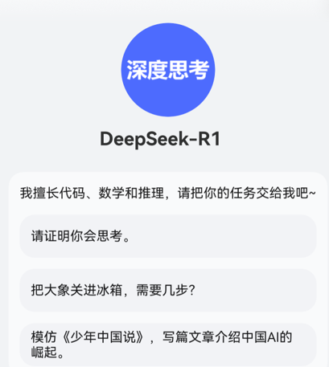

# 智能体信息

**智能体名称**

1、智能体名称是必填项，命名原则：需要通过名称直观表达出智能体可以实现的功能、服务或可帮助用户解决什么问题。

2、名称仅支持使用简体中文、中英文结合，不支持特殊符号、繁体字等。

3、名称应适合所有受众，且需与实际功能和用途相符，不得违反适用的法律法规。

4、名称不得含有错别字。

5、名称不得包含定价信息、价格、诱导赚钱等具有营销属性的商业化词汇（如免费、促销、清仓、XX元、9块9、躺赢等），避免夸大宣传、误导用户。

6、未经允许不得直接使用宽泛词语，包括不限于城市名、行业领域、产品名称、人名、热门应用、流行及日常用语、古诗词句、疑问句、感叹句、陈述句等，例如不得直接使用：北京、互联网、律师、人工智能、客服等具有概念性或概括性的宽泛通用词语直接作为智能体名称。

7、禁止使用具有极限性、夸大性、误导性的名称，例如不得使用：最高级、第一、首个、最便宜、全网销量第一、全网首发、销量冠军、唯一等极限词语。

8、名称禁止使用含低俗色情、辱骂等任何违反国家法律法规的内容。

9、名称不得含有测试相关词语，例如名称不得含有测试、test、beta等关键词。

（“心理测试助手”、“心理测评专家”等除外）

10、智能体上架前名称需进行商标侵权评估。

**智能体创建人**

1、智能体创建人为必填项。

2、创建人不能带“官方”、“小艺官方”等字眼。

**智能体头像**

1、智能体头像为必填项，需要内容清晰可辨且突出主题，需与名称、简介等提供的内容或功能有关联性。

2、不得出现花屏、内容截断、图片过曝、分辨率低、画面锯齿、严重拖影、马赛克、不合理水印、色框、黑屏、前后帧交叠等问题，导致智能体头像重度不清晰。

3、图片方向正确，不可为镜像图、上下或左右颠倒、扭曲、拉伸等。

4、不得使用纯色图片，不可是纯色或者纯色背景+文字组合直接作为头像。

5、图片上不得出现误导或暗示智能体的排名和表现的文字，如使用官方、权威、推荐、精品、TOP1等词汇。

6、不得出现诱导及营销内容，如不得含有网站、商户的水印、图标、logo 、二维码、联系方式、社交账号、社群、邀请码口令码、官方及认证性质标识等。

7、头像禁止使用含低俗色情、辱骂等任何违反国家法律法规的内容。

8、不得包含“适合幼儿”和“适合儿童”等暗示服务受众为儿童的词语。

9、智能体头像需具备科技感，相对年轻化，需与功能匹配。

10、源图必须是有版权原创。

**智能体描述**

1、智能体描述为必填项，介绍智能体提供的功能、服务及特色，应言简意赅、语句通顺、突出主题，在有限的字数内使用户能直观清楚的了解到智能体提供的能力。

2、描述需要与名称、头像等提供的内容或功能有相关性，描述和引导语不得重复。

3、智能体描述结尾要有标点符号，描述总字数不超过50个字。

4、智能体描述中的“您”和“你”要保持一致，建议统一用“你”。

5、不得含有广告法明令禁止的词汇，如“最”、“第一”、“世界第一”、“全球首家”、“绝对正品”、“100%合规”等词语。

6、不得误导或暗示智能体的排名和表现，如使用官方、权威、推荐、精品等词汇。

7、非儿童类的智能体描述不得包含“适合幼儿”和“适合儿童”等暗示服务受众为儿童的词语。

8、描述不得出现诱导及营销内容，如不得含有网站、联系方式、APP下载、社交账号、社群、邀请码口令码、官方及认证性质等词语。

9、不得包含误导性、不相关或不恰当的商业化用语、热门搜索词、流行词语，且不得宣传实际并不提供的内容或服务、以及做出无法证实的产品声明。

10、描述禁止使用含低俗色情、辱骂等任何违反国家法律法规的内容。

**智能体开场语**

1、智能体开场语为必填项，需与智能体功能和内容相关，需要和描述不得重复。

2、开场语文案风格可使用细节引导风格，可通过特色场景强化智能体的特性优势，需要接地气、有共鸣、突出竞争力，写清楚用户价值。

3、需要为简体中文介绍，可适当出现中英文内容，不得使用其他语言。

4、主谓宾完整句子需带标点，无错别字。

5、开场语建议控制在69个字以内（3行以内）。

6、开场语中的“您”和“你”要保持一致，建议统一用“你”。

7、开场语禁止使用含低俗色情、辱骂等任何违反国家法律法规的内容。

8、开场语需要贴合用户真实的使用场景进行设置，从而快速抓住用户兴趣。

**智能体引导事例**

1、智能体引导事例为必填项，引导事例需与智能体优势特性结合，与智能体调性匹配。

2、引导事例主谓宾完整句子需带标点，无错别字。

3、引导事例需为1-3条，且建议是不同场景。

示例：

**智能体气泡生成内容**

1、需要保障功能及按钮可用及顺畅，不得出现闪屏、白屏、闪退等Bug及异常内容，包括但不限于打开报错，功能按钮不可用、页面不适配、内容死链、功能模块信息缺失、无意义乱码字符串、色彩搭配不合理、信息干扰浏览、信息及功能重复、页面元素大小不统一或错位、频繁弹窗或无法关闭等问题。

2、生成的内容应当准确且具有权威性，严禁包含虚假、无效或具有误导性的信息。

3、生成的内容应保持时效性，禁止包含过期或陈旧的信息。

4、生成的内容不得引用未经证实的信息。

5、生成的文字内容需语句通顺、无病句、无错别字，段落不得重复，禁止出现乱码或无意义字符，且应与输入信息相关。

6、生成的图片内容，需可以直接预览，且内容清晰可辨。

7、生成的视频内容，需要可直接观看，音视频及字幕等信息同步。

**智能体分类**

需正确选择一二级行业分类。

**智能体背景图片**

1、图片需要内容清晰可辨且突出主题，需与名称、简介等提供的内容或功能有关联性。

2、图片不得出现花屏、内容截断、图片过曝、分辨率低、画面锯齿、严重拖影、马赛克、不合理水印、色框、黑屏、前后帧交叠等问题，导致智能体背景图片重度不清晰。

3、背景图片方向正确，不可为镜像图、上下或左右颠倒、扭曲、拉伸等。

4、不得使用纯色图片，不可是纯色或者纯色背景+文字组合直接作为背景图片。

5、图片上不得出现误导或暗示智能体的排名和表现的文字，如使用官方、权威、推荐、精品、TOP1等词汇。

6、不得出现诱导及营销内容，如不得含有网站、商户的水印、图标、logo 、二维码、联系方式、社交账号、社群、邀请码口令码、官方及认证性质标识等。

7、图片禁止使用含低俗色情、辱骂等任何违反国家法律法规的内容。

8、图片不得包含“适合幼儿”和“适合儿童”等暗示服务受众为儿童的词语。

9、图片需具备科技感，相对年轻化，需与功能匹配。

10、源图必须是有版权原创。
