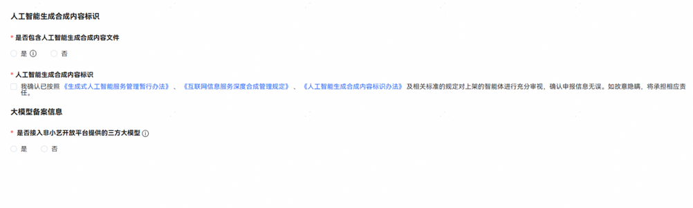
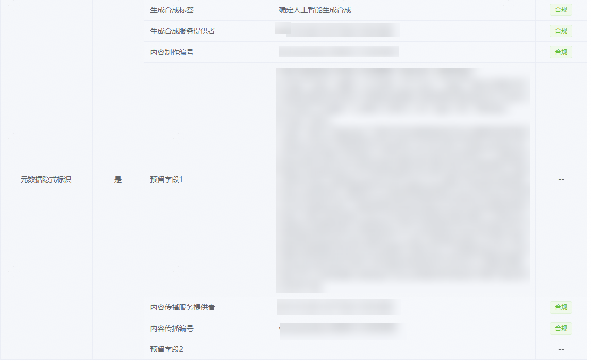

# 内容合规信息中人工智能生成合成内容标识和大模型备案FAQ

为了帮助您的智能体尽可能顺利地通过审核，请查看下列可能会导致审核流程延误或审核不通过的常见问题：

1、人工智能生成合成内容标识信息填写不准确。

2、大模型备案信息填写不准确。

具体内容信息填写示意图如下：

一、人工智能生成合成内容标识常见问题

1、什么是人工智能生成合成内容？

依照《人工智能生成合成内容标识办法》第三条，人工智能生成合成内容是指利用人工智能技术生成、合成的文本、图片、音频、视频、虚拟场景等信息。

2、人工智能生成合成内容标识的类型有哪些？

依照《人工智能生成合成内容标识办法》第三条，人工智能生成合成内容标识包括显式标识和隐式标识。显式标识是指在生成合成内容或者交互场景界面中添加的，以文字、声音、图形等方式呈现并可以被用户明显感知到的标识。隐式标识是指采取技术措施在生成合成内容文件数据中添加的，不易被用户明显感知到的标识。

3、人工智能生成合成内容标识信息怎么填？

（1）若不包含人工智能生成合成内容可填“否”。

（2）若包含人工智能生成合成内容可填“是”，并填写相关标识信息。人工智能生成合成内容具体标识方法可参考[《网络安全技术 人工智能生成合成内容标识方法》](https://openstd.samr.gov.cn/bzgk/std/newGbInfo?hcno=F32EA2A561F1886CD8D606513512D547)。

4、人工智能生成合成内容标识的检测方法（如何自验证生成内容已添加AI标识/如何获取隐式标识填写项）？

（1）登录[AI标识服务检测平台](https://www.gcmark.com/web/index.html#/mark/check/image)，选择对应类型的标识检测；

（2）上传待检测的文件，上传完成后点击“开始检测”；

（3）查看AI标识的检测结果。

二、 大模型备案信息常见问题

1、大模型备案信息怎么填？

（1）若接入的是小艺开放平台提供的三方大模型可填“否”。

（2）若接入的非小艺开放平台提供的三方大模型可填“是”，并提供生成式人工智能服务上线备案号和算法备案号。

2、生成式人工智能服务上线备案号和算法备案号怎么查询？

（1）生成式人工智能服务上线备案号查询方式：登录[国家互联网信息办公室关于发布生成式人工智能服务已备案信息的公告](https://www.cac.gov.cn/2025-09/10/c_1759222982377536.htm)查询

（2）算法备案号查询方式：登录[互联网信息服务算法备案系统](https://beian.cac.gov.cn/#/index)查询
