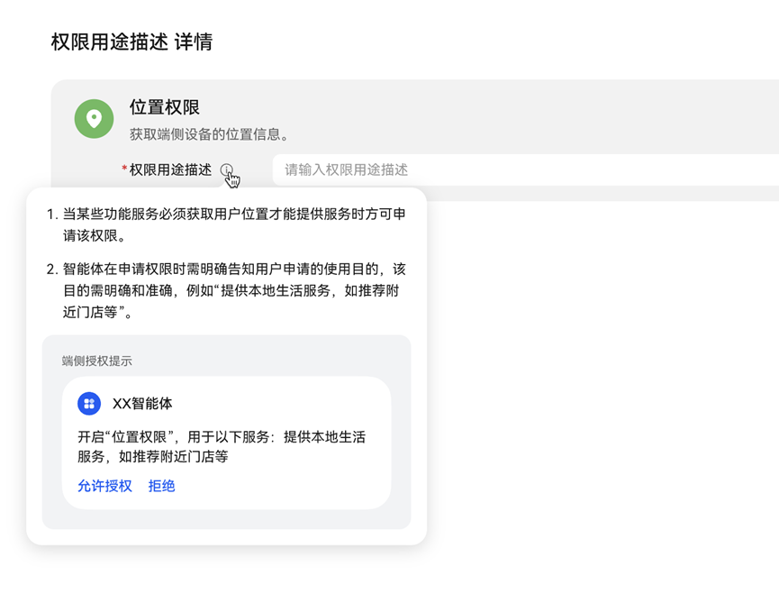

# 权限用途描述FAQ

为了帮助您的智能体尽可能顺利地通过审核，请查看下列可能会导致审核流程延误或审核不通过的常见问题：

1. 智能体在调用设备位置、日历等权限时，未同步告知该权限申请的使用目的。
2. 权限使用目的说明不明确、不准确、不符合相关法律法规要求。

   具体内容信息填写示意图如下：

   

   一、权限用途描述常见问题

   1、为什么要告知权限用途描述？

   根据[《工业和信息化部关于进一步提升移动互联网应用服务能力的通知》](https://www.gov.cn/zhengce/zhengceku/2023-03/02/content_5744106.htm)加强个人信息保护章节，要求合理申请使用权限：在调用终端相册、通讯录、位置等权限时，同步告知用户申请该权限的目的。未经用户同意，不得更改用户未授权权限状态。

   2、权限用途描述该怎么填？规则是什么？

   （1）当智能体某些功能服务必须获取用户位置才能提供服务时方可申请该权限。

   （2）智能体在申请权限时需明确告知用户申请的使用目的，该目的需明确和准确，例如“提供本地生活服务，如推荐附近门店等”。

   3、正确案例有哪些？

   （1）权限用途描述明确：写清楚推荐的是附近美甲门店

   

   （2）权限用途描述准确：明确告知用户是根据当前位置信息查询天气数据

   

   4、典型错误案例有哪些？

   （1）权限用途描述乱填，不按照规则填。

   

   （2）权限用途描述过于模糊，没有明确告知用户申请的使用目的。

   
