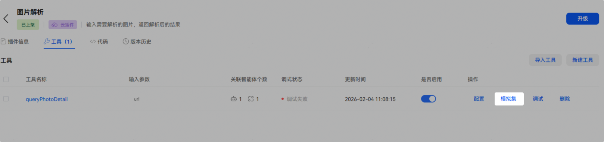
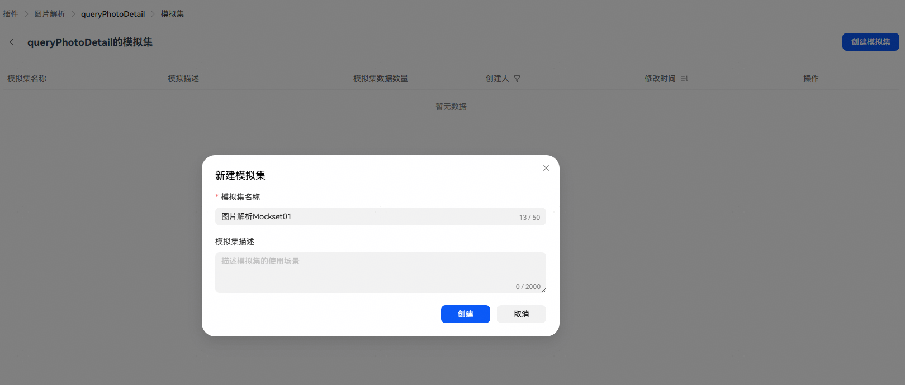
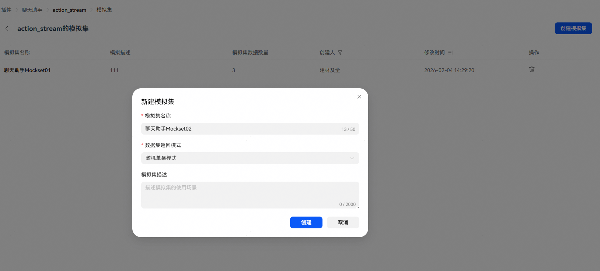
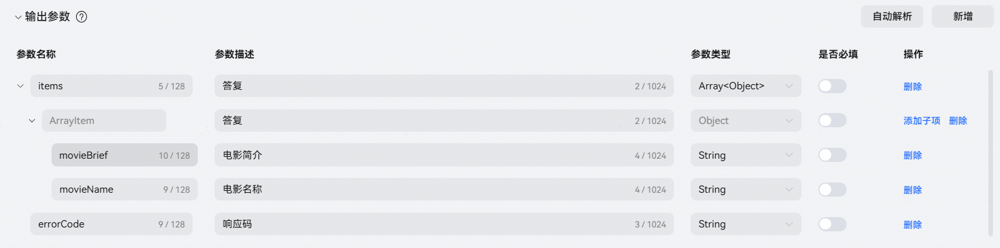
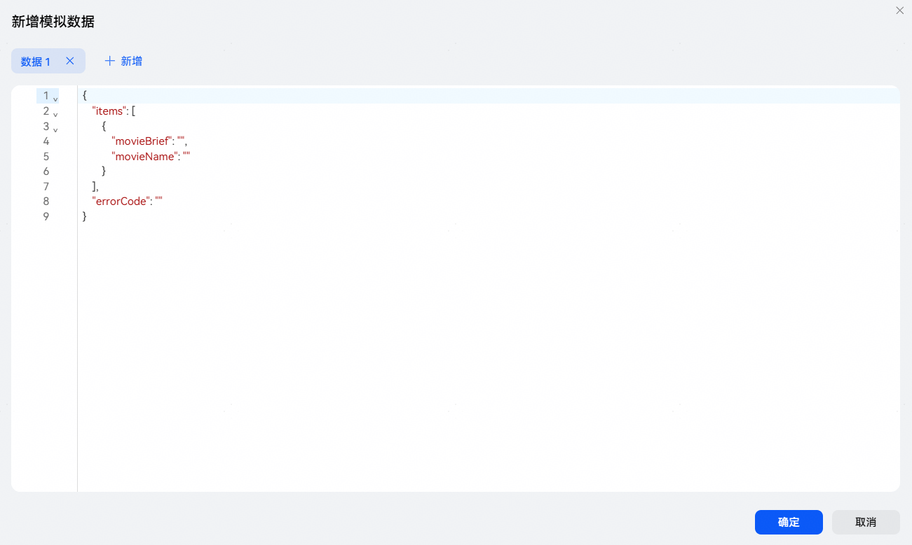
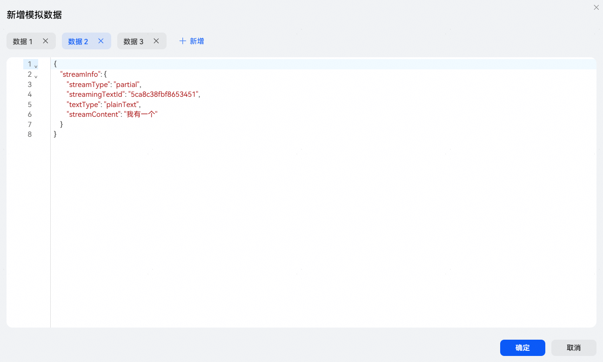

# 创建工具模拟集

插件模拟集的核心作用：在不调用真实插件接口的前提下，直接返回预设的模拟数据，实现快速调试与流程验证。本章节将详细介绍模拟集的创建，具体使用可参考[模拟集使用](https://developer.huawei.com/consumer/cn/doc/service/plug-in-node-0000002437625906#section1822835713130)。

## 创建模拟集

插件上架后，点击工具的【模拟集】进入模拟集管理页面，点击【创建模拟集】填写信息后开始创建。

## 模拟集基本信息说明

| 配置项 | 说明 |
| --- | --- |
| 模拟集名称 | 创建时会自动生成模拟集名称（插件名称+mockset+序号），支持修改。 |
| 数据集返回模式 | 批处理工具固定为“随机单条模式”，页面不展示此项。  流处理工具支持选择两种模式：  随机单条模式：该模拟集下存在多条模拟数据时，将随机返回一条数据。  全量返回模式：使用时按顺序返回该模拟集下所有模拟数据。 |
| 模拟集描述 | 模拟集描述说明，可记录模拟集使用场景。 |

## 模拟数据说明

模拟集创建完成后，即可在模拟集中添加模拟数据。

**批处理工具**

批处理工具新增模拟数据时，系统将根据工具输出参数的字段定义，自动生成对应数据结构。生成的数据支持编辑，通常直接填充数据值即可。注意：不建议添加输出参数中未定义的参数，否则该参数将被忽略，无法使用。

**流处理工具**

流处理工具新建数据时，系统将自动生成流插件结束帧标准数据结构。可以修改streamType设置首帧或中间帧数据。

注意：模拟数据中必须包含且仅包含一个start数据帧和一个final数据帧，以确保流程的完整性与可执行性。

start帧示例：

partial帧示例：

final帧示例：

