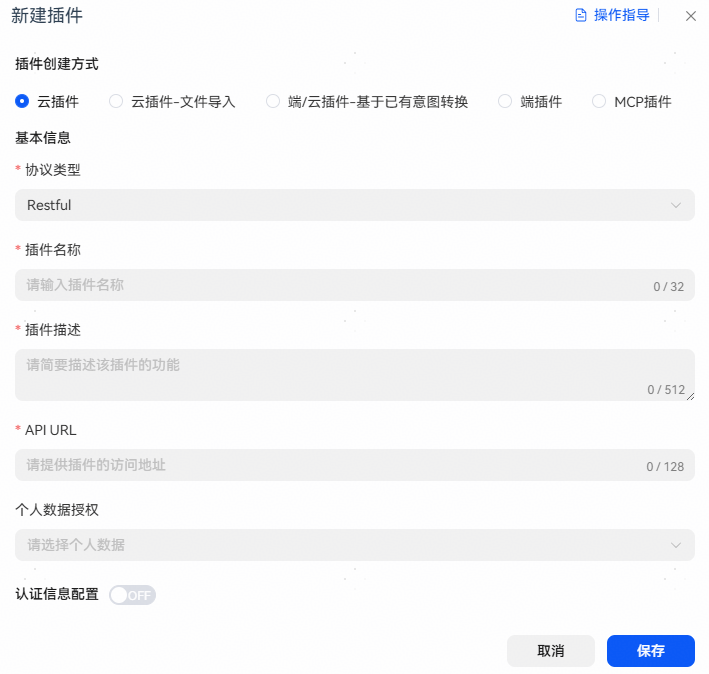
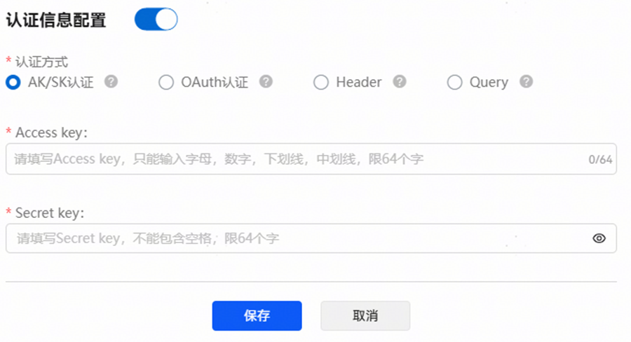
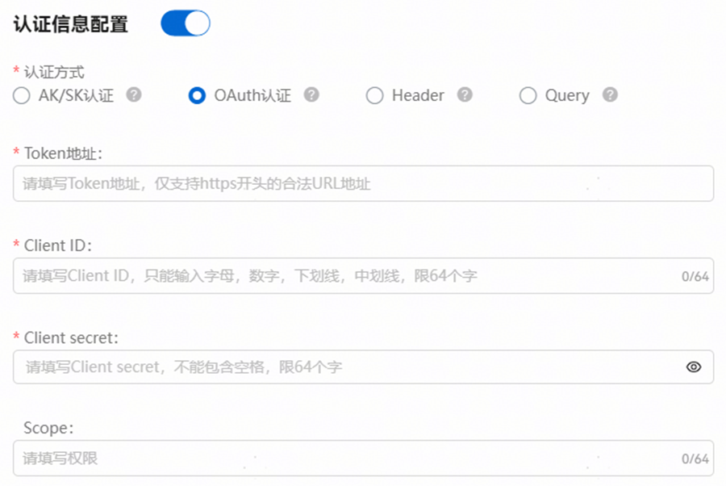
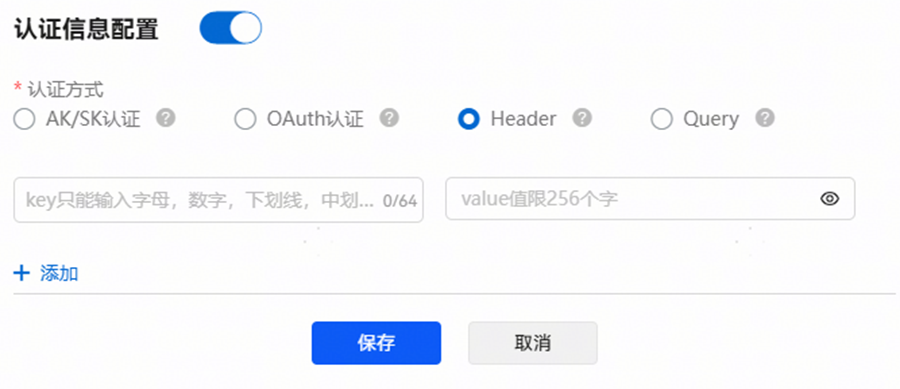
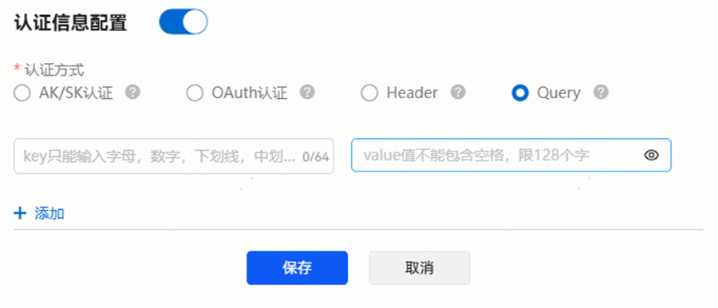

# 创建插件

## 插件基本信息

在小艺智能体平台页面，通过【工作空间】-【插件】-【新建插件】，进入新建插件配置页面。选择云插件，填写对应的插件信息等，如下图所示，以查询电影插件为例。



## 协议类型

Restful：单向通信，简单易用，广泛支持，兼容性好，适用于不需要实时更新的应用，此协议下，插件时延需控制在2.2s内，否则将超时；

SSE：服务器向客户端单向通信，长连接，实时性中高，适用于需要接收服务器推送通知和更新的场景；

Websocket：实时双向通信，实现复杂度较高，低延迟，实时性好，适用于需要实时更新的应用。

## 认证方式

**AK/SK：**

标准鉴权体系认证，使用密钥对及时间戳生成签名，在请求时于header中携带对应参数值。

配置说明：

access Key：分配给小艺开放平台的唯一身份标识，用于识别请求方身份。

Secret key：接入密钥，用于生成请求签名。



请求示例及字段说明：

```
curl  'https://xxx/test' \
--header 'Content-Type: application/json' \
--header 'accessKey: {{平台配置的接入码}}' \
--header 'ts: {{时间戳}}' \
--header 'sign: {{参数签名}}' \
--data  '{{插件请求参数}}'
```

| <strong>参数列表</strong> | <strong>类型</strong> | <strong>M/O</strong> | <strong>字段描述</strong> |
| --- | --- | --- | --- |
| accessKey | String（64） | M | 认证信息配置中Access key的值。 |
| sign | String（256） | M | 参数签名=Base64（HMAC-SHA256（secretKey，ts））。其中secretKey为认证信息配置中Secret key的值。 |
| ts | String（16） | M | 时间戳，用于加密和缓存穿透。格式为：当前计算机时间和GMT时间（格林威治时间）1970年1月1号0时0分0秒所差的毫秒数。例如：2018/1/1 08:00:00.000的时间戳为"1514764800000"。 |

sign计算方式：

1）防重放

出于防重放攻击的需要，服务端应该校验报文中的ts和当前实际时间相差在一个范围内。

例如：校验服务器侧时间戳与请求报文中的时间戳差值的绝对值（ABS），小于15分钟。

2）签名算法示例

Sign的计算代码示例，服务器侧可以基于ts计算该sign，与请求中的sign比对是否相等，以达到验证客户端身份的目的。

```
String secret = "密钥";
String ts = "从消息头中获取ts";
Mac mac = Mac.getInstance("HmacSHA256");
SecretKey secretKey = new SecretKeySpec(secret.getBytes(SystemCharsets.UTF_8), "HmacSHA256");mac.init(secretKey);
byte[] byteHMAC = mac.doFinal(ts.getBytes(SystemCharsets.UTF_8));
byte[] sign = Base64.getEncoder().encode(byteHMAC);
```

例如：Secret key 为 2e3b71f5def64d95a727314f028bf5aa， ts为1547630863716时，签名结果应该为：6lFqepUu79KSxVCsrXyB/aLVFIdutsTLLx1cZjxDE4I=。

**OAuth:**

遵循OAuth2.0协议规范，当前仅支持Client模式；OAuth2.0协议规范，可访问[OAuth2.0官方网站](https://oauth.net/2/)。

配置后请求前会先调用token接口获取token并在请求业务接口时携带该参数值。

配置说明：

Token地址：换取访问令牌的接口地址。

Client ID：客户端ID，授权服务器提供的唯一标识符。

Client Secret：客户端密钥，与客户端ID配对的密钥，用于向授权服务器证明应用的身份。

Scope：授权范围，定义请求访问用户资源的权限范围。



OAuth认证方式调用流程：

1、携带Client ID和Client Secret调用Token地址换取访问令牌access\_token：

请求示例：

```
curl -X POST \
-H 'Content-Type: application/x-www-form-urlencoded' \
-F 'grant_type=client_credentials' \
-F 'client_id={{认证信息配置中Client ID的值}}' \
-F 'client_secret={{认证信息配置中Client Secret的值}}' \
'{{认证信息中配置的Token地址}}'
```

响应示例：

```
{
    "access_token": "{{换取的访...携带}}",
    "token_type": "{{令牌类型，如Bearer}}",
    "scope": "{{可选，授予的权限范围}}",
    "refresh_token": "{{可选，用...令牌}}",
    "expires_in": {{过期时间，单位秒}}
}
```

2、携带access\_token请求业务接口示例：

```
curl  'https://xxx/test' \
--header 'Content-Type: application/json' \
--header 'Authorization: Bearer {{调用To...值}}' \
--data  '{{插件请求参数}}'
```

**Header**:

即在请求header中传递对应参数



请求示例：

```
curl  'https://xxx/test' \
--header 'Content-Type: application/json' \
--header '{{认证信息配置的key}}: {{认证信息配置的value}}' \
--data  '{{插件请求参数}}'
```

**Query**:

直接在接口地址中传递参数

该认证方式可能存在安全风险，建议使用其他认证方式。



请求示例：

```
curl  'https://xxx/test?{{认证信息配置的key值}}={{认证信息配置的value值}}' \
--header 'Content-Type: application/json' \
--data  '{{插件请求参数}}'
```