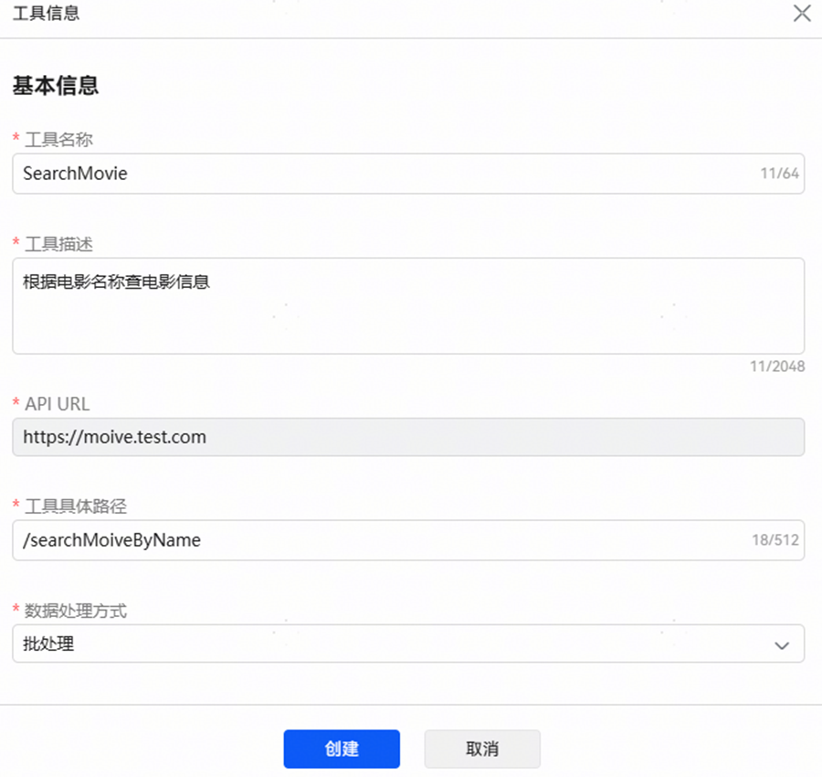
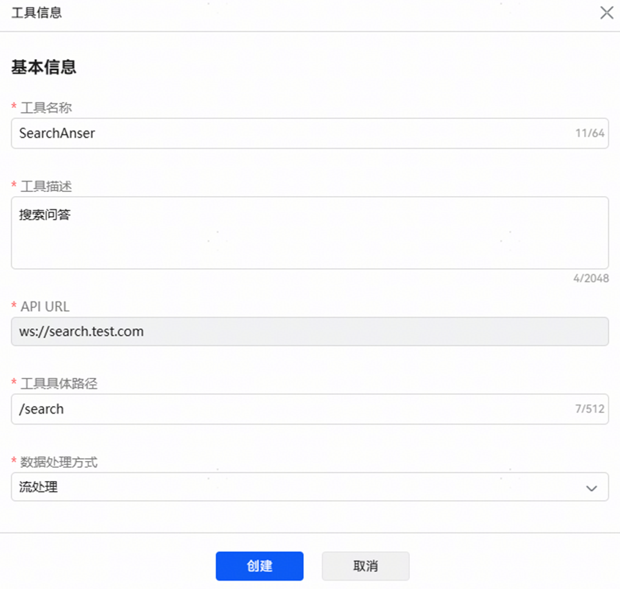
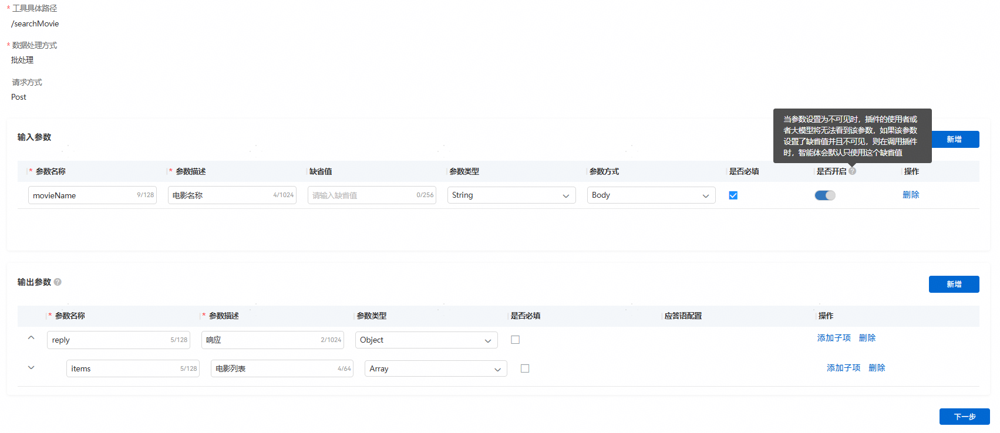
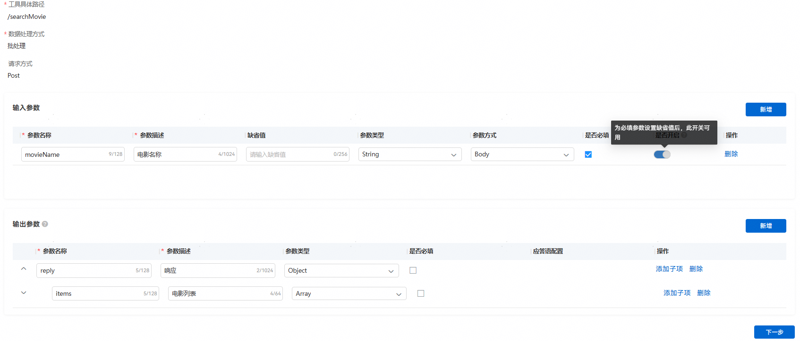

import MergeTable from '@site/src/components/MergeTable';

# 创建工具

## 工具基本信息

工具可以理解为一个API，一个插件里可以创建多个工具即关联多个API，如一个电影插件，可能会有查电影和查排片的影院等多个工具。（工具的名称、描述、参数定义会影响function call结果，需要定义清楚）。

在已创建的插件内创建工具。





## 数据处理方式

批处理：处理有界数据集（完整的数据集合）。

流处理：处理无界数据流（可能不完整的、持续到达的数据）（插件需为Websocket或SSE协议）。

## 输入参数配置

缺省值：当参数必填且值为空时，会自动填入缺省值。

开启开关：关闭后参数对模型不可见，当插件参数为固定值时，可关闭此开关，使用缺省功能，减少智能体中的大模型调用插件时的流程，提高调用效率。

（必填的输入参数，如果想关闭开启开关，则需要填写缺省值）。





## 输出参数配置

批处理插件可自定义输出参数。

流处理插件输出参数配置：

注意：流插件含默认输出参数streamInfo（string类型），插件在工作流中使用时，后续节点引用streamInfo即可获取到streamContent的内容。

**配置样例：**


流处理插件输出参数说明：

**参数：**

| 参数 | - | 参数类型 | O/M | 说明 |
| --- | --- | --- | --- | --- |
| errorCode | - | String | M | 响应码，成功返回0，非0视为失败。 |
| errorMessage | - | String | O | 描述信息。 |
| reply | - | Object | M | 响应内容。 |
| streamInfo | Object[StreamInfo] | M | 答复文本结构。 |
| items | Array`<Object>` | O | 结构化数据，通常用来绑卡。结构内参数可自定义。注意：   * 非[文卡混排输出](/docs/distribute/xiaoyi/workflow-configuration-5-0000002471264261/workflow-text-card-0000002517847268)场景，只有final帧的items结构有效。 * [文卡混排输出](/docs/distribute/xiaoyi/workflow-configuration-5-0000002471264261/workflow-text-card-0000002517847268)场景，结构内必须含displayType且值固定为EmbedMarkdown； |

**StreamInfo****:**

| 参数 | 参数类型 | O/M | 说明 |
| --- | --- | --- | --- |
| streamContent | String | M | 截止到当前帧的全量输出内容；示例：第一帧：“今天”，第二帧：“今天天气真好呀”。 |
| streamingTextId | String | M | 流式文本Id；一次请求的答复中所有帧id相同。 |
| streamType | String | M | start|partial|final（流式类型，需按顺序发送start开始帧，partial中间帧，final结束帧）。 |
| textType | String | M | 文本格式，值固定为plainText或markdown。 |

输出示例：

```
{
	"errorCode": "0",
	"errorMessage": "",
	"reply": {
		"streamInfo": {
			"streamContent": "你好呀，有什么想要跟我聊的呢？",
			"streamingTextId": "5aae898d-2346-4ad4-bad6-2fcd8d911d3d",
			"streamType": "final",
			"textType": "markdown"
		},
		"items": [{
			"displayType": "EmbedMarkdown",
			"movieName": "匿杀",
			"image": "https://p0.pipi.cn/mediaplus/friday_image_fe/0fa3341425c9a1374c5b28aaa4028dbd34ae4.jpg",
			"deepLink": {}
		}]
	}
}
```
