# 选项组组件用法

选项组（DualSelect）是容纳选项（DualSelectItem）的容器。

一、选项组的选项个数允许设置固定个数和绑定变量。

1、固定个数

新建的选项组默认包含三个选项，可为选项“选中时”、“未选中时”状态分别设置不同样式。

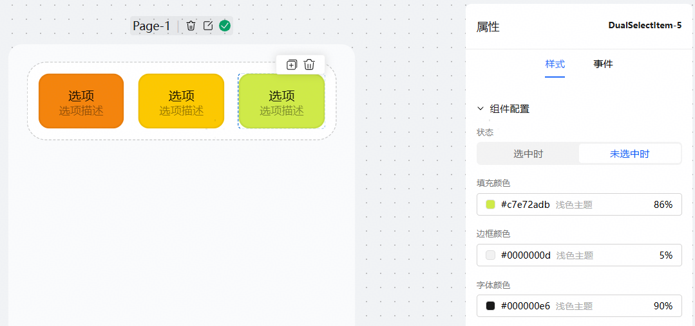

选中选项组，可对选项进行拖动排序、新增选项、编辑选项和删除选项，也能点击画布中复制按钮，复制单个选项。

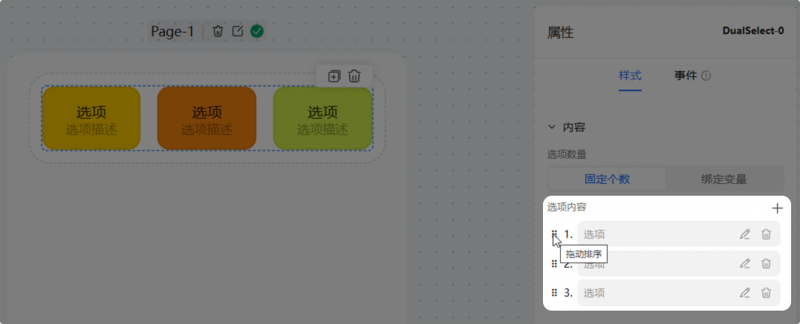

点击编辑按钮，对单个选项进行配置。左侧带红色\*号的为必填项。

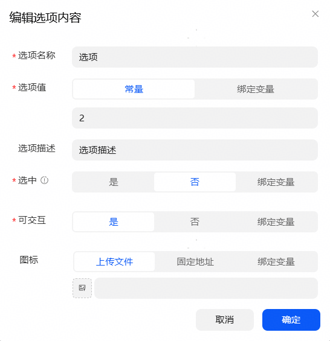

2、绑定变量

与列表组件相似，可以给选项组绑定数组变量，来遍历生成选项，此时每个选项的选中时、未选中时状态样式是一致的。

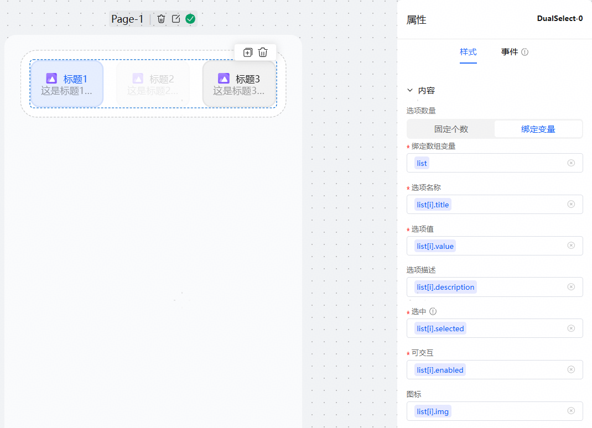

二、功能介绍

1、选项类型：

提供单选和多选两种类型，在单选模式下，如果设置多个选项为选中（选中状态时值为true），卡片加载后只有最后一个选中状态选项生效。

2、提供水平和垂直两张排列方式，根据需求自由设置水平和垂直的对齐方式。

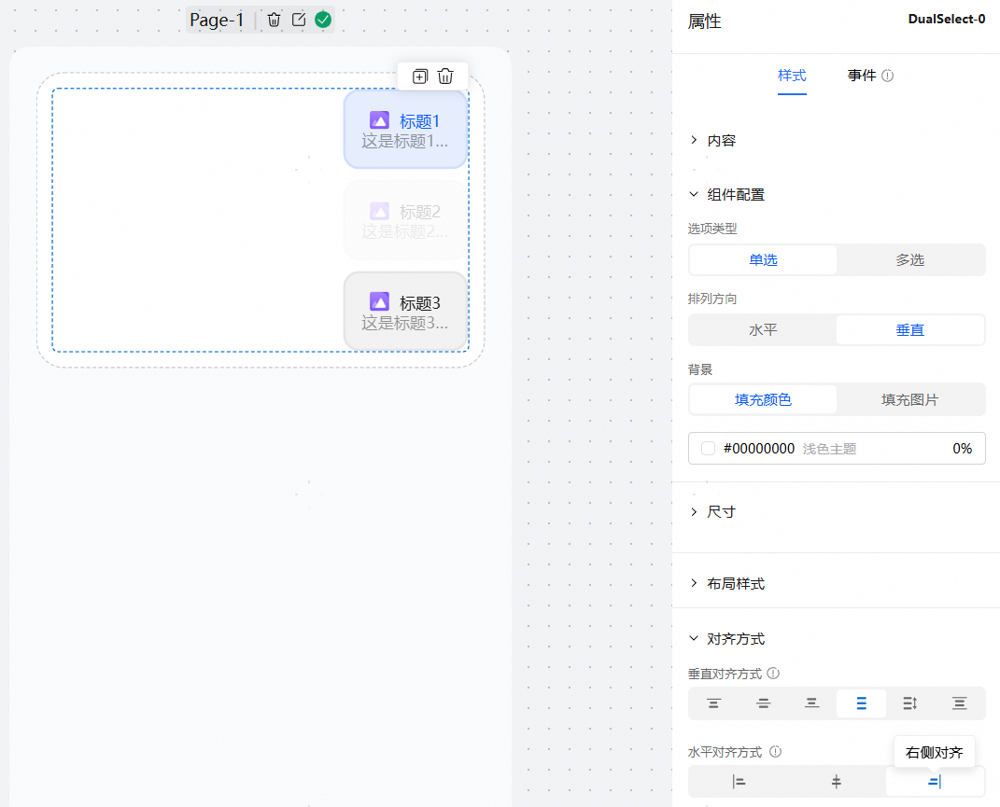

3、可交互

选项可交互功能绑定布尔类型的变量，或者设置默认的布尔值。为false时，选项会有禁用状态样式，如上图中的标题二选项，此时点击选项不能选中，也不能取消选中。

4、选项描述为当行文本，超出部分自动省略

三、用法演示

预期效果：选择大熊猫，默认文本变为对大熊猫的种类（科）。

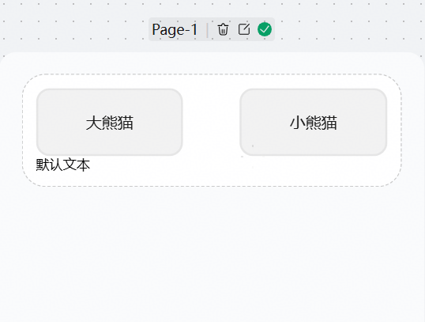

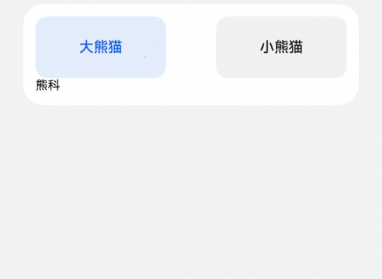

步骤：

每新建一个选项组组件就会生成一个组件变量，变量名与选项组组件的id相同，变量类型为字符串。这个变量用来存储已选中选项的选项值。

对选项进行配置，选项名称动物名称，选项值设为对动物种类（科）。

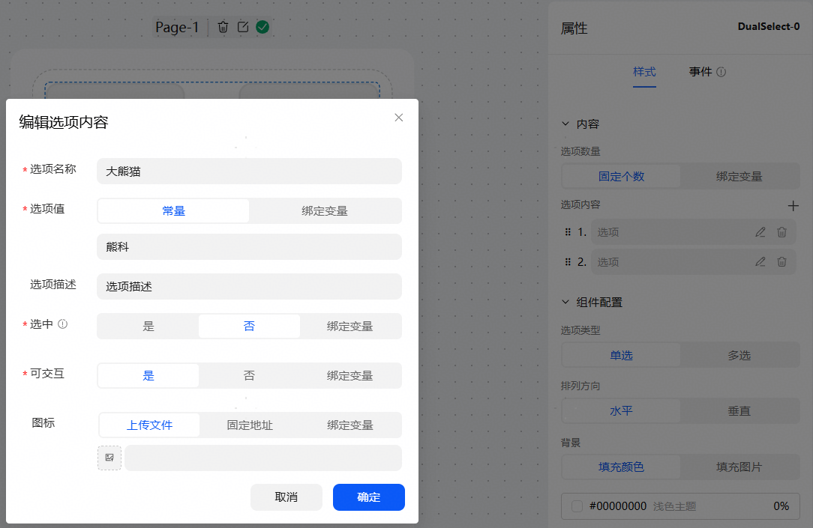

给文本组件绑定上字符串变量description。

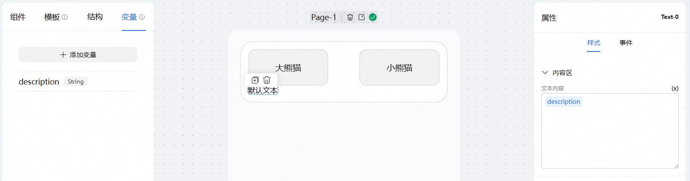

对选项组进行变化时事件配置，执行动作选择设置变量值，变量选为文本标签绑定的变量description，变量值选择组件变量DualSelect-0。

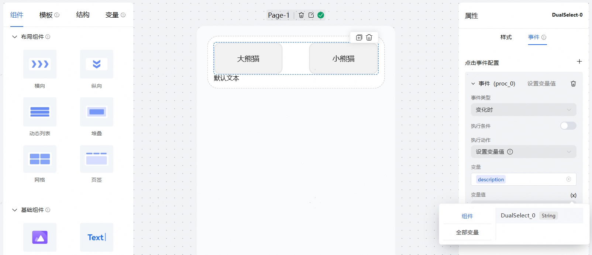

如果此时是多选模式，两个选项都被选中，默认文本就会变成是两个选项值以“，”拼接的情况。

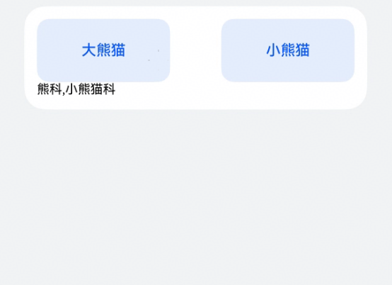
