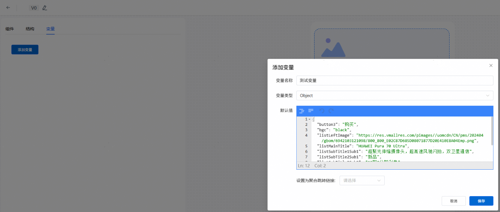
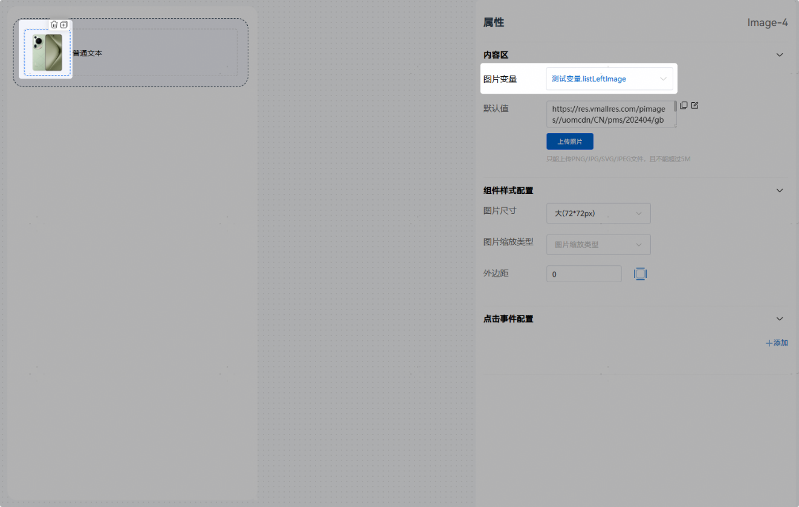
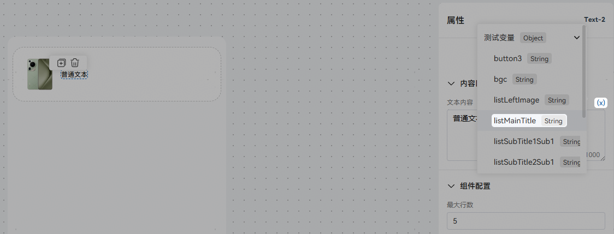
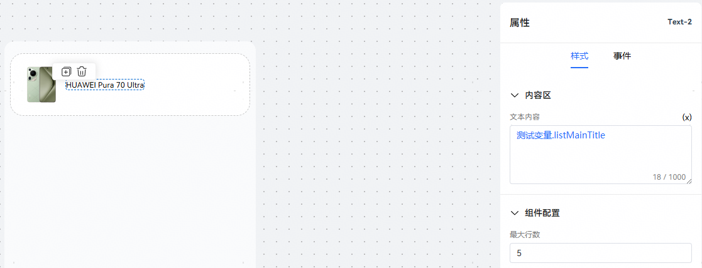
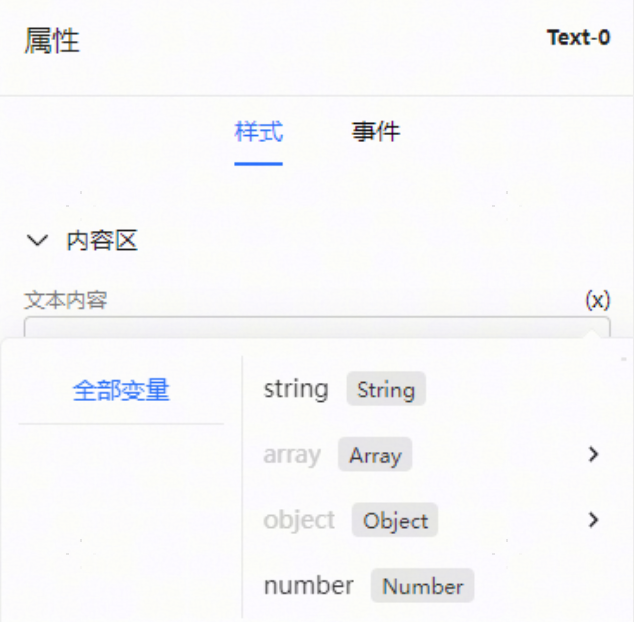

# 编辑变量

卡片可能需要根据场景动态调整参数，所以需要新建变量用于在卡片中绑定动态变化的内容，真实的值通过调用时传入。

画布中组件可以绑定创建的变量用于预览，真实的值是在卡片模板配置中由插件或工作流输出参数的值决定。

变量的类型有String、Number、Array、Object、Object（聚合链接）和Boolean，Object（聚合链接）的配置方式参见[跳转](https://developer.huawei.com/consumer/cn/doc/service/multi-jump-0000002485633457)。

新建变量后，可以在内容区绑定对应的变量

点击文本内容右边（x）按钮，选择变量绑定。

右侧的属性配置栏主要包含内容区、样式配置和事件配置。内容区的文本内容中蓝色字体表示引用的变量的名称。

在绑定变量时，会对不支持的变量进行过滤，无法绑定。例如，为文本组件绑定变量时，无法绑定array变量和object变量。

