# 自定义卡片演示案例

**华为商城卡片**

构建思路：将卡片分为顶部栏和商品栏上下两部分依次绘制

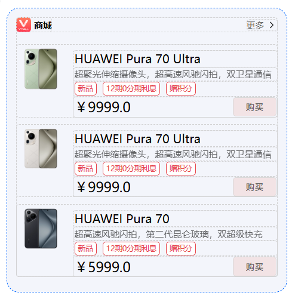

**顶部栏效果实现**

框架搭建效果预览

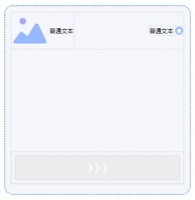

框架搭建实现步骤

1、选择外层行布局（将元素横向排列的容器），在右侧属性栏中内部组件位置找到水平对齐方式，选择两端对齐。

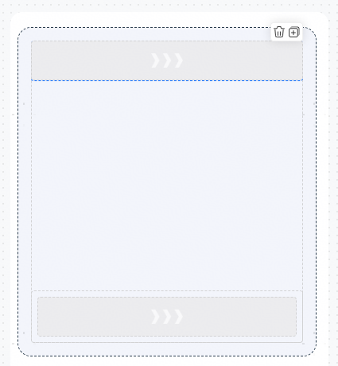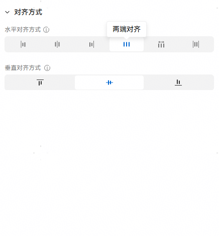

2、插入新的行布局，在其内依次插入图片组件和文本组件后，宽高设为自动。再次插入新的行布局，依次插入文本组件和图标组件，将其宽高设为自动。

（将行布局作为容器，把两个基础组件绑定为一个小单元）

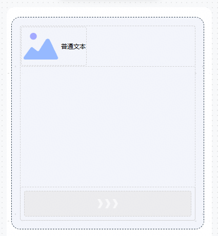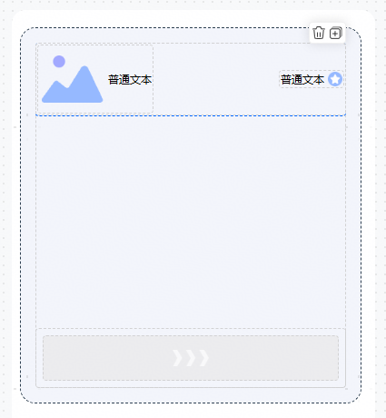

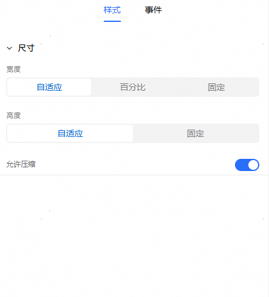

3、然后将上述三个行布局内边距设为0。

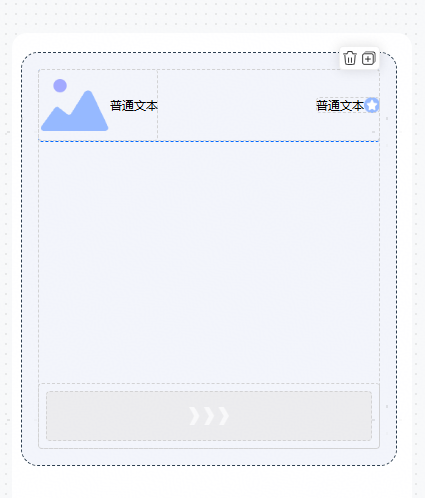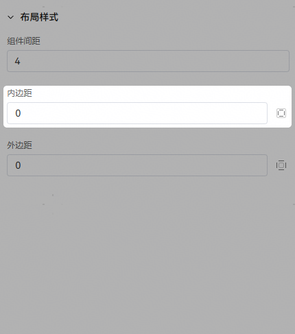

样式配置效果预览

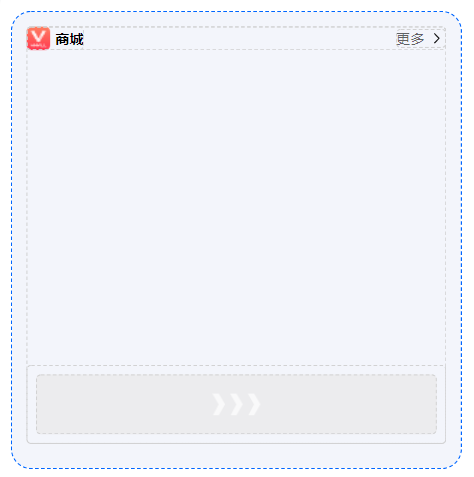

样式配置实现步骤

1、通过变量绑定的方式，给图片组件绑上变量globalContent.logo对应的图片地址

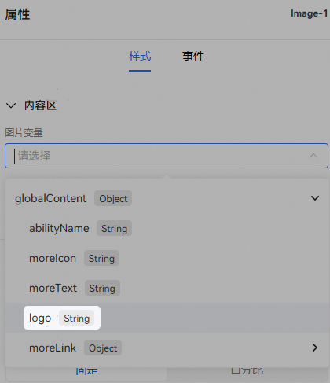

2、进行样式配置，图片尺寸选择自定义、宽高比选择1:1、宽度设为20px、图片缩放类型为等比缩放。

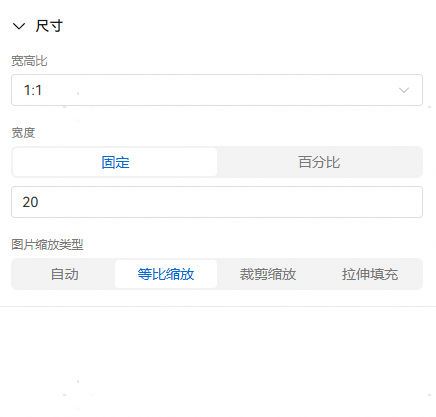

3、文本组件“商城”：字体大小：12、字体粗细：700、不透明度：100%；文本组件“更多”：字体大小：10、字体粗细：500、不透明度：60%。

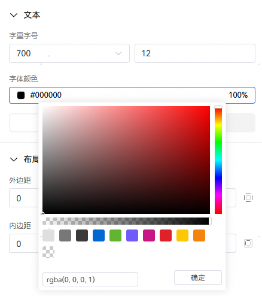

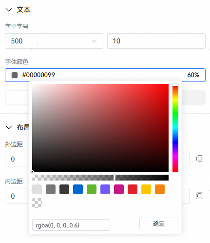

4、图标标签：“向右”。

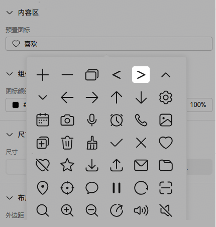

**技巧：组件间距设置方法**

1、在行布局组件的默认设置下，可能会出现这种组件间距过小而影响视觉体验的情况：

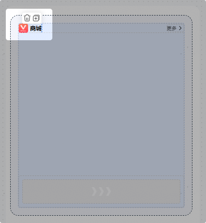

此时，您可以通过改变该行布局组件的组件间距属性来调整相关效果。首先，在画布或结构页面中选中该行布局组件：

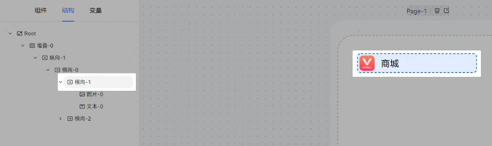

行布局设置组件间距为4，图片组件和文本组件外边距设为0，即可改善视觉效果。

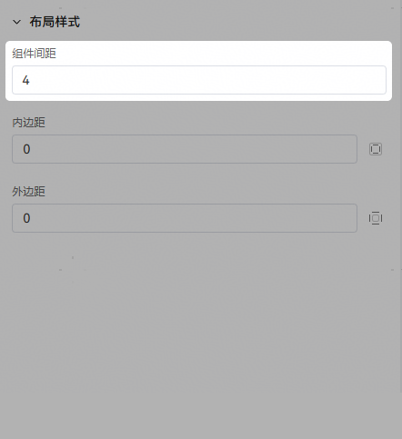

2、类似的，将右侧的行布局组件设置为组件间距为0，图片组件的右侧外间距设为2，或者文本组件左侧外间距设为6（由于标签组件左右有留白，间距为2的效果大于第一点间距为4的效果）。

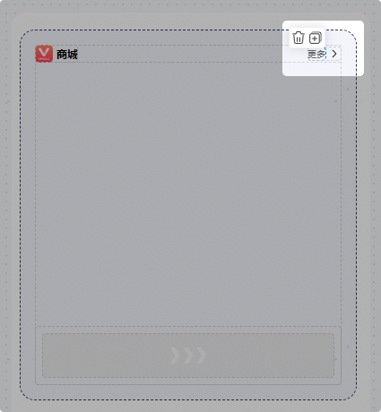 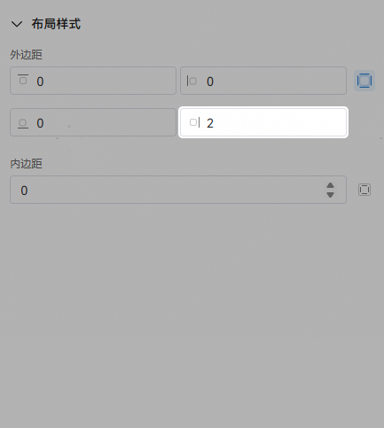

**商品栏效果实现**

1、动态列表组件的视觉效果与绑定的数组变量有关。例如，在变量页面选择添加变量选项，创建一个有3项内容的数组变量：

```
"listContent": [
    {
        "button3":"购买",
        "listLeftImage": "https://res.vmallres.com/pimages//uomcdn/CN/pms/202404/gbom/6942103121098/800_800_E02C87D685D08071877D20E410E8A04Emp.png",
        "listMainTitle": "HUAWEI Pura 70 Ultra",
        "listSubTitle1Sub1": "超聚光伸缩摄像头，超高速风驰闪拍，双卫星通信",
        "listSubTitle2Sub1": "新品",
        "listSubTitle2Sub2": "12期0分期利息",
        "listSubTitle2Sub3": "赠积分",
        "listSubTitle3Sub1": "￥9999.0"
    },
    {
        "button3":"购买",
        "listLeftImage": "https://res1.vmallres.com/pimages/uomcdn/CN/pms/202404/gbom/6942103121081/800_800_E01463FFB1D9208814652C56045C5234mp.png",
        "listMainTitle": "HUAWEI Pura 70 Ultra",
        "listSubTitle1Sub1": "超聚光伸缩摄像头，超高速风驰闪拍，双卫星通信",
        "listSubTitle2Sub1": "新品",
        "listSubTitle2Sub2": "12期0分期利息",
        "listSubTitle2Sub3": "赠积分",
        "listSubTitle3Sub1": "￥9999.0"
    },
    {
        "button3":"购买",
        "listLeftImage": "https://res.vmallres.com/pimages//uomcdn/CN/pms/202404/gbom/6942103120374/800_800_606AD050130CDD9F17DBBB7EECDD9B4Amp.png",
        "listMainTitle": "HUAWEI Pura 70",
        "listSubTitle1Sub1": "超高速风驰闪拍，第二代昆仑玻璃，双超级快充",
        "listSubTitle2Sub1": "新品",
        "listSubTitle2Sub2": "12期0分期利息",
        "listSubTitle2Sub3": "赠积分",
        "listSubTitle3Sub1": "￥5999.0"
    }
]
```

然后为动态列表组件绑定该数组变量，系统便会自动遍历数组并绘制对应的动态列表组件，其中动态列表的区块数量与数组长度相同：

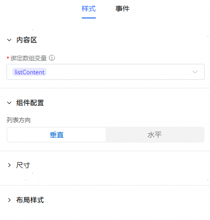

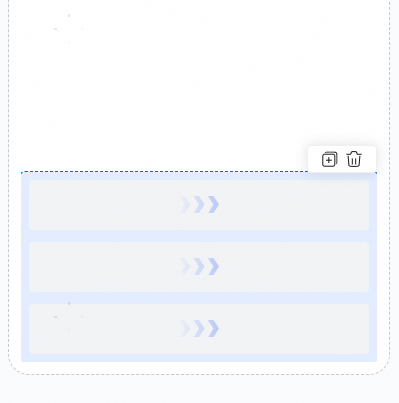

2、给图片组件绑定对应的变量，由于listContent数组中，每项的listLeftImage的内容不同，因此系统生成卡片时，每一区块中的图片组件会对应地根据不同的图片地址生成对应的图片。

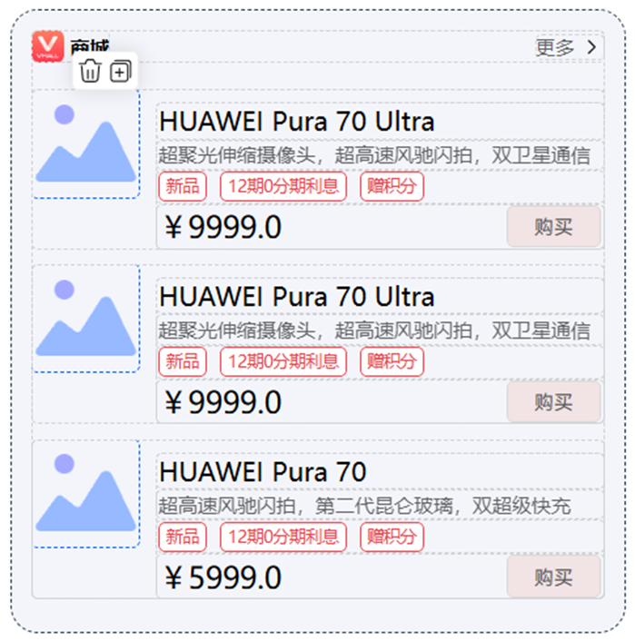

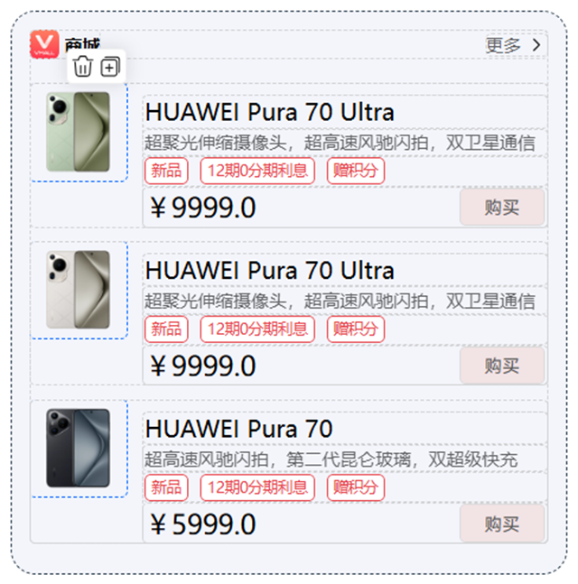

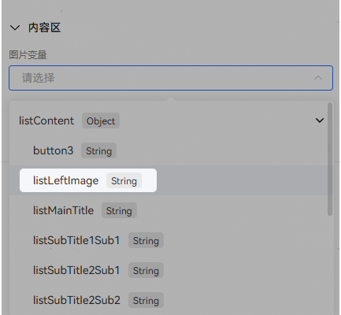

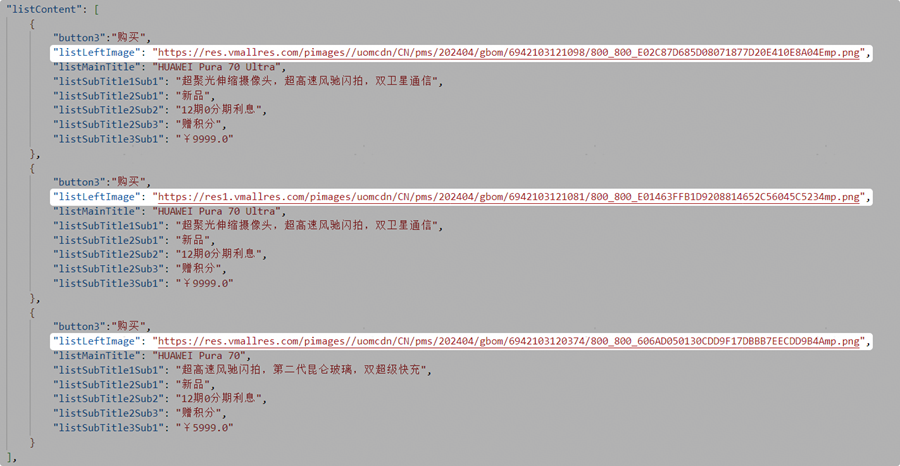

3、标签组件可设置圆角大小，左上和左下圆角为20、右上和右下圆角为4，根据需求来调整。

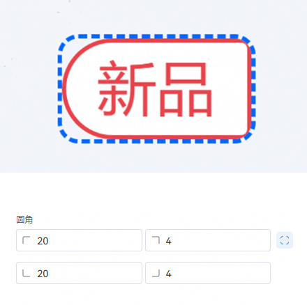

4、选择需要复制的组件，点击+按钮，再更换文本内容，能够提高开发效率。

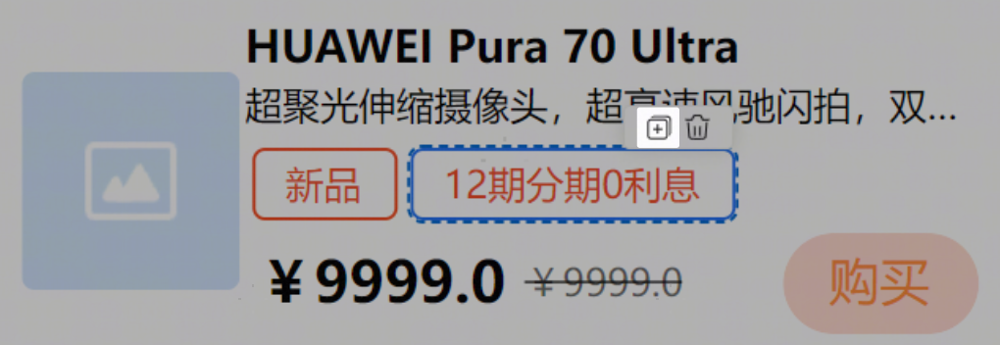
