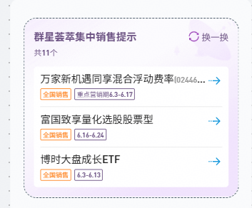
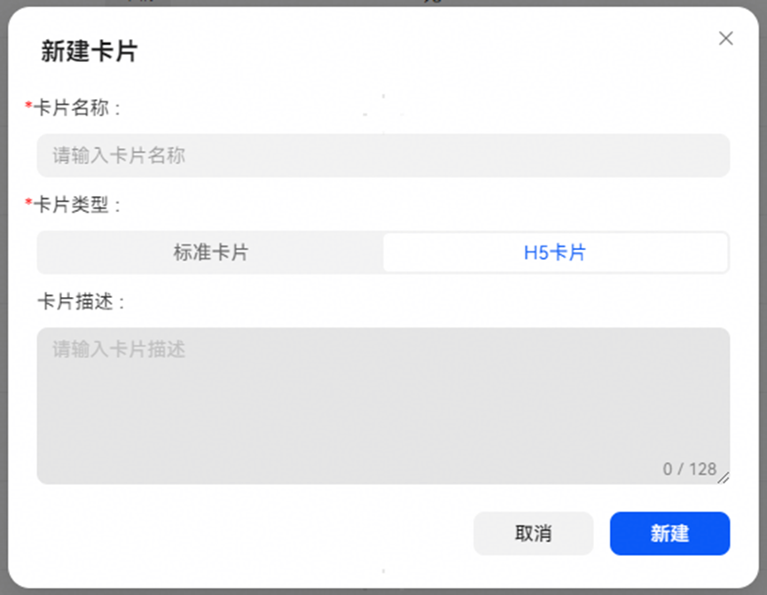
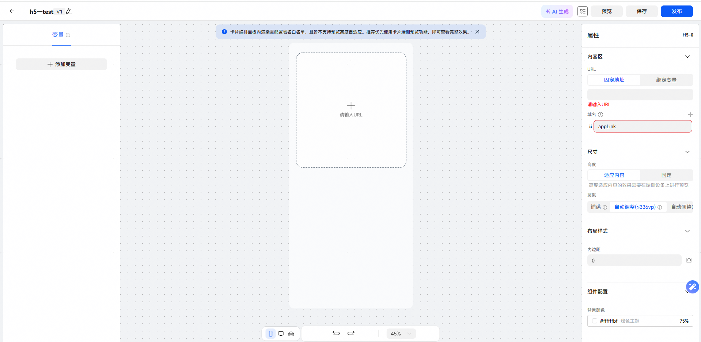
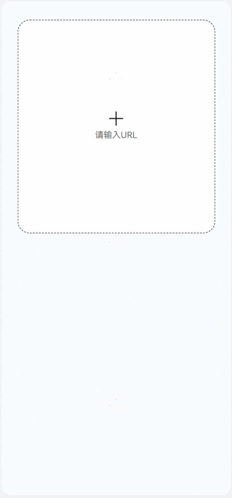
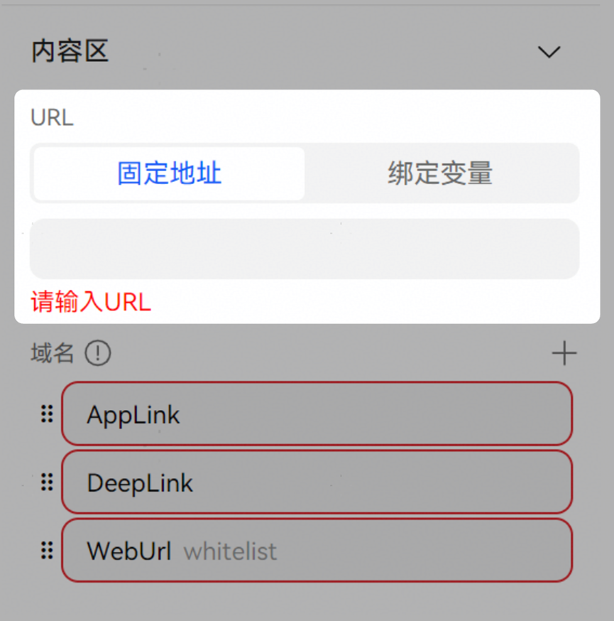

# H5卡片用法

若您已经在其他网页上拥有成熟孵化的卡片设计，可以考虑使用H5卡片功能直接展示这些卡片。H5卡片将展示给定的URL指向的网页中的内容，无需您再做复杂适配即可完全展示已有设计的效果。目前H5卡片功能在内测阶段，需先发送邮件申请并开通H5卡片白名单权限后使用。

卡片效果示例：

若需要使用H5卡片功能，请先发送邮件申请开通H5卡片白名单权限，申请审核周期预计2-3个工作日，请耐心等待：

| <strong>字段</strong> | 说明 |
| --- | --- |
| <strong>发送邮箱</strong> | hagservice@huawei.com |
| <strong>邮件主题</strong> | H5卡片权限申请 |
| <strong>邮件内容</strong> | 申请目的：创建H5卡片；  账号基本信息：[填入注册账号时使用的手机号或邮箱]；  域名：[卡片上需要展示的页面的域名]；  意图框架调试ID：[按照[文档教程](/docs/dev/app-dev/ai/intents-kit-guide/intents-appendix-a-get-uid)获取到的uid]。 |

添加白名单权限后，点击创建卡片按钮并选择H5卡片选项即可创建一张H5卡片。

H5卡片的编辑页面如下图所示，左侧为变量区域，中间为卡片展示区域，右侧为卡片属性配置区域。

中间区域为卡片展示区域，将展示在属性区域中填写的URL所对应的页面。

在右侧的卡片属性配置区域中，您可以对卡片属性进行调整。

**URL**一栏为需要使用的H5卡片对应的链接，可选择手动输入链接或绑定已有变量，必须为https协议地址。

**域名**为允许渲染H5卡片或跳转的域名，您可以自由增加或删除，也可编辑单条域名数据，支持以下三种类型：

* AppLink：标准https协议的Applink地址，触发应用跳转，点击H5卡片后跳转到应用中。
* DeepLink：应用的deeplink地址，触发应用跳转，点击H5卡片后跳转到应用中。
* WebUrl：网页跳转链接，点击H5卡片后跳转到对应网页中。

