# 地图组件用法

如果开发者需要展示地图样式卡片，可借助地图组件实现，下图为地图组件的卡片效果：

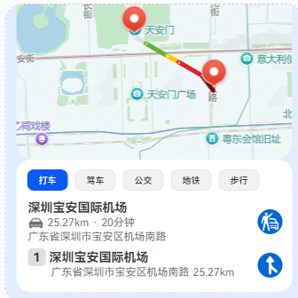

地图组件允许用户在卡片上查看地图，标记地点和路线，也可以在地图上显示用户位置。

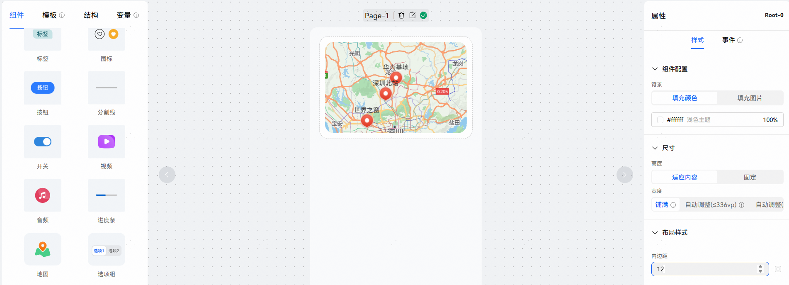

**组件属性**

地图组件支持配置地点、路线、组件配置，尺寸、布局样式以及可见性为通用属性。

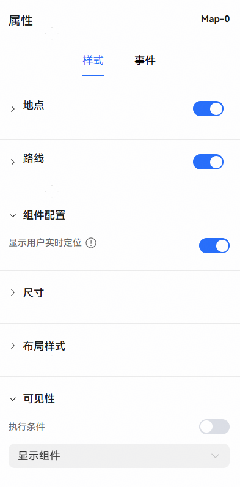

**地点**

使用地图组件必须进行地点配置，配置的地点将在卡片上展示特定的标注点效果。

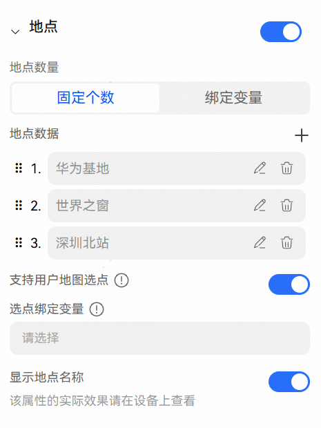

地点数量配置：

地点数量中配置需要在地图卡片上标注展示的地点数据，支持配置固定个数和绑定变量两种方式。

a. 固定个数：开发者配置固定地点数据时，可以增加、编辑、删除标注点，并支持拖动调整标注点顺序。

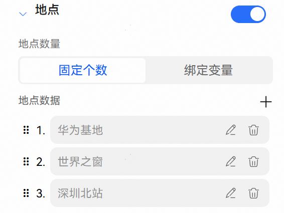

点击编辑按钮，进入标注点数据框，支持修改标注点名称、经纬度和缩略图，缩略图为标注地点展示图标，支持上传图片、填写固定地址或绑定变量三种方式。

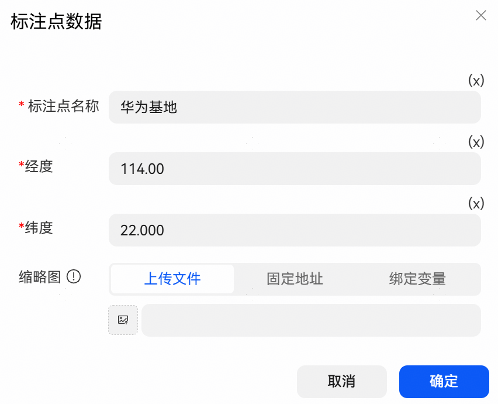

b. 绑定变量：开发者展示非固定地点数据时，可以使用绑定变量模式配置地点。

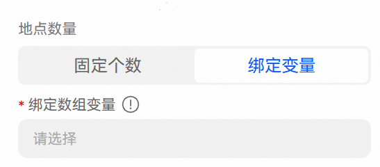

标注地点变量需按照指定格式输出，可点击提示按钮查看样式，点击提示中的“创建变量”可自动创建标注变量样式模板。

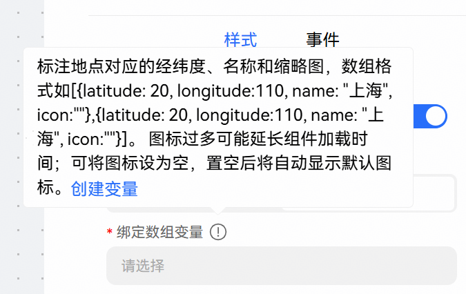

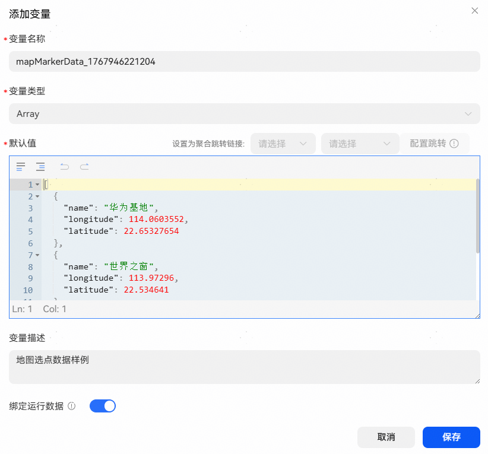

选点配置：

支持用户地图选点：开关打开时，自动显示选点放大动效。

选点绑定变量：绑定值为需要自动放大的地点坐标的变量，选点格式：\\{latitude: 20, longitude: 30, name: "深圳华为基地"\\}。

显示地点名称：开关打开时，将在地图上显示地点的名称。

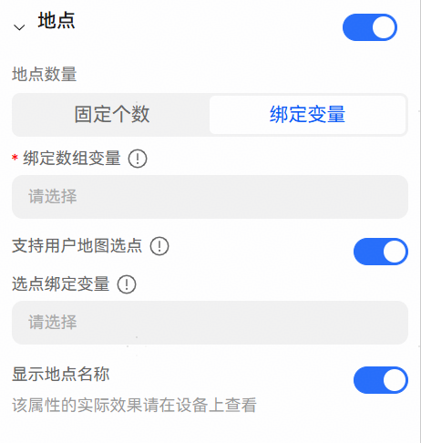

**路线配置**

当开发者需要卡片展示路线时，打开此配置。路线变量需按照指定格式输出，点击提示按钮可查看数据样式，点击提示中的“创建变量”可自动创建样式模板。

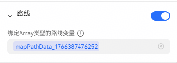

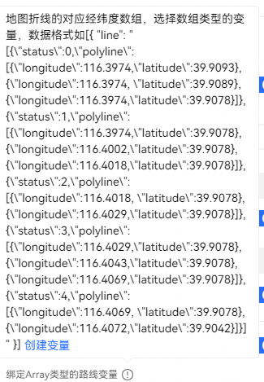

路线数据说明：

数组中的每一项表示路线中的一段，status属性表示路线段状态，值为0、1、2、3、4中的一个，在地图上显示时，不同的status值会使路线显示不同的颜色；polyline属性表示路径点，一个有效的polyline应当包含至少两个点，且每个点的经度和纬度都必须为合法的值，在地图上显示时，一段路线会用直线按顺序连接polyline中的每个点。

status：路线段状态，不同值显示不同的颜色，取值0（灰色）、1（绿色）、2（黄色）、3（红色）、4（深红色）。

polyline：路径点，一组至少包含两个点，且每个经纬度必须合法，卡片上将用直线按顺序连接polyline中的每个点。

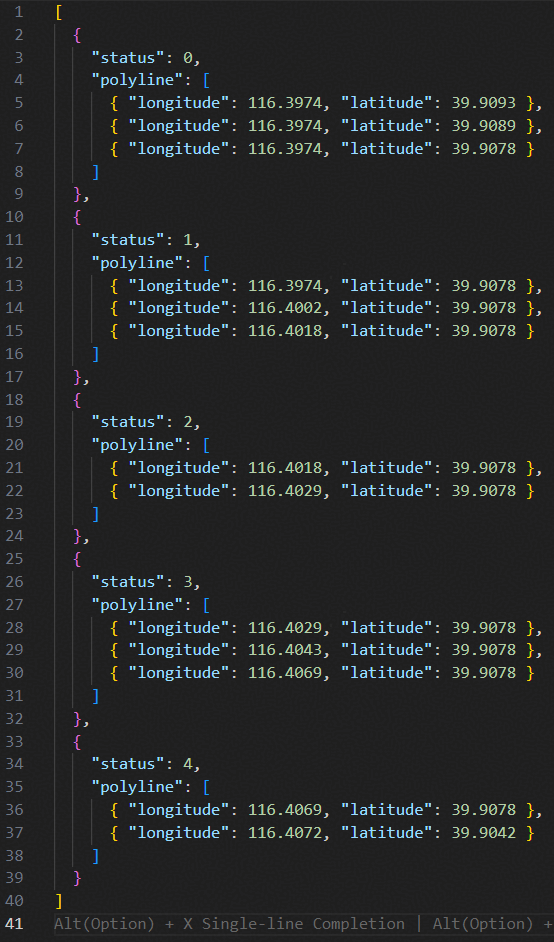

**组件配置**

显示用户实时定位：开关打开时，地图的视野中心将变为用户实时定位。注意：此功能仅在获取到用户定位权限后生效。

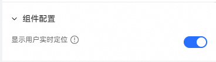
