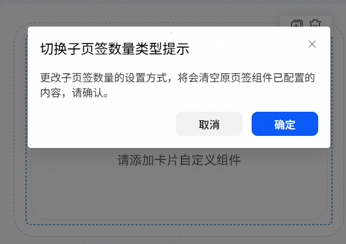
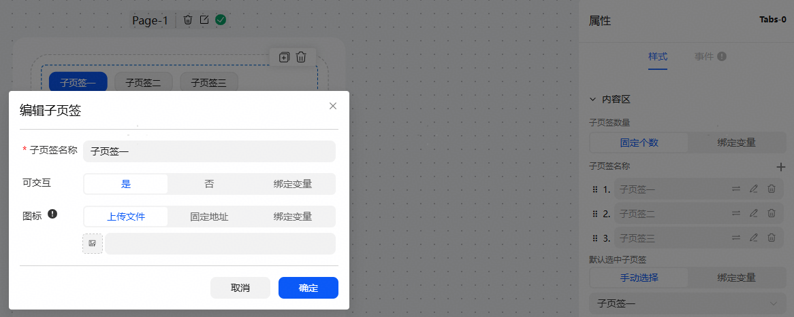
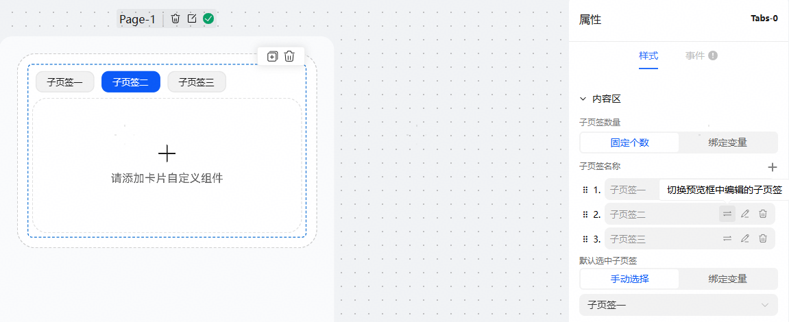
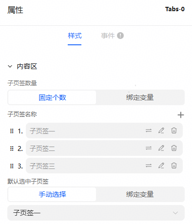
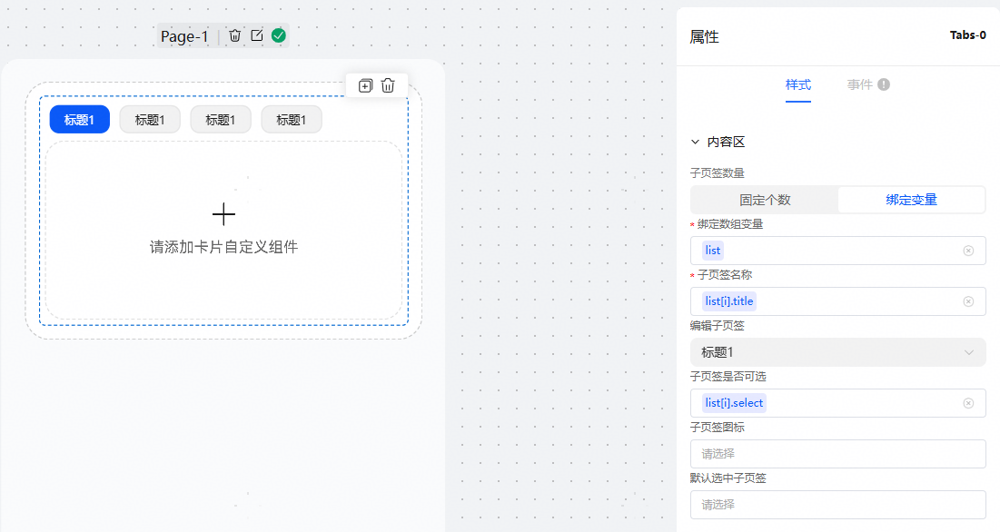
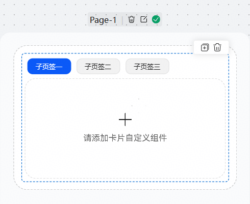
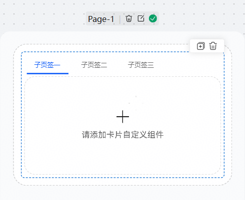
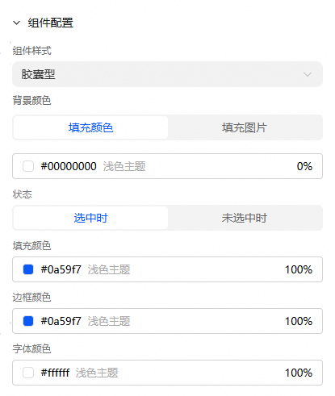
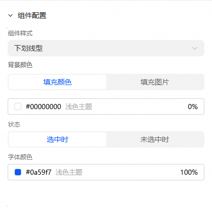
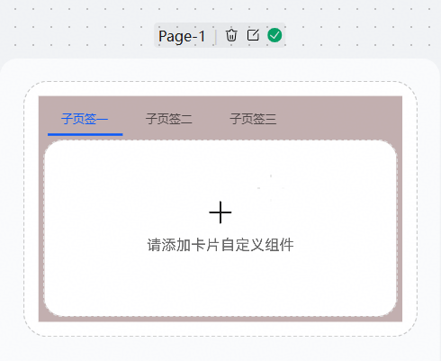

# 多页签组件用法

一、子页签个数允许设置固定个数和绑定变量。

切换子页签数量的类型会导致页签组件的所有子页签内容清空，请提前考虑好页签数量类型，谨慎切换。

点击切换子页签数量模式时，将弹出提示框确认是否更改：

1、固定个数

需要手动输入每个子页签的名称，点击编辑按钮可以配置子页签的交互属性和图标内容，图标内容非必填。

允许每个子页签下配置不同的内容，拖入组件配置即可，点击切换按钮，可以切换当前编辑的子页签。

允许删除和新增子页签。

默认选中子页签指的是卡片在端侧展示的时候的初始子页签，仅用于下发给端侧的字段，不影响云侧显示。

2、绑定变量

整个页签绑定一个数组变量，然后每个子页签的名称、可交互属性、图标、子页签具体内容绑定数组里的子元素的属性，类似列表，每个子页签的构成组件完全相同，具体值不同。

编辑子页签选框，等同于固定个数类型的切换按钮，用于切换不同的子页签预览。

默认选中子页签，等同于固定个数的默认选中子页签，用于卡片在端侧展示的时候的初始子页签，仅用于下发给端侧的字段，不影响云侧显示。

二、组件配置

1、胶囊型和下划线型

胶囊型允许配置选中和未选中时的填充颜色、边框颜色、字体颜色，类似标签。

下划线型只允许配置选中和未选中时的字体颜色。

2、背景颜色

指的是整个子页签的背景颜色。

