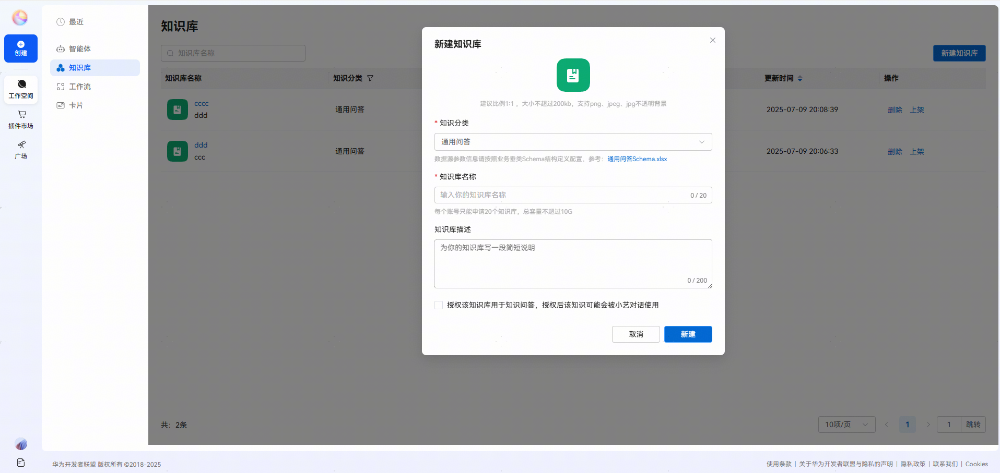
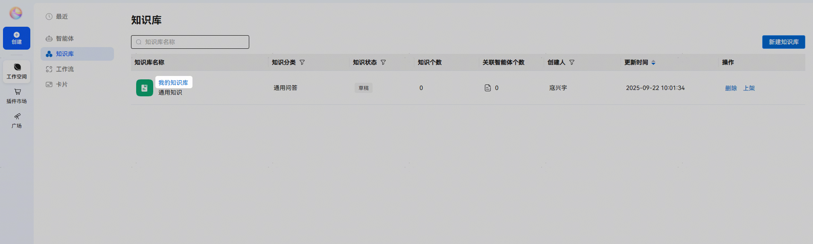
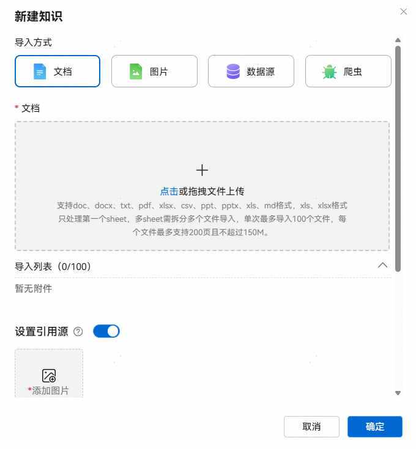
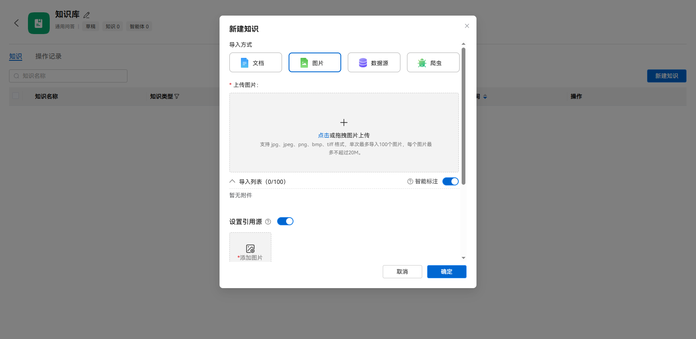
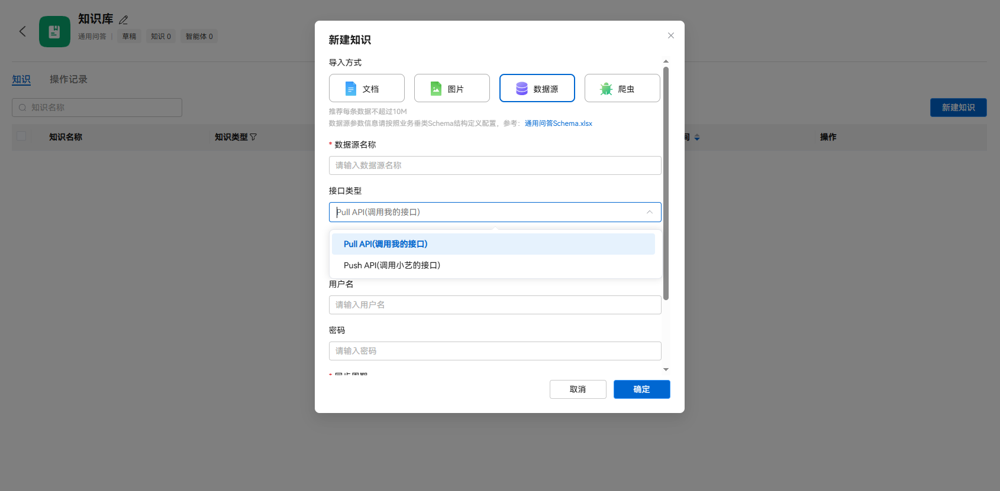

# 创建知识库

在小艺智能体平台页面，通过【工作空间】-【知识库】-【新建知识库】，进入新建知识库流程。

PS：若勾选【授权知识库用于知识问答，授权后该知识可能会被小艺对话使用】，该数据库上架审核周期为1-3个工作日。

从列表点击知识库名称进入知识列表页面。

选择对应的知识类型填写相关信息：

1. **导入方式-文档**：使用文档形式导入知识数据，可以配置引用源信息；

   
2. **导入方式-图片**：使用图片形式导入知识数据，可以配置引用源信息，可以选择对图片智能标注；

   
3. **导入方式-数据源**：配置接口的形式导入知识数据，按提示填写相关信息；

   
4. **导入方式-爬虫**：填写爬取地址，配置爬取周期自动爬取所需的知识数据。

