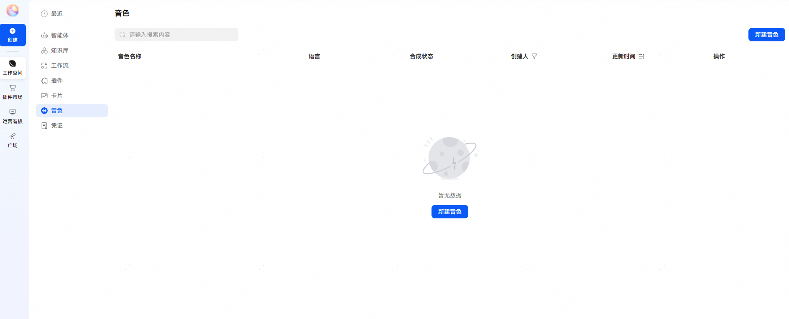
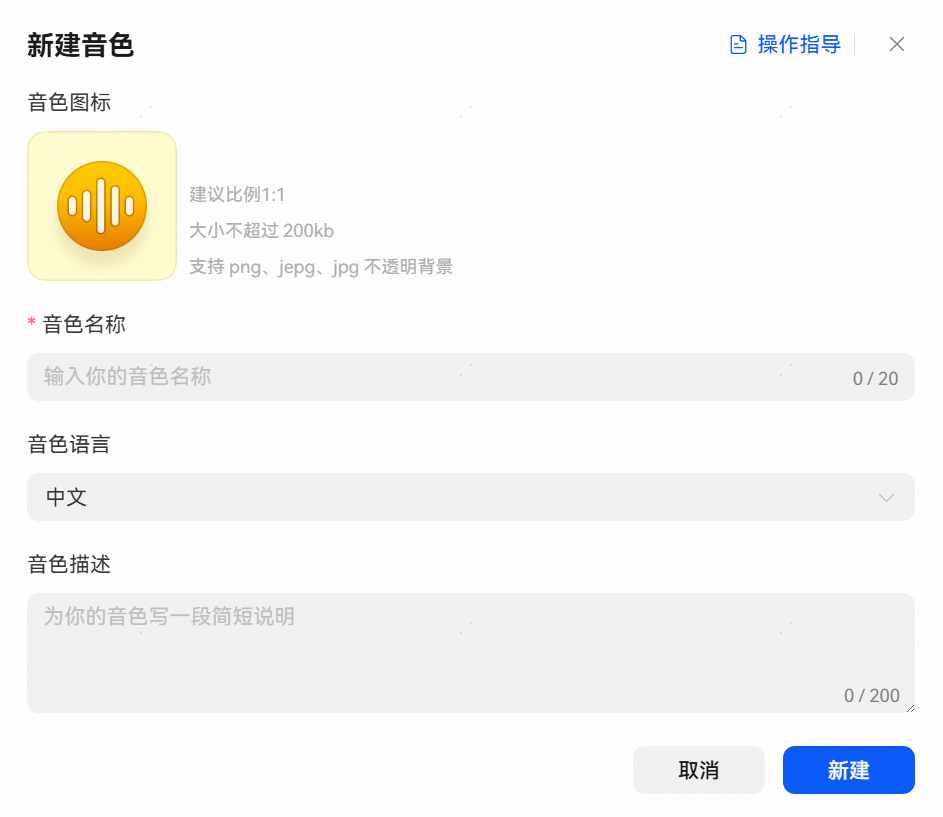
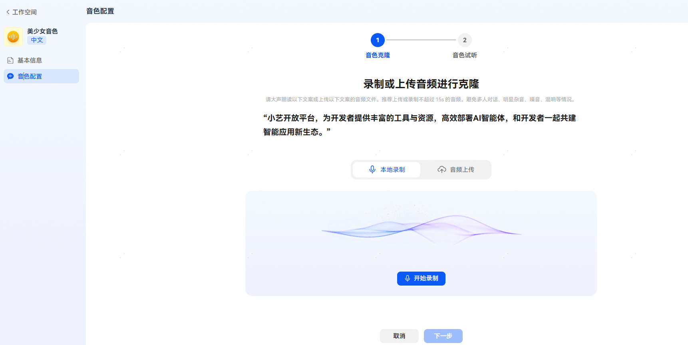
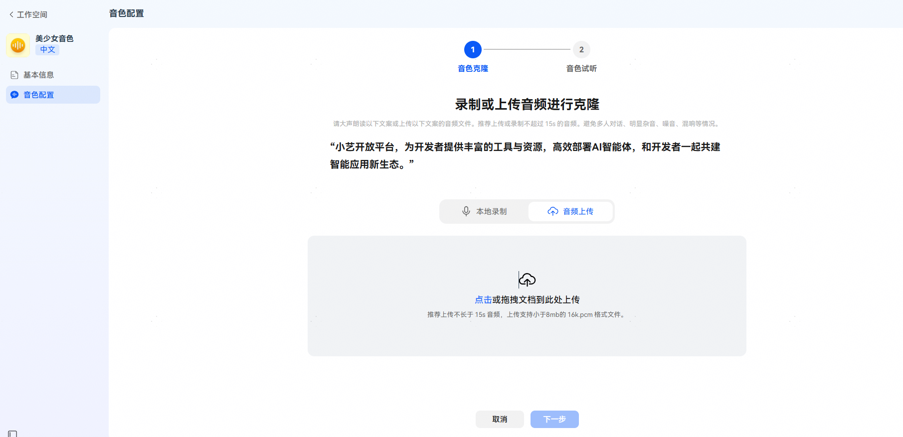
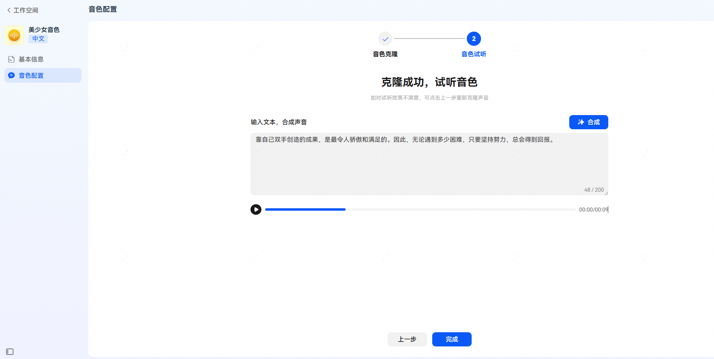
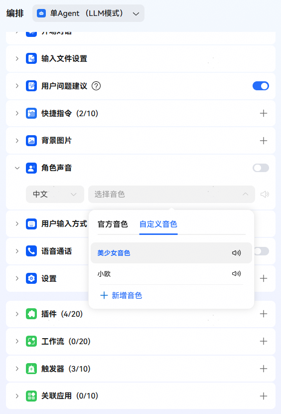

# 开发音色

## 功能介绍

平台支持开发者创建个性化音色资源，创建完成后可以在智能体角色声音中使用，从而实现更自然的语音交互体验。注意：目前音色创建功能仅对企业用户开放，且同一账号最多允许创建5个音色。

## 1、新建音色

进入小艺开放平台，选择【工作空间】-【音色】，点击新建音色，设置音色图标、音色名称和音色描述后点击新建。

## 2、音色克隆

音色配置页面点击【开始克隆】，支持录制或上传音频进行音色克隆。

* 本地录制：朗读平台提供的文案直接录制。
* 音频上传：上传本地预先录制完成的音频文件，音频内容需为平台提供的文案。

克隆完成后，点击【合成】，系统将根据文本和克隆音色合成音色，以供试听。

## 3、使用自定义音色

音色资源创建完成后，可在智能体编排页【角色声音】中设置使用。注意：仅在角色声音切换开关关闭时支持使用自定义音色。

