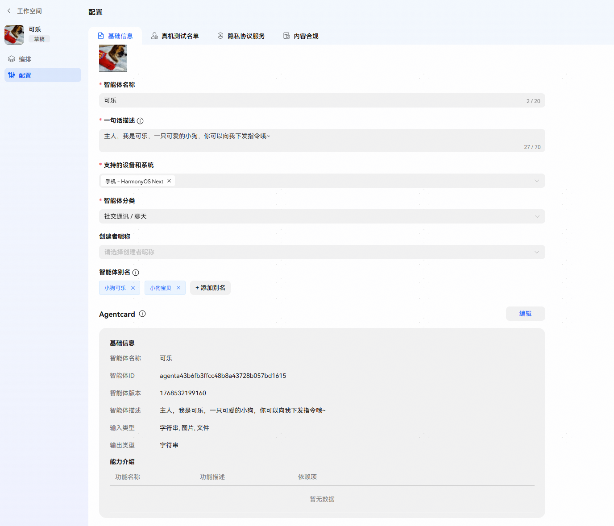

# 配置-基础信息

创建智能体后，开发者可以进入智能体配置页面对智能体基础信息进行编辑。支持编辑智能体图标、智能体名称、智能体一句话描述、智能体支持的设备和系统、创建者昵称、智能体分类、智能体别名、AgentCard。

**图标**：上传的图标建议比例1:1正方形图片，大小不超过5M，支持png、jpeg、jpg不透明背景。

**智能体名称**：支持编辑智能体名称，智能体名称为必填项，不能编辑为空。

**智能体分类**：开发者可根据智能体能力选择适合的智能体分类。

**支持的设备和系统**：开发者可编辑智能体支持的设备和系统，支持多选。（HarmonyOS NEXT为设备系统ROM版本5.X以上，HarmonyOS为设备系统ROM版本4.X）

| 支持的设备和系统 |
| --- |
| 手机 - HarmonyOS NEXT |
| 平板 - HarmonyOS NEXT |
| PC - HarmonyOS NEXT |
| 手表 - HarmonyOS NEXT |
| 手机 - HarmonyOS |
| 平板 - HarmonyOS |
| 车机 - HarmonyOS |

**创建者昵称**：不配置默认为此账号设置的创建者昵称（查看方式：点击头像-账号设置-创建者昵称）；企业开发者也可选择已创建并通过审核的创建者昵称。

**一句话描述**：开发者可根据智能体的实际功能对智能体进行描述，描述会直接显示在智能体的详情页内展示给用户查看。

**智能体别名**：用于智能体分发，提高分发准确率，支持配置多个别名。

**AgentCard**：

AgentCard相当于智能体的“名片”，用户描述智能体的能力和技能。主要用于小艺主对话分发智能体，可支持部分字段编辑。

AgentCard字段会根据智能体当前的基础信息与配置的插件与工作流配置自动同步生成，同时支持新增和编辑AgentCard中的能力，可编辑功能名称、功能描述、依赖项。

典型字段如下：

| <strong>自动同步字段</strong> | <strong>子项</strong> | <strong>可编辑</strong> | <strong>描述</strong> |
| --- | --- | --- | --- |
| 智能体名称 |  | 否 |  |
| 智能体ID |  | 否 |  |
| 智能体版本 |  | 否 |  |
| 智能体描述 |  | 否 |  |
| 输入类型 |  | 否 | 同步自智能体输入文件设置，多选值；可以包含 字符串、文件、图片。 |
| 输出类型（默认为字符串） |  | 否 | 预留字段，默认为字符串。 |
| 智能体功能（功能同步自智能体插件与工作流） |  | 是 | 智能体功能列表，支持新增、编辑、删除列表中的智能体功能。 |
|  | 功能名称 | 是 | 同步自插件的工具名称和工作流名称。 |
|  | 功能描述 | 是 | 同步自插件的工具描述和工作流描述。 |
|  | 依赖项 | 是 | 同步自能力依赖的端插件，云插件无依赖项。 |