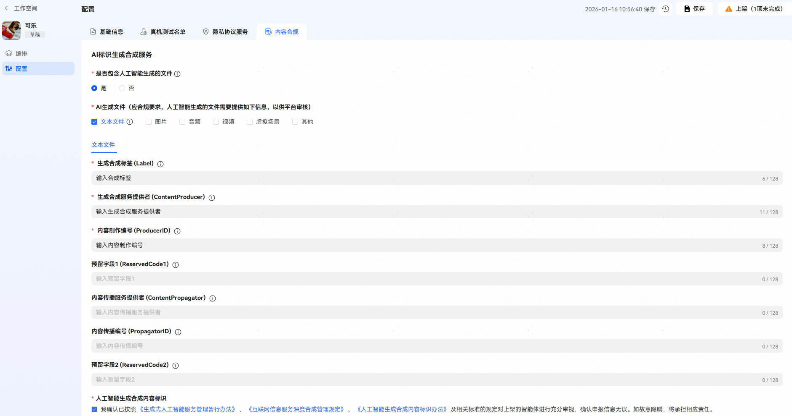
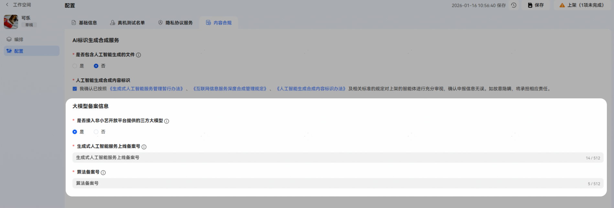

# 配置-内容合规

## 概述

应国家法律规定和网信办合规要求：[《生成式人工智能服务管理暂行办法》](https://www.cac.gov.cn/2023-07/13/c_1690898327029107.htm)、[《互联网信息服务深度合成管理规定》](https://www.cac.gov.cn/2022-12/11/c_1672221949354811.htm)、[《人工智能生成合成内容标识办法》](https://www.cac.gov.cn/2025-03/14/c_1743654684782215.htm)、[《国家互联网信息办公室关于发布生成式人工智能服务已备案信息的公告》](https://www.cac.gov.cn/2024-04/02/c_1713729983803145.htm)，智能体上架前，需完成“人工智能生成合成内容标识”和“大模型备案信息”填写 ，以供平台审核；可在智能体【配置】-【内容合规】中填写。

## 人工智能生成合成内容标识

“人工智能生成合成内容标识”填写智能体是否涉及人工智能生成的内容，开发者需按照国家法律规定如实在这里填写申报。

人工智能生成合成内容标识填写说明：

| 填写项 | 说明 |
| --- | --- |
| 是否包含人工智能生成合成内容文件 | 结果中是否包含AI生成合成内容，如文本文件、图片、音频、视频、虚拟场景等；若包含选择“是”，否则选择“否”。 |
| AI生成文件 | 涉及AI生成合成内容文件时必填，根据实际勾选对应AI生成文件类型，并填写人工智能生成合成内容标识。 |
| 人工智能生成合成内容标识 | 请仔细阅读相关规定后勾选。 |

“是否包含人工智能生成合成内容文件”选择“是”时需填写人工智能生成合成内容标识。人工智能生成合成内容标识详情可参考[《人工智能生成合成内容标识方法》](https://openstd.samr.gov.cn/bzgk/std/newGbInfo?hcno=F32EA2A561F1886CD8D606513512D547)。

人工智能生成合成内容标识配置及说明：

| 填写项 | 说明 |
| --- | --- |
| 生成合成标签 (Label) | 存储内容属于、可能、疑似为人工智能生成合成的属性信息：属于人工智能生成合成内容的，值取1；可能为人工智能生成合成内容的，值取2；疑似为人工智能生成合成内容的，值取3。 |
| 生成合成服务提供者 (ContentProducer) | 存储生成合成服务提供者的名称或编码。 |
| 内容制作编号 (ProducerID) | 存储生成合成服务提供者对该内容的唯一编号。 |
| 预留字段1 (ReservedCode1) | 可存储用于生成合成服务提供者自主开展安全防护、保护内容、标识完整性的信息。 |
| 内容传播服务提供者 (ContentPropagator) | 存储内容传播服务提供者的名称或编码。 |
| 内容传播编号 (PropagatorID) | 存储内容传播服务提供者对该内容的唯一编号。 |
| 预留字段2 (ReservedCode2) | 可存储用于内容传播服务提供者自主开展安全防护、保护内容、标识完整性的信息。 |

## 大模型备案信息

开发者如果在智能体中接入了非小艺开放平台提供的三方大模型，需在此处申报备案，多个备案号使用英文逗号分隔。生成式人工智能服务上线备案号查询：登录[《国家互联网信息办公室关于发布生成式人工智能服务已备案信息的公告》](https://www.cac.gov.cn/2024-04/02/c_1713729983803145.htm)查询、算法备案号查询：登录[《互联网信息服务算法备案系统》](https://beian.cac.gov.cn/#/index)查询。

