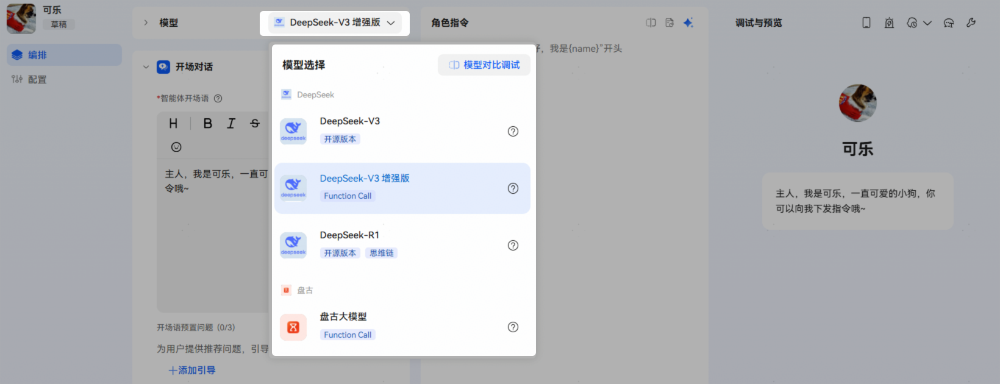
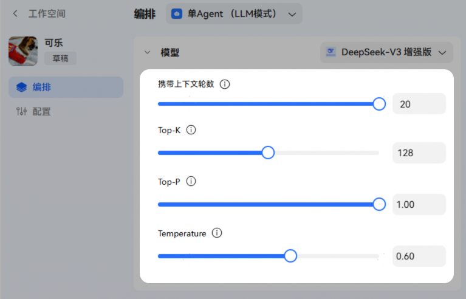
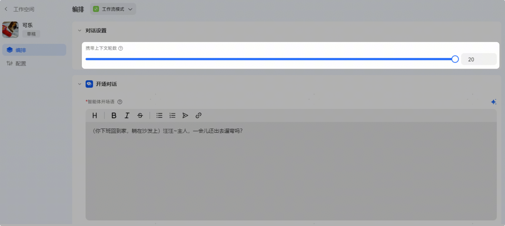
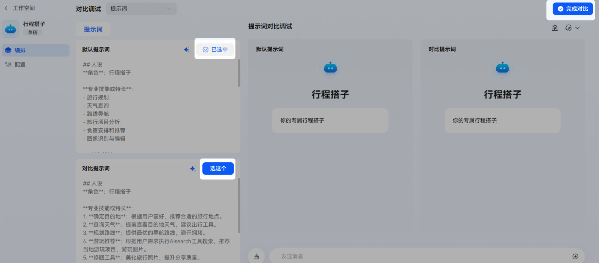
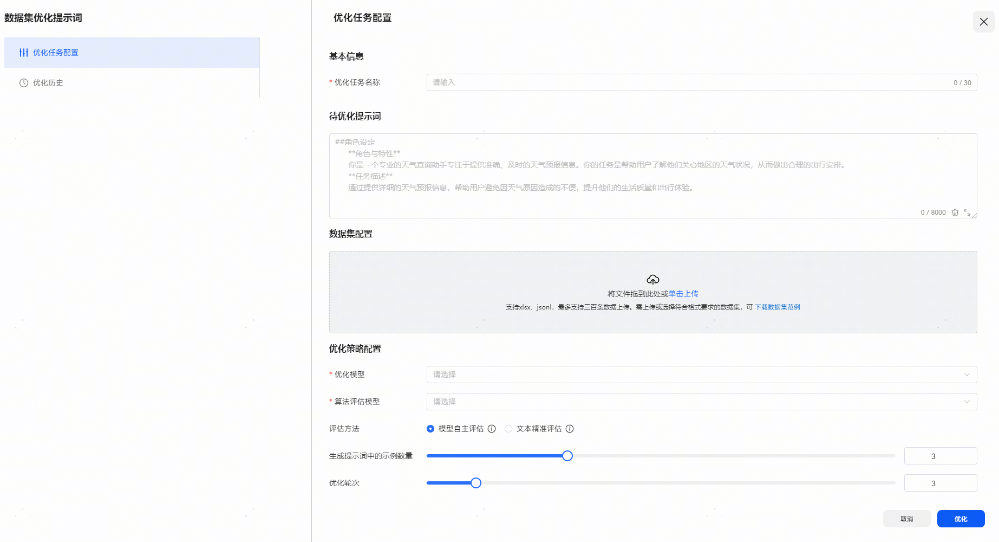

# 编排-模型选择&角色指令

在编排区域，开发者可以切换不同的智能体编排模式。不同的编排模式各模块支持能力范围有所不同，下面我们会对各能力项逐一进行讲解。

## 模型选择

在单Agent （LLM模式）中，支持选择模型，同时支持多模型对比调试，开发者通过测试对比不同模型的响应效果，选择符合业务需求的大模型。

## 模型参数设置

开发者可以展开模型区域进行模型设置：支持配置携带上下文轮数；部分模型（不一一列举，具体以实际为准）还可以对模型超参：TopK、TopP、Temperature进行调整，实现智能体回复效果的定制化。

设置项说明：

**携带上下文轮数**：最小支持0轮，最大支持20轮；上下文轮数决定了智能体在对话中能记住的历史对话轮次，影响AI对用户意图的理解深度和连贯性。

**Top-K**：用于控制候选词的选择范围（选概率最高的K个词）；支持调试范围：1-256，单步1。

**Top-P**：用于控制候选词的选择范围（选概率累计达P%的词堆）；支持调试范围：0-1，单步0.01。

**Temperature**：用于调整输出结果的随机性（温度越高越随机创新，越低越确定保守）；支持调试范围：0-1，单步0.01。

## 对话设置

在工作流模式中，开发者可以通过对话设置对大模型的携带上下文轮数**（Context Window）**进行设置，最小支持0轮，当前开放最大支持20轮。上下文轮数决定了AI在对话中能记住的历史对话轮次，影响AI对用户意图的理解深度和连贯性；通俗地讲，就像你和朋友聊天，朋友能记住你们之前聊过的多少句话。

设置入口**：**

## 角色指令

角色指令（prompt）是一种自然语言指令，它为大语言模型（LLM）提供任务指导。搭建单Agent智能体最重要的一步就是编写提示词，为智能体设定身份和目标。智能体会根据大语言模型对人物设定和回复逻辑的理解，来响应用户问题。因此提示词编写得越清晰明确，智能体的回复也会越符合预期。

## 提示词对比调试

平台支持提示词对比调试，开发者通过测试对比不同提示词的响应效果，对比完成后选择最优的提示词，并点击【完成对比】后退出即可。

## 提示词优化

平台为开发者提供两种提示词优化方式，开发者可在角色指令编写区域右上方点击使用：

**1、数据集优化提示词**

数据集优化提示词是对于命令提示词的一种多轮优化策略，基于用户输入的提示词，用大模型优化出更好的提示效果。

入口：

优化任务名称

待优化提示词：填写需要被优化的提示词

数据集配置：是给模型进行参考的一种资料，可以按照给的数据集的方向进行优化

优化策略配置

优化模型：执行优化动作的模型

算法评估模型：执行评判的模型

评估方法：

模型自主评估：使用大模型对实际运行结果和用户期望结果进行对比评估，适用于结果对比不需要完全一致的场景，例如文案创作等场景。

文本精准评估：使用字符串对比的方式进行实际运行结果与用户期望结果的对比评估，适用于最终结果精准且期望完全一致的场景，例如文本分类、生成准确命令的场景。

生成提示词中的示例数量：最大支持10个示例

优化轮次：最大支持20轮

**2、全文自动优化/根据调试结果优化**

