# 配置-隐私协议服务

## 概述

发布智能体时，您需要提供隐私政策，以便用户了解智能体的数据收集和使用情况；支持选择自定义隐私政策，或者使用平台隐私声明托管服务生成的隐私协议。

智能体添加隐私政策上架后，可以在手机端-智能体详情页-隐私和安全-隐私声明中展示给用户。

效果示例：

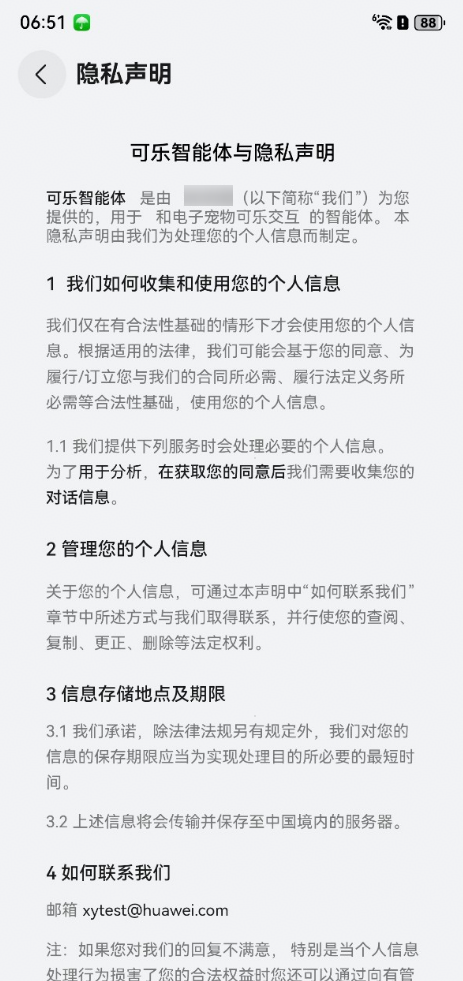

如果您已有描述隐私政策和用户隐私权利的隐私网址：在智能体【配置】-【隐私协议服务】页面，隐私声明处选择“自定义隐私政策”，在隐私政策网址中直接填写隐私网址，无需参考本章节进行隐私声明托管。

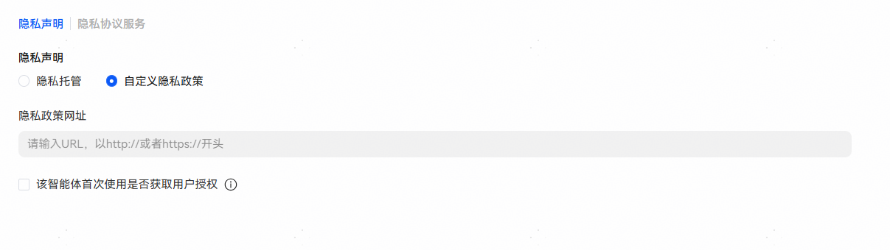

如果没有自定义隐私网址，平台提供了隐私声明创建和托管能力，可以参考本章节的指导进行配置。

## 配置隐私声明

通过平台提供的隐私声明托管服务基于标准化模板生成自己的隐私协议。

注意：

1）请如实填写，当用户个人信息处理或敏感权限调用等场景发生变动时，请及时更新隐私声明。如实际情况与本声明中内容不符，您将承担由此产生的法律责任及风险。

2）每个智能体可配置多个隐私协议，但上架时仅能关联1个隐私协议。

## 新建隐私协议

可以通过智能体【配置】-【隐私协议服务】页面，在隐私声明处选择“隐私托管”，点击【协议服务】，跳转到智能体配置-隐私协议服务页面，点击【新建协议】创建。

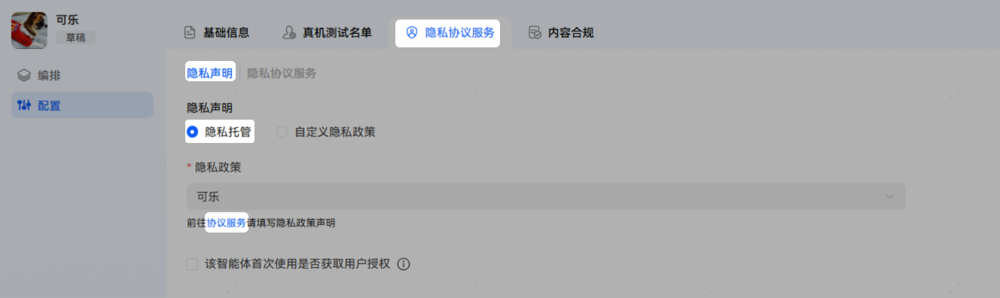

也可以直接通过智能体【配置】-【隐私协议服务】页面，点击【新建协议】创建。

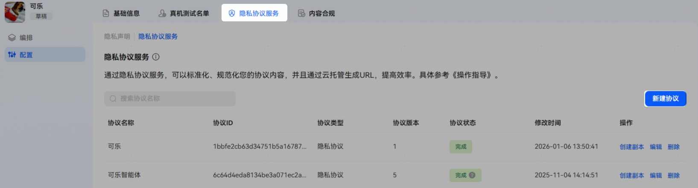

点击新建协议后，在弹出窗口中填写“协议名称”，点击“创建”后，开始编辑隐私协议。

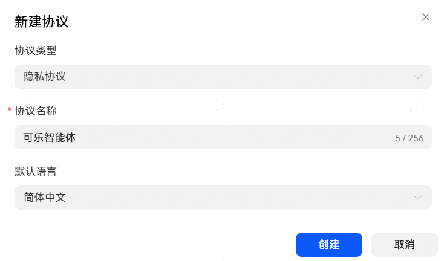

## 编辑隐私协议

完整协议包含多块内容，您需要逐个配置完成，在配置过程中，您可以随时点击右上方的“保存”按钮保存已填写内容。

**导语部分**

导语内容模板比较固定，提供如下信息：

智能体介绍：简单介绍智能体提供的功能。

重要提示或版本变更说明：描述协议相对上个版本的变更点或重要提示点。

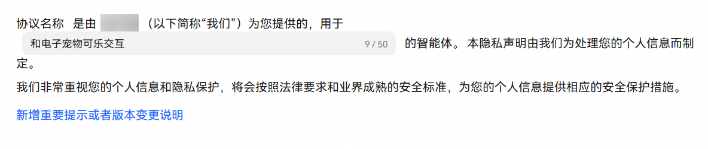

**“我们如何收集和使用您的个人信息”部分**

“我们提供下列服务时会处理必要的个人信息”：提供服务时会处理的个人信息项说明，默认收集用户对话信息；若涉及其他数据项，可通过“新增数据信息”添加，添加后填写“个人信息采集用途”、“前提条件”以及补充说明（补充说明可选）。

“个性化推荐说明”（可选）：仅当向用户推送个性化推荐内容时，需要声明；可通过“新增数据信息”添加。

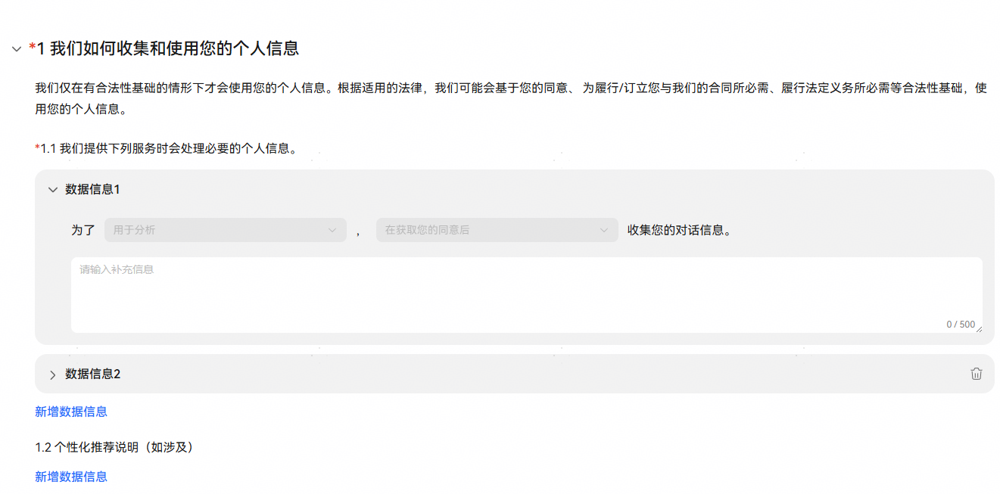

**“对未成年人的保护”部分（可选）**

声明对未成年人的保护政策；点击“增加对儿童保护声明”，生成对应声明模板，在模板中填写儿童隐私保护声明链接，以及补充说明（补充说明可选）。

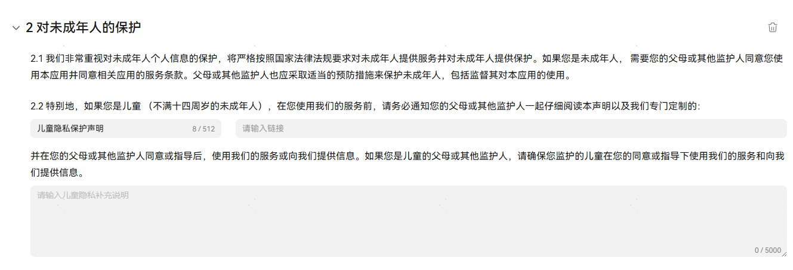

**“与第三方共享”部分（可选）**

如果涉及将用户个人信息提供给第三方，则需要对三方共享信息进行声明。点击“增加三方共享信息声明”，生成对应声明模板，填写共享数据的第三方公司的信息；如果将数据共享给多个第三方，点击“增加三方共享信息声明”，继续增加其他第三方共享信息说明。

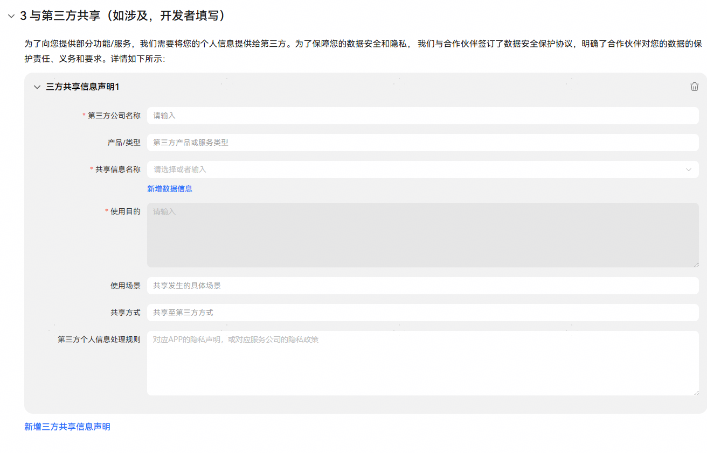

**“第三方MCP Server”部分（可选）**

如果涉及将用户个人信息提供给第三方MCP Server，则需要对三方MCP Server共享信息进行声明。点击“新增MCP Server信息”，生成对应声明模板，填写共享数据的第三方MCP Server的信息；如果将数据共享给多个第三方，点击“新增MCP Server信息”，继续增加其他第三方MCP Server共享信息说明。

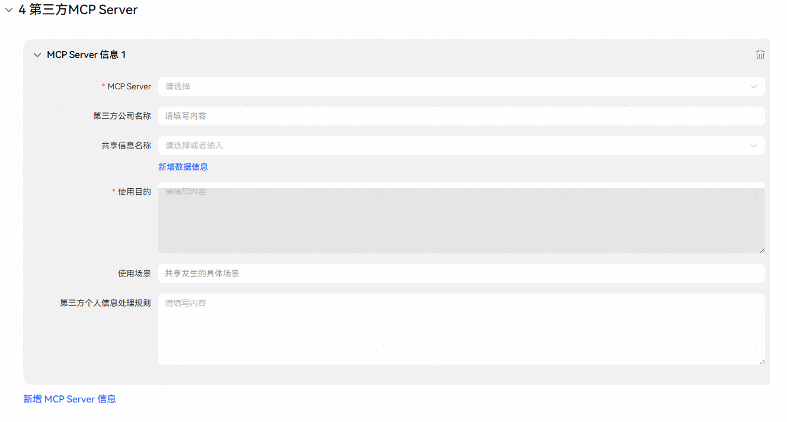

**“管理您的个人信息”部分**

固定内容，不可修改

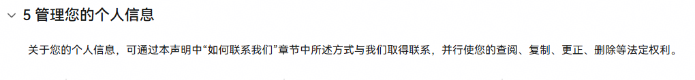

**“信息存储地点及期限”部分**

说明对用户信息的存储期限、存储位置。

设置个人数据存储期限：

1）固定存储期限：填写信息会存储的具体时间。

2）非固定存储期限：承诺保存期限为实现处理目的所必要的最短时间。

存储位置：固定为中国境内的服务器。

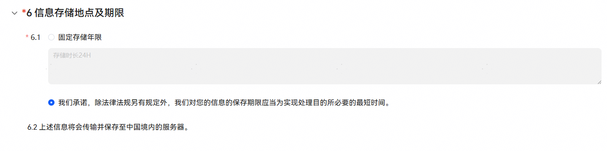

**“开发者自定义章节”部分（可选）**

如果有其他涉及用户利益、需要提示的事项或者免责说明，在本模块进行说明。

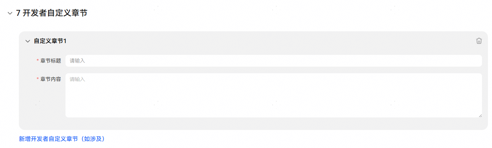

**“如何联系我们”部分**

提供用户联系您的方式。点击“增加商业联系方式”添加，可以配置电话、邮箱和公司地址三种联系方式。

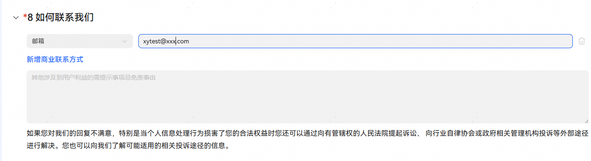

**“隐私政策生效日期”部分**

设置当前隐私政策的生效日期。

## 预览隐私协议

所有内容编辑完成，可以点击右上角“预览”查看协议生成效果。

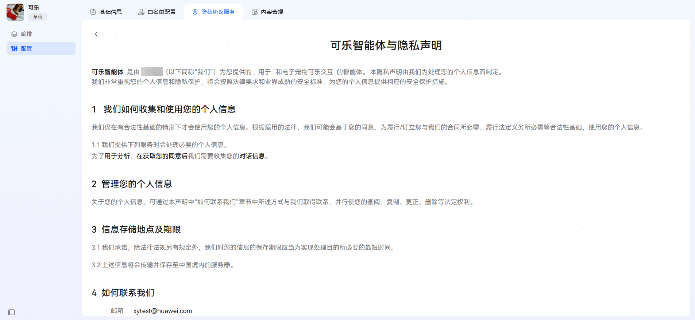

## 生成隐私协议

隐私协议配置完成后，点击【生成协议】，生成后的隐私协议状态为“完成”，完成状态的协议可供智能体上架时关联。

保存后的隐私协议可通过“编辑”修改协议内容，编辑后需再次点击【生成协议】完成协议更新。

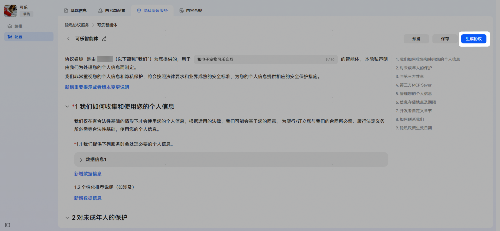

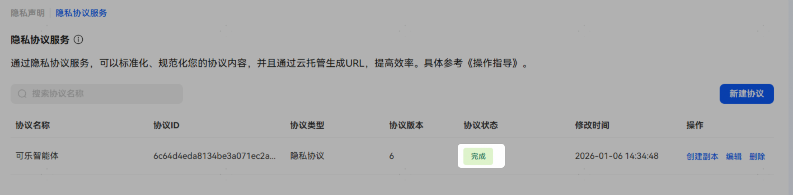

## 平台托管的隐私声明使用

智能体【配置】-【隐私协议服务】页面，隐私声明处选择“隐私托管”，并在“隐私政策”处关联“完成”状态的隐私协议。智能体上架并审核通过后，用户可在手机端-智能体详情页-隐私和安全-隐私声明中查看隐私政策。

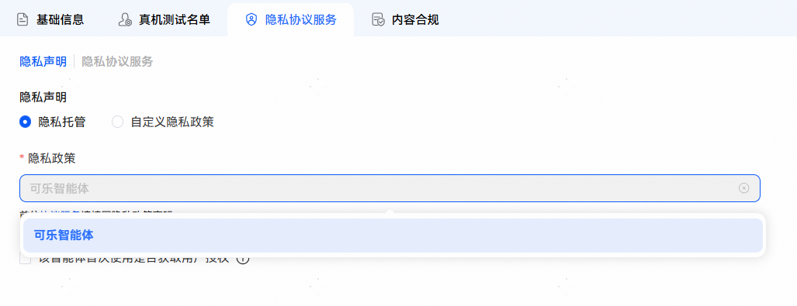

## FAQ

问题1：智能体选择隐私托管的隐私协议后，有错误提示？

回答：智能体关联托管的隐私协议后，平台会自动检测智能体编排涉及隐私相关项与选择的隐私协议中隐私相关项是否一致，若不一致会提示开发者补充，可通过点击“查看更新后的隐私协议”查看具体问题项。

点击“查看更新后的隐私协议”后，可以通过“编辑原文”在原协议中补充，也可以点击“继续使用”新建一个“修改后（自动生成）”的协议，然后点击“生成协议”更新或生成新协议供智能体上架时关联。

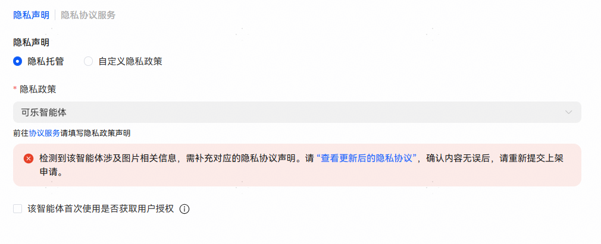

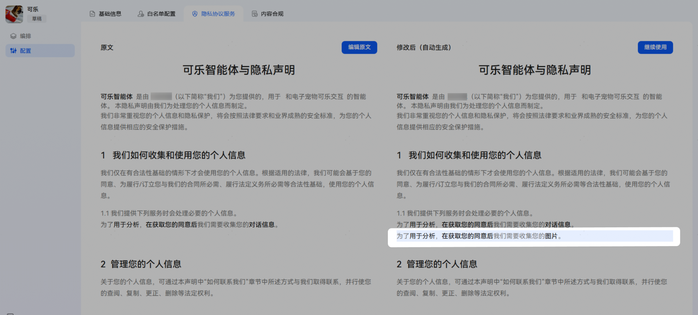

问题2：平台创建的隐私协议已修改并保存，上架后选择的仍是旧版隐私协议？

回答：协议生成后，若发生编辑，需再次点击“生成协议”完成协议更新。

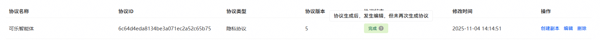
