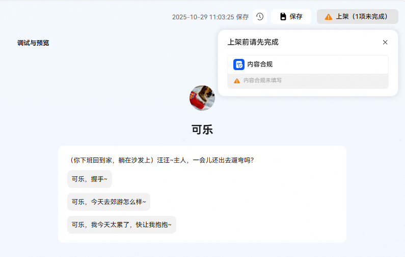

# 上/下架、升级流程介绍

执行上架操作，并且已经审核通过的智能体，才能被其他用户搜索并使用。

升级审核未通过的智能体，线上依旧保留上一次通过审核的智能体版本提供给其他用户使用。

下架后的智能体，用户无法再使用。开发者可以选择编辑后再次提交上架申请。

**上架前注意事项：**

受隐私风险影响，当前暂不支持上架包含私有云插件及私有MCP插件的个人智能体。仅支持页面调试能力。

智能体发起上架操作前，需通过平台校验。若不满足上架条件，需先完成检查清单中待完成项后方可发起。

**上下架操作&权限管控：**

团队账号下仅团队管理员权限可发起智能体上下架等操作。

方式1：开发者可通过智能体编排页面内右上角【上架】/【升级】按钮发起审核。

方式2：开发者可通过【工作空间】-【智能体】页签内，智能体列表中的操作区域进行【上架】【下架】【升级】【撤回】等操作。

**智能体审核周期：**

智能体审核周期为1-3个工作日，开发者可根据上架审核规范查看相关规则，并完成真机测试体验后提交审核以提高审核通过率。

**变更审核不通过原因查看**

Q：当开发者发起的智能体上架/升级、下架申请被驳回时，需要如何查看审核意见？

A：

1、开发者可通过智能体编排页面的【版本记录】查看。

以智能体上架审核不通过为例，开发者点击智能体进入智能体编排页面，点击页面右上方【保存】左侧【版本记录】图标。即可通过对应版本审核结果处查阅审核意见。

2、开发者可通过【工作空间】-【智能体】页签内，智能体列表中的状态tag查看。

在智能体列表页，对于审核状态为“升级审核不通过”“上架审核不通过”“下架审核不通过”“经审核强制‘已下架’的智能体”，鼠标悬浮在tag上即可查看具体的审核意见。

