# 卡片使用实践教程

若想要更具体地了解各组件的使用方法，事件配置及其他功能的详细说明，可点击[实践教程](https://developer.huawei.com/consumer/cn/training/study-path/121760148615534232)查看教学视频。

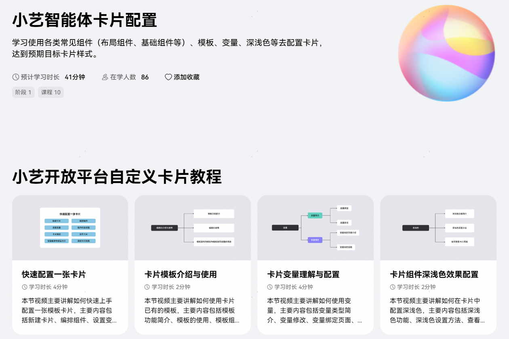

1、[快速配置一张卡片](https://developer.huawei.com/consumer/cn/training/course/video/C501759129926436163)

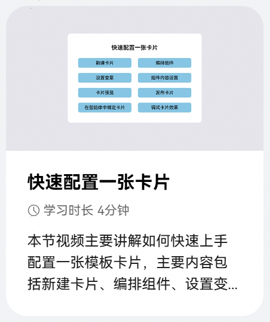

2、[卡片模板介绍与使用](https://developer.huawei.com/consumer/cn/training/course/video/C101759130062735082)

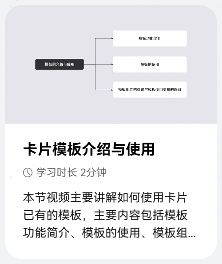

3、[卡片变量理解与配置](https://developer.huawei.com/consumer/cn/training/course/video/C101759130516457083)

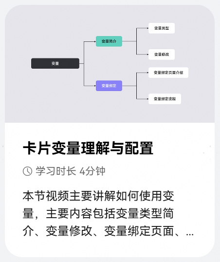

4、[卡片组件深浅色效果配置](https://developer.huawei.com/consumer/cn/training/course/video/C101759130607488084)

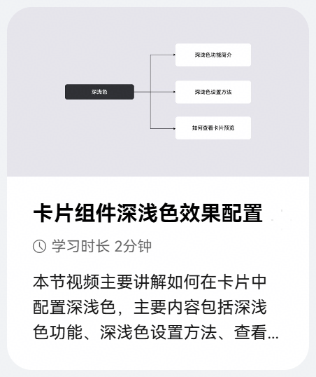

5、[卡片横向组件配置](https://developer.huawei.com/consumer/cn/training/course/video/C501759130703518164)

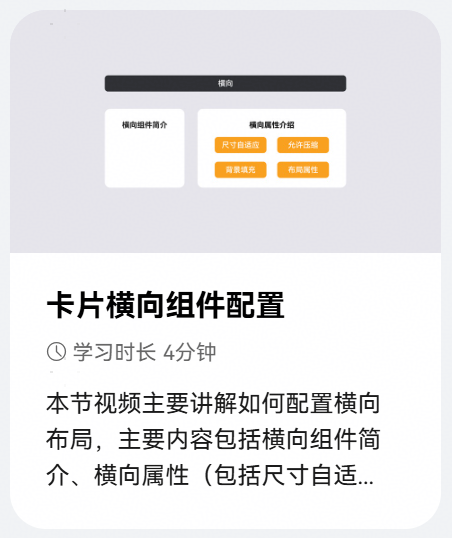

6、[卡片纵向组件配置](https://developer.huawei.com/consumer/cn/training/course/video/C201759130809414513)

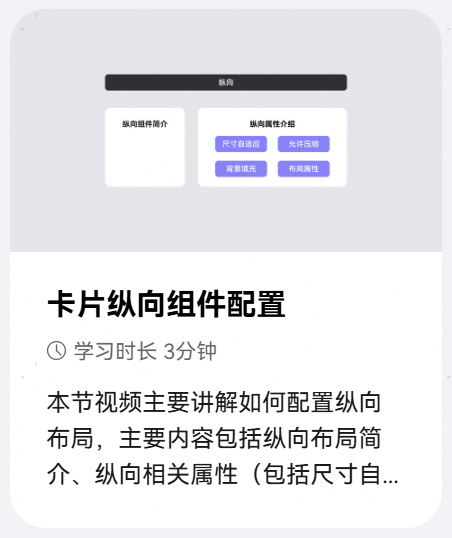

7、[卡片动态列表组件配置](https://developer.huawei.com/consumer/cn/training/course/video/C201759130936372514)

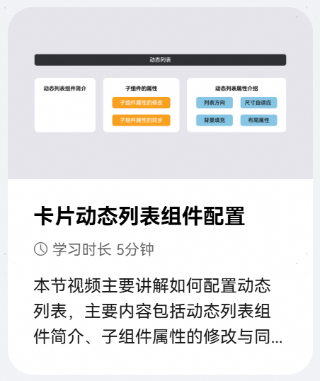

8、[卡片堆叠组件配置](https://developer.huawei.com/consumer/cn/training/course/video/C101759131094830085)

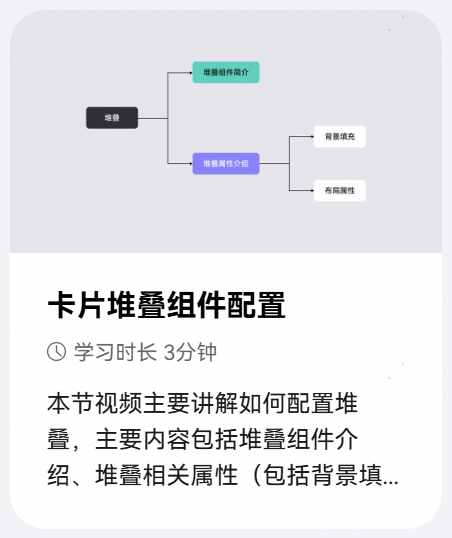

9、[卡片基础组件配置](https://developer.huawei.com/consumer/cn/training/course/video/C401759131323001753)

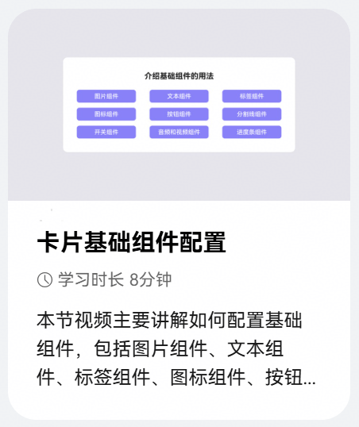

10、[卡片事件类型配置](https://developer.huawei.com/consumer/cn/training/course/video/C401759131547323754)

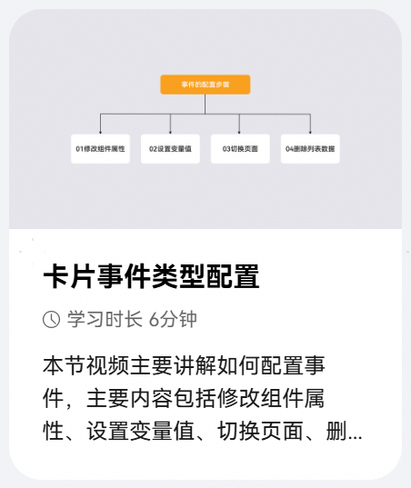
