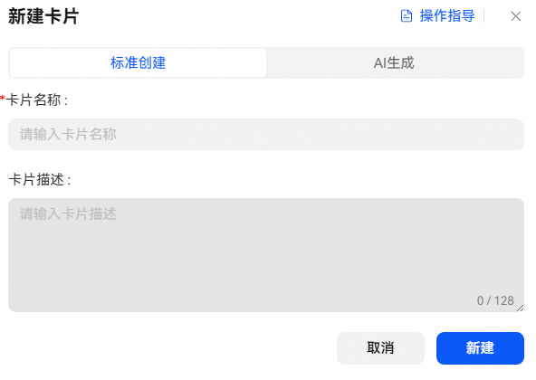
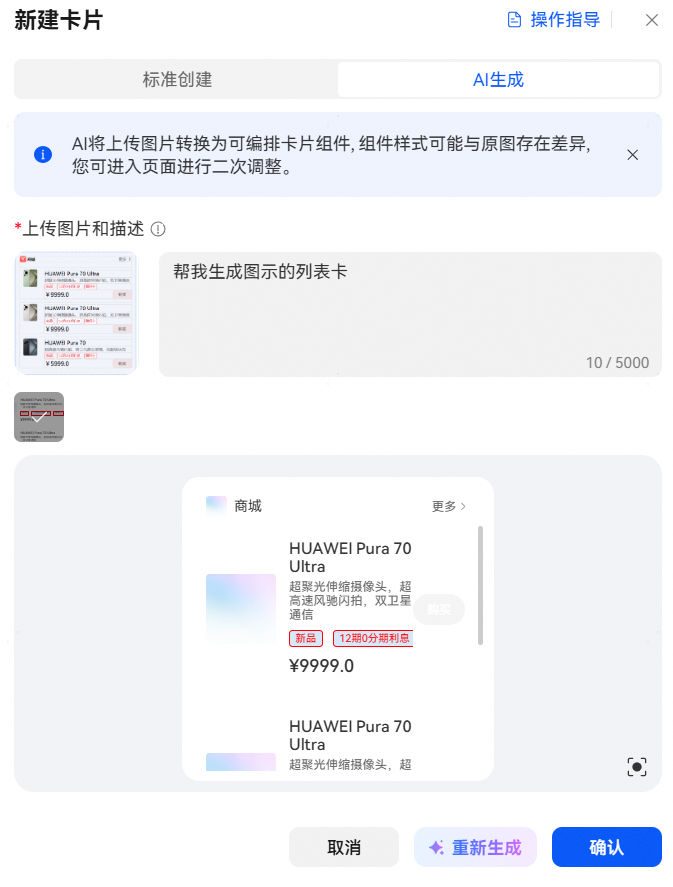
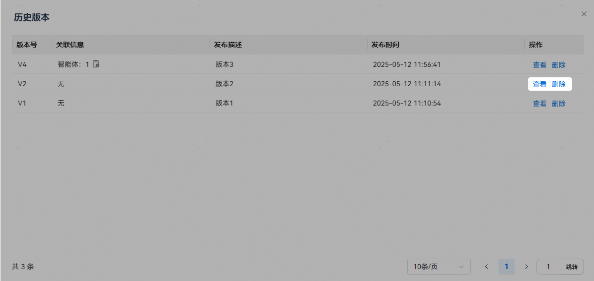
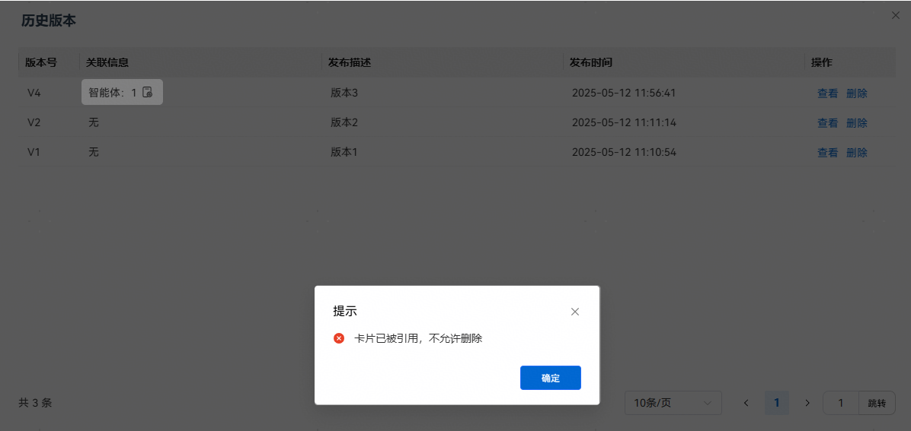

# 新建卡片

卡片功能描述：支持智能体以消息卡片的形式发送消息，卡片的所有者支持创建、编辑、查看和删除自己创建的卡片，并将卡片与智能体绑定。

进入小艺开放平台，点击【工作空间】-【卡片】-【新建卡片】，填写卡片信息后即可新建。卡片创建有两种方式：

1、标准创建：输入卡片名称和卡片描述后，参考[自定义卡片编辑](https://developer.huawei.com/consumer/cn/doc/service/custom-card-editing-0000002471264337)创建卡片。

2、AI生成创建：将上传的示例图片结合卡片描述转换为可编排的卡片组件。

* 图片不得低于10\*10像素，不能超过1024\*1024像素；大小不超过5M，且仅支持解析JPG/PNG格式。
* 卡片生成预计耗时1~3min，请耐心等待。
* 生成的卡片可能在结构和样式上与原图有差异，请点击确认添加到画布中调整。

已发布的版本只能查看，不能编辑。

已被关联的卡片不能删除。

