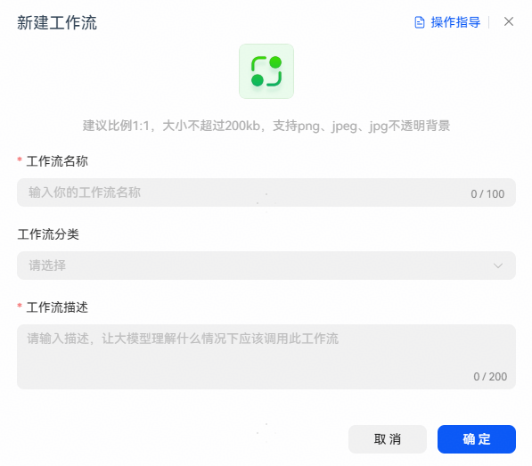
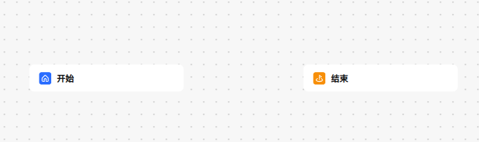
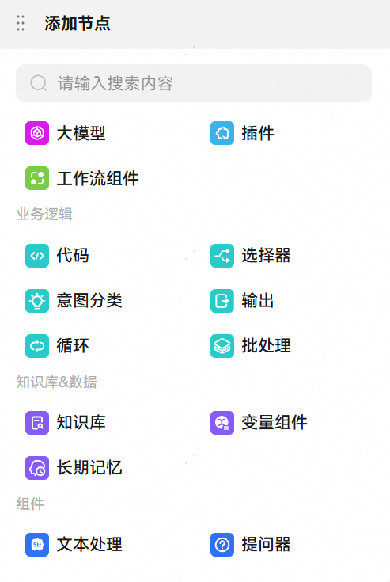
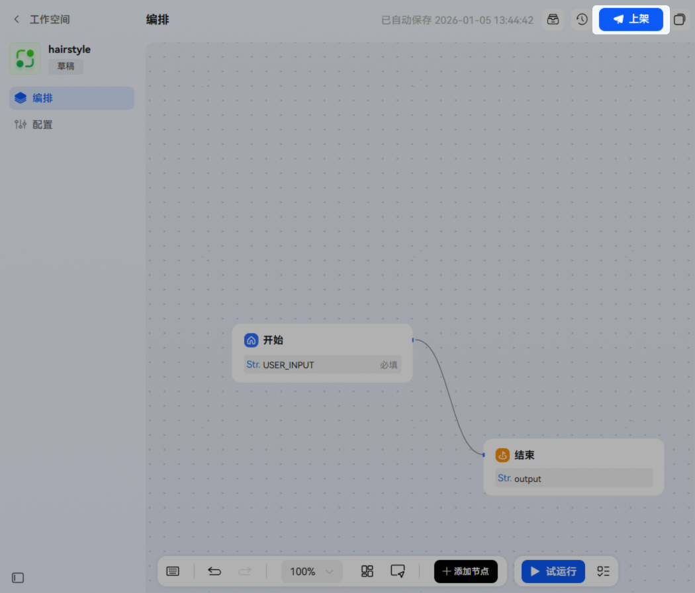

# 创建工作流

## 新建工作流

在小艺智能体平台页面，通过【工作空间】-【工作流】-【新建工作流】，进入新建工作流配置页面。设置工作流名称、分类、描述，并单击【确定】。

创建后页面会自动跳转至工作流的编辑页面，初始状态下工作流包含开始节点和结束节点。

## 编排工作流

开发者可以在画布中添加节点，并按照任务执行顺序连接对应节点，工作流内置了多种基础节点供开发者使用，开发者选择合适节点来执行特定任务。

1、在底部面板中选择要使用的节点。

2、将节点按任务流程相连接。

3、配置节点的输入和输出参数。

## 测试并发布工作流

开发者如需在智能体内使用该工作流，必须先完成工作流的上架。

1、单击【试运行】，运行成功的节点边框将显示为绿色，用户可在页面右侧弹窗中查看节点的输入输出以及运行的调测树信息。

2、单击【上架】，调测成功的工作流方可发布上架。

