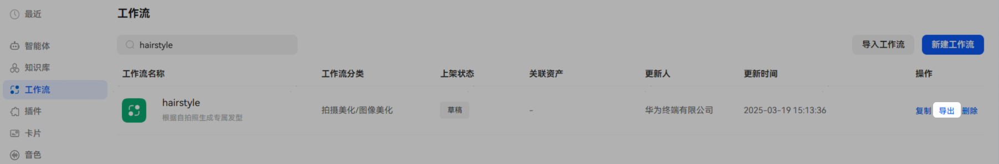
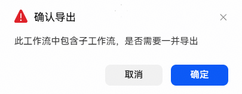
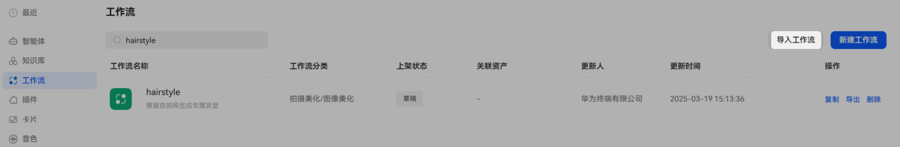
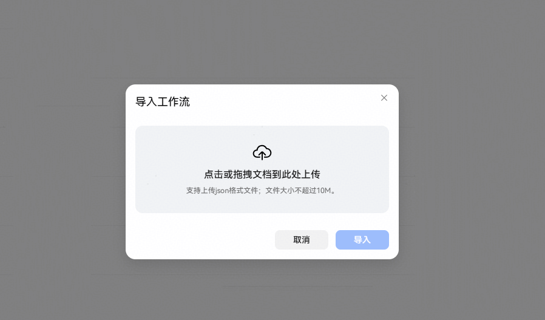
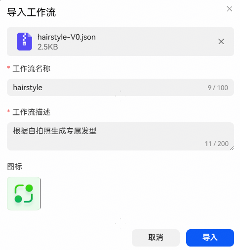
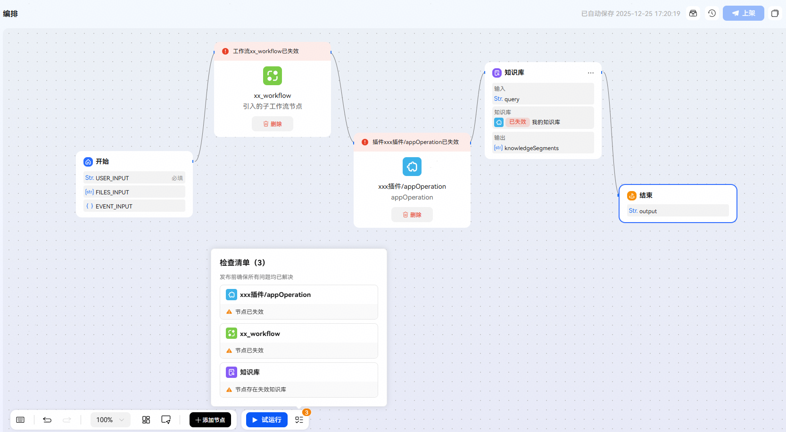

# 导入导出工作流

已创建的工作流支持导出，导出的工作流文件可以导入到任意工作空间；适用于跨账号复制工作流场景。

## 导出工作流

点击工作流操作项中的【导出】按钮，可以将此工作流导出为json文件，文件包含了该工作流各节点详细信息，可直接用于工作流导入。

如果工作流中包含工作流节点，导出时可通过提示弹框选择是否需要一并导出。

## 导入工作流

点击工作流列表右上方【导入工作流】，上传导出的工作流json文件，上传完成后系统将自动预填工作流名称、描述及图标，点击【导入】后即可完成导入创建。

注意：

（1）部分组件有效性和账号有关，导入后存在失效可能，如插件、知识库、工作流等，需手动清理并替换节点资源。

（2）如果工作流中包含子工作流节点，则需要先将子工作流导入后，试运行上架，再将主工作流导入后重新关联该子工作流方可使用。

