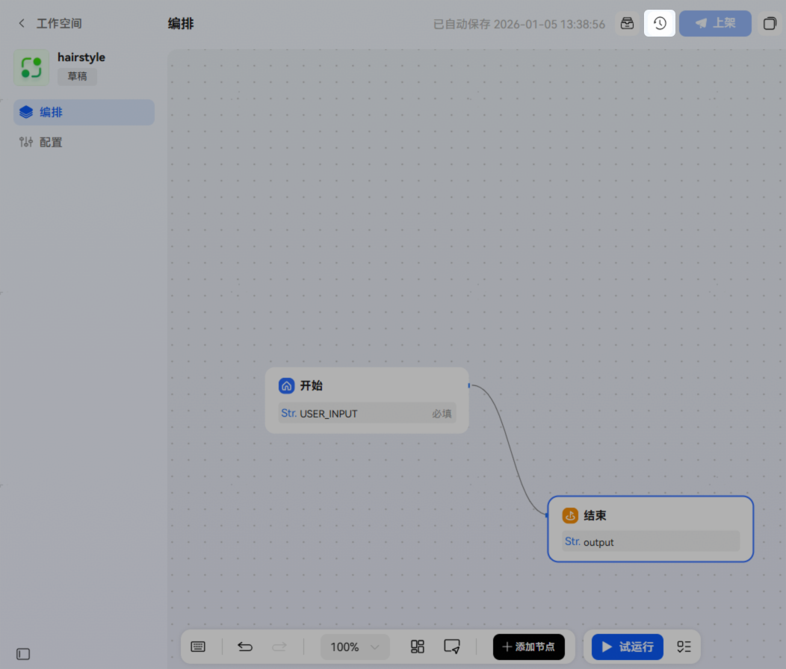
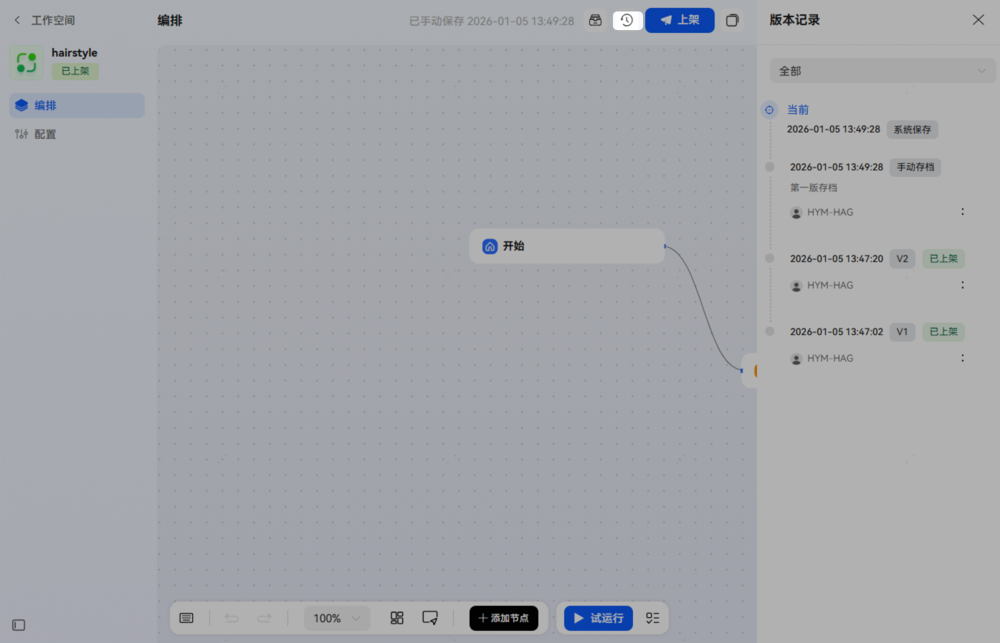
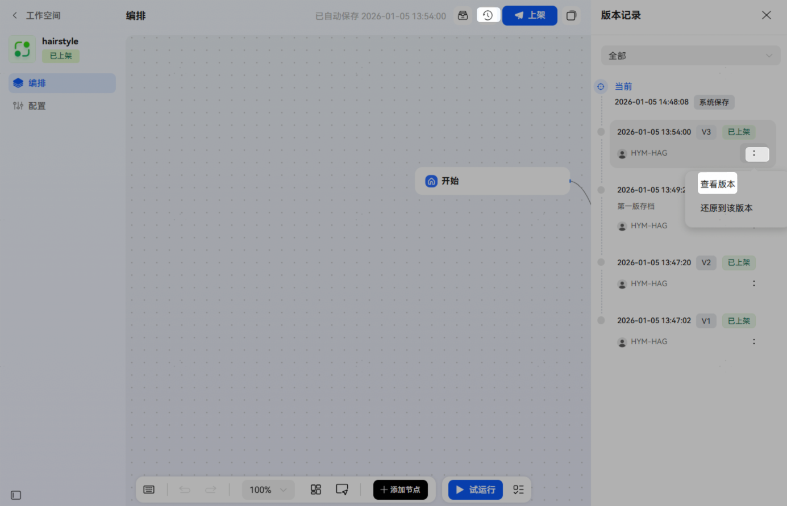
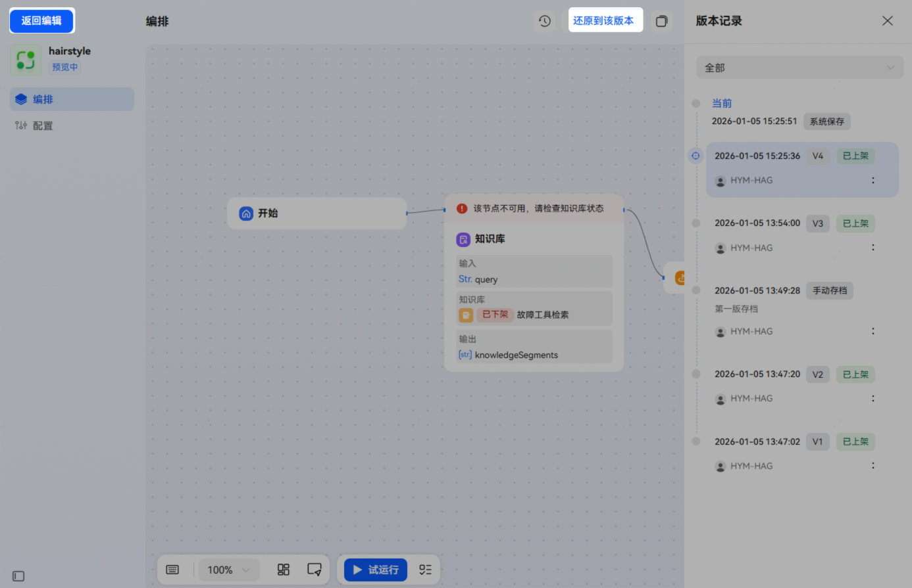
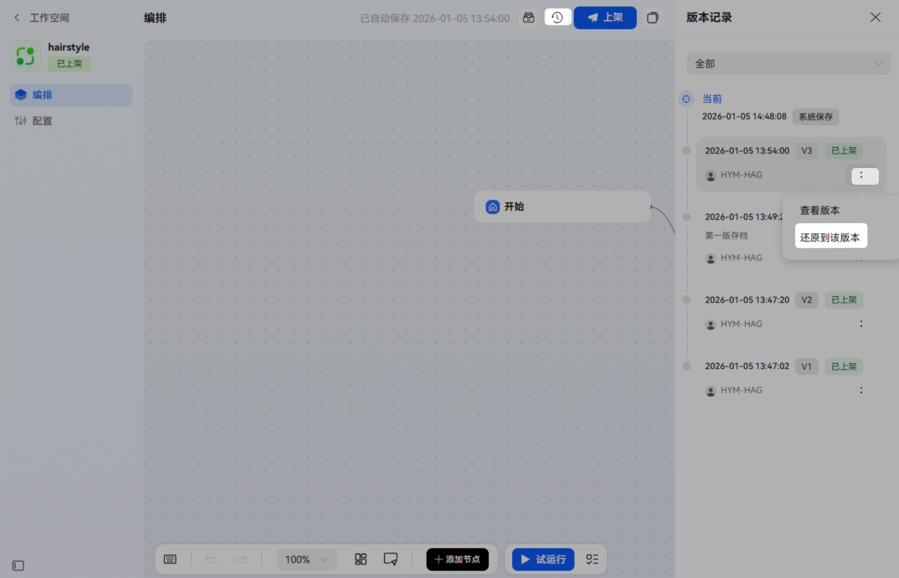

# 工作流版本管理

工作流的版本管理功能，包括版本存档、预览历史版本、回退到历史版本；通过版本管理，开发者可以记录工作流演进过程，并快速预览或回退到特定版本。

## 版本存档

* 上架存档：工作流每次上架完成，都将记录在版本记录中。
* 系统存档：工作流发生编辑后，将自动保存一条最新的测试版本，即【版本记录】中的【当前】版本。
* 手动存档：点击工作流右上角【存档】图标，填写存档描述并存档成功后，将会生成一条手动存档记录。

## 查看版本记录

点击工作流右上角【版本记录】图标可查看版本记录，包括各版本的存档类型、版本号、存档描述、操作人和存档时间；当版本较多时，你还可以根据版本类型筛选。

## 预览历史版本

在工作流【版本记录】列表中，选择历史版本，直接点击该版本或点击版本右下角操作项中的【查看版本】即可预览该版本。

* 预览时不可编辑工作流，可查看版本编排或试运行；
* 预览时可以点击【返回编辑】回到当前版本，点击【还原到该版本】回退到该版本。
* 预览时若添加的知识库、插件、工作流已下架，对应节点将显示失效状态；注意预览时不可编辑，可先回退到该版本再清理失效节点。

## 回退到历史版本

在工作流【版本记录】列表中，选择历史版本，点击版本右下角操作项中的【还原到该版本】，即可将此历史版本覆盖当前工作流的草稿版本。还原后，版本记录中该版本不受影响。

