# **智能体数字商品支付服务配置**

目前“智能体数字商品支付服务”在内测阶段，仅企业开发者可用，企业开发者在使用前请通过商务或提[华为开发者联盟工单](https://developer.huawei.com/consumer/cn/support/feedback/#/)联系小艺商业化运营人员申请开通。

开通“智能体数字商品支付服务”的权限后，需要先配置[【账号绑定设置】](/docs/distribute/xiaoyi/ability-expansion-function-introduction-0000002437625858/account-binding-0000002471344141)模块。

在智能体（仅**A2A模式**和**工作流模式**支持付费智能体）编排界面下可以看到【付费智能体】模块，打开付费开关即成为付费智能体，根据文档后续的指导完成相关配置后即可支持用户在付费后使用智能体相关付费功能。

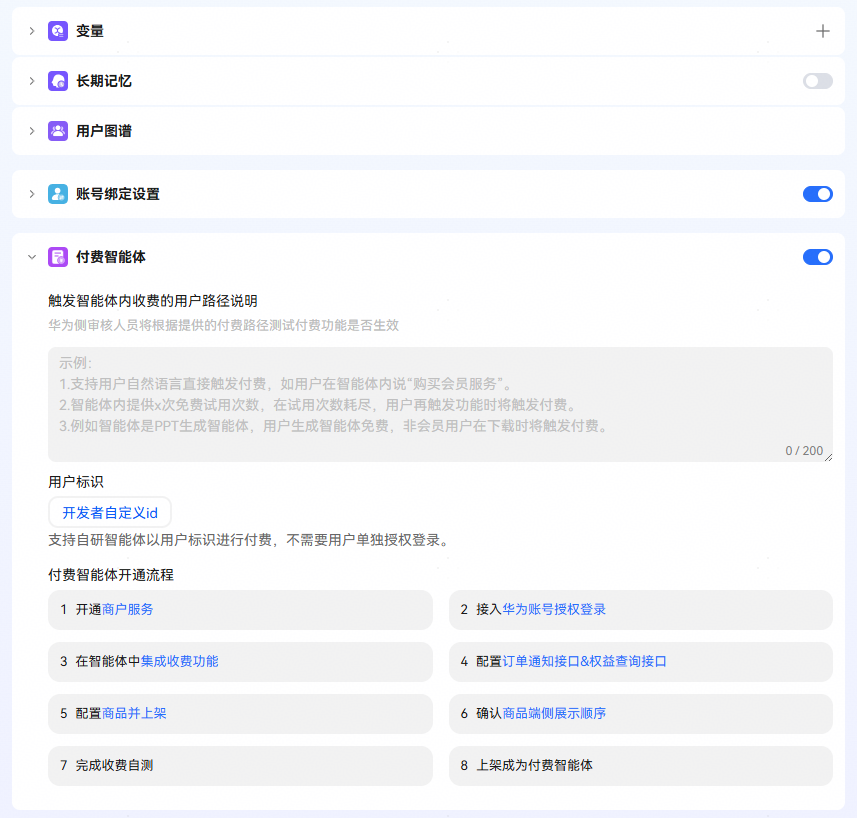

## 1.【开通商户服务】

开通商户服务是后续结算的基础，请根据“[开通商户服务](https://developer.huawei.com/consumer/cn/doc/start/merchant-service-0000001053025967)”指导完成。

## 2.【接入华为账号授权登录】

华为账号授权登录是用户付费后权益发放的基础载体，请根据“[华为账号授权登录](/docs/distribute/xiaoyi/ability-expansion-function-introduction-0000002437625858/account-binding-0000002471344141)”指导完成，在支付场景下开发者服务器需要返回标识开发者侧用户唯一标识符的cpUserId。

## 3.【在智能体中集成收费功能】

开发者根据自己业务需要规划收费卡点，目前支持**superlink**和**端插件**方式拉起商品展示页。

## 3.1 superlink方式

支持给用户的应答语中以超链接的形式拉起商品展示页。

如下图所示，用户点击订购即可拉起商品展示页。

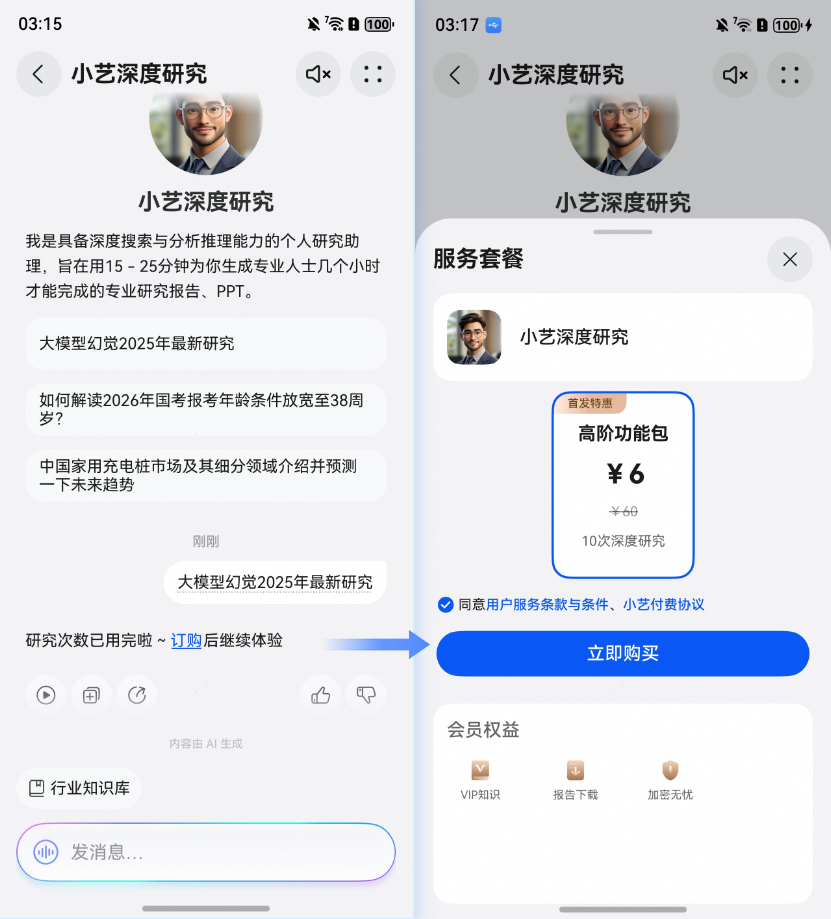

**markdown样例：**

 研究次数已用完啦~ [订购](superlink://vassistant?startmode=cashierpage&parameters=\\{"agentid":"xxx","transBuffer" : "自定义透传参数"\\}) 后继续体验 

**字段含义：**

agentid：从[系统变量](/docs/distribute/xiaoyi/ability-expansion-function-introduction-0000002437625858/variable-0000002437625886#section177616814473)中获取agent\_instance\_id的值，运行时Agent的唯一标识，真机测试与上架运行时的智能体是不同的实例，具有不同的id。账号绑定、支付等场景，在superlink中填写智能体id时，需要从系统变量获取agent\_instance\_id来适配真机测试等场景。

transBuffer：透传字段，通知开发者发货时会透传给开发者服务。用于开发者存放业务自定义非敏感字段（如触发场景等，金额、账号等相关信息不要存放在该字段）， 如无必要可以不填。

## 3.2 执行端插件拉起

通过端插件方式直接拉起商品展示页，可以在工作流等场景下识别到需要用户付费使用时，触发该端插件。

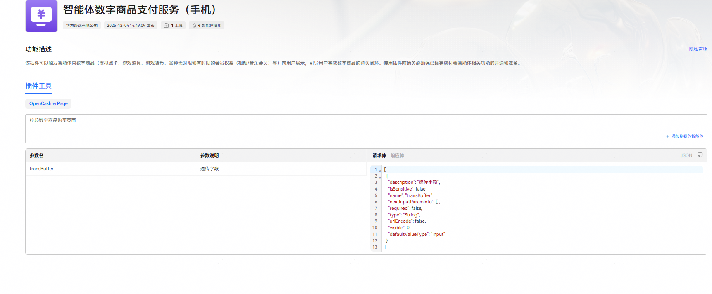

如下图所示，当用户的输入匹配上工作流中配置的拉起端插件的意图时即可拉起商品展示页。

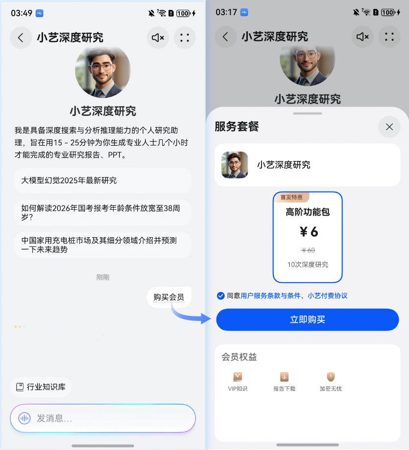

字段含义：

transBuffer：透传字段，通知开发者发货时会透传给开发者服务。用于开发者存放业务自定义非敏感字段（如触发场景等，金额、账号等相关信息不要存放在该字段）， 如无必要可以不填。

## 4.【配置订单通知接口&权益查询接口**】**

**[订单通知接口](/docs/distribute/xiaoyi/interaction-interface-0000002505801554/order-notification-0000002537601307)：**当用户付费/申请退费后，为了向用户发放/撤销权益，需要开发者实现一个订单通知接口。华为侧在收到用户付费或当用户申请退费后通过该接口通知开发者服务器为对应的用户发放或撤销权益。

**[权益查询接口](/docs/distribute/xiaoyi/interaction-interface-0000002505801554/privilege-query-0000002537721285)：**在收到用户付款成功的通知后，根据用户购买的商品为用户发放对应的权益，为了让用户可以随时感知权益发放情况，开发者需要实现一个权益查询的接口，主要为用户展示购买的权益名称、剩余数量、购买时间、到期时间等权益信息，如下图所示。

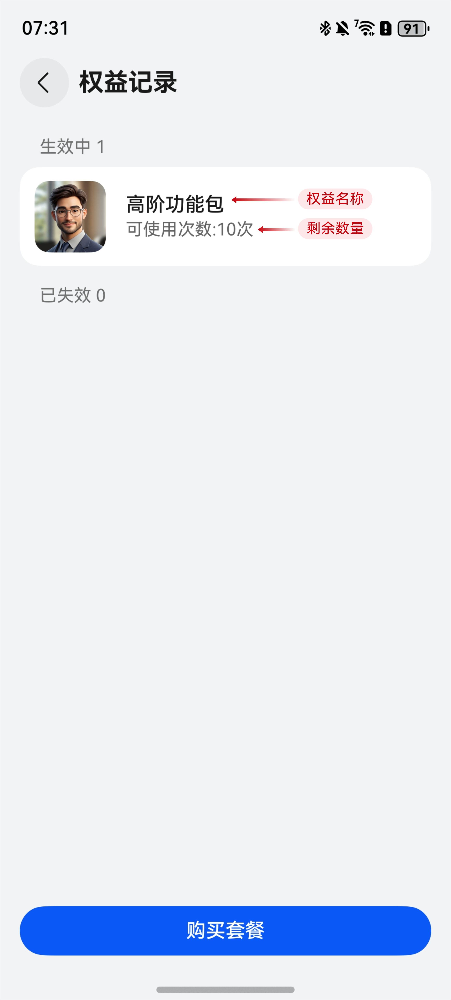

接口开发调测后，将接口相关信息配置到订单服务对接配置页面，具体路径为【配置】-【商品管理】-【订单服务对接配置】，配置提交给华为侧审核，华为侧运营审核人员审核通过后在【已生效接口】TAB页下可查看当前生效的接口信息。

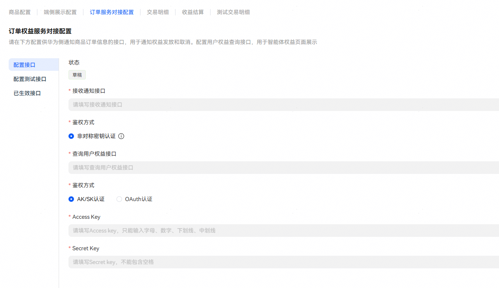

## 5.【配置商品并上架】

点击蓝色字体【商品并上架】，跳转到配置页的商品管理页面，商品配置页面可直接看到已保存或已提交的商品信息及状态。

只有团队管理员或运营才能发起商品编辑、提交审核（审核周期预计2-3个工作日）、下架、撤回等动作。

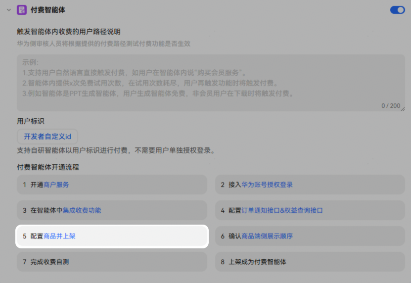

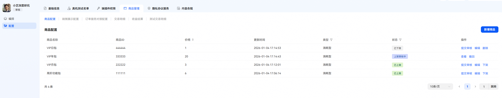

具体配置路径为【配置】-【商品管理】-【商品配置】，点击新增商品，在页面弹窗内左侧根据自身业务需求填写配置，右侧可以预览手机端的商品展示效果。

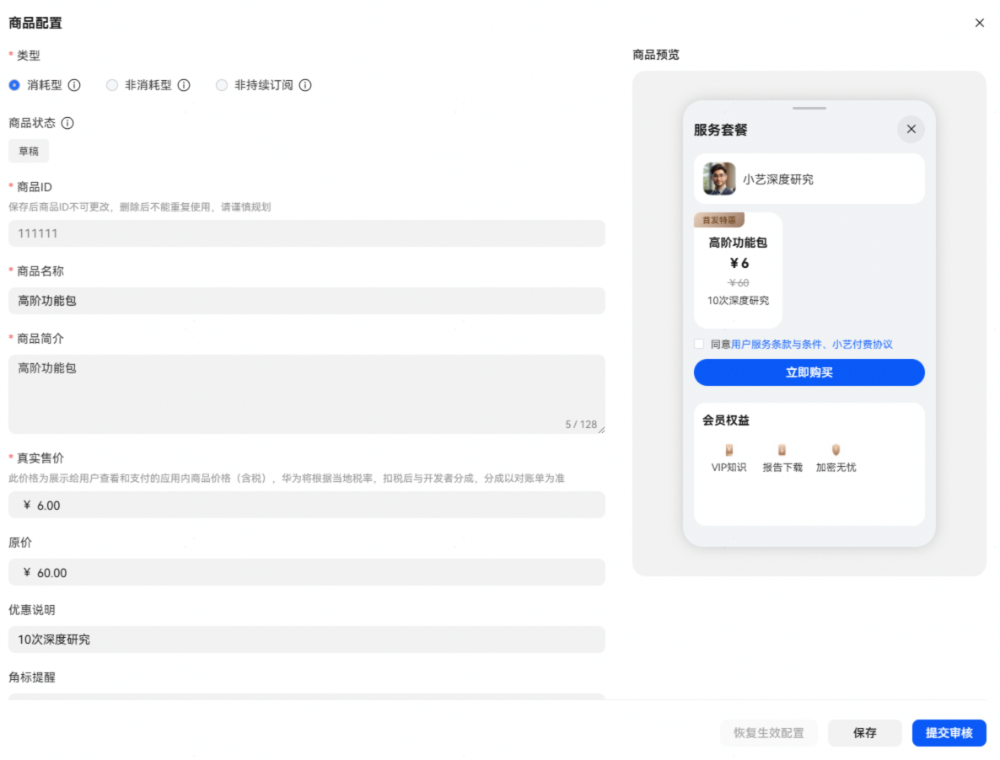

**①类型（必填项）：可根据商品类型勾选对应类型。**

【消耗型】：使用一次后即消耗掉，随使用减少，需要再次购买的产品通常选择为消耗品。例：游戏货币，游戏道具等。

【非消耗型】：用户只需购买一次非消耗型产品，而且这类产品不会过期或随着使用而减少。例：去广告，升级专业版等。

【非持续订阅】：用户在你所设置的时间段内访问内容 (例如订阅一个月的杂志内容)。此类订阅不会自动续期。

**②商品状态：****除生效状态为在架外，其他都是不在架状态****。**

**③商品ID（必填项）**：可根据自身需要设置商品ID，保存后商品ID不可更改，删除后不能重复使用，请谨慎规划。商品ID必须以大小写字母或数字开头，且由大小写字母“A-Z、a-z”、数字“0-9”、下划线“\_”和句点“.”组成。

**④商品名称（必填项）****：**根据自己的需要填写商品名称。

**⑤商品简介（必填项）：**主要是给审核人员理解商品便于审核，字数限制需少于128字。

**⑥真实售价（必填项）：**此价格为展示给用户查看和支付的应用内商品价格（含税），华为将根据当地税率，扣税后与开发者分成，分成以对账单为准。在输入框内输入售价金额，如99.99，当前仅支持中国大陆，售价以人民币定价，单位为“元”，可点击输入框右侧上下键调整金额，点击一下增减1元。

**⑦原价****（非必填）：**此价格为展示给用户查看价格，具体支付按真实售价为准。在输入框内输入原价金额，如99.99，当前仅支持中国大陆，售价以人民币定价，单位为“元”，可点击输入框右侧上下键调整金额，点击一下增减1元。

**⑧优惠说明****（非必填）：**可通过填写优惠说明，吸引消费者进行购买。

**⑨角标提醒****（非必填）：**可通过填写角标提醒，吸引消费者进行购买，字数限制少于8字。

**⑩权益（必填项）：**权益部分可以从已经添加的商品上复制后修改。点击【从其他商品复制权益】，您可以在下拉框中选择已创建的商品，快速将权益复制到当前商品。可点击【新增权益】进行编辑权益，支持图文权益，最多可添加8项，每一项都可点击右上角进行删减。

**⑪收费协议****（必填项）：**收费协议部分可以从已经添加的商品上复制后修改。点击【从其他商品复制协议】您可以在下拉框中选择已创建的商品，快速将协议复制到当前商品。可点击【新增协议】进行编辑新的协议内容，包含协议名称和跳转链接，最多可添加3项。协议名称和跳转链接为必填项。可点击下方“查看链接”和“删除按钮”对协议进行操作。

上述信息填写完成后，点击【保存】或【提交审核】。

如果对已经上架的商品进行编辑，想要将修改内容恢复到当前上架状态，可点击【恢复生效配置】进行重置。

## 6.【确认商品端侧展示顺序】

具体配置路径为【配置】-【商品管理】-【端侧展示配置】，此处仅展示已上架的套餐，可以通过最右侧的操作箭头调整商品在端侧展示的先后顺序。点击商品名称可查看商品的详细信息。最新审核通过的商品默认展示在最后。

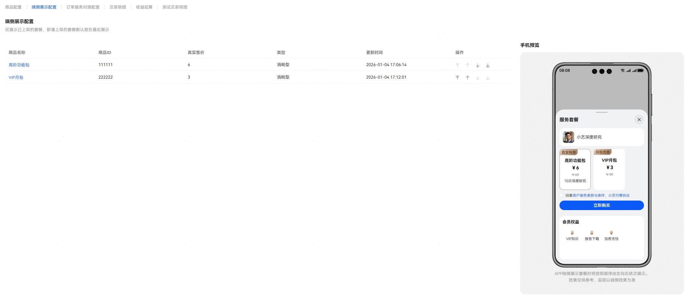

## 7.【完成收费自测】

开发者配置商品后在非上架状态，可以通过真机测试完成付费流程的调测，购买不会产生真实费用，仅验证订阅流程，步骤详情参考[数字商品支付服务收费调测](/docs/distribute/xiaoyi/digital-product-payment-0000002537601305/service-debug-0000002513652200)。

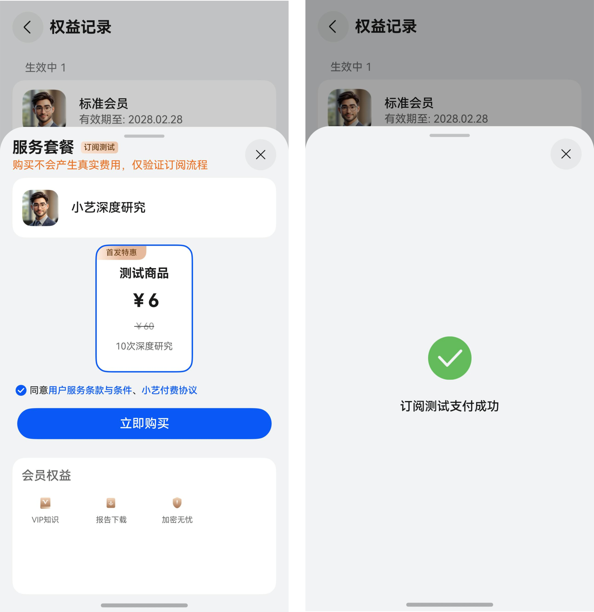

## 8.【上架成为付费智能体】

在完成付费自测且商品上架成功后，可上架或升级付费智能体，后续商品可独立上架。上架前请确认您已完成付费智能体所有步骤，否则上架申请将被驳回。

上架弹窗内需要填写智能体收费说明，以便帮助测试和运营进行功能测试。

例：

a. 用户在智能体内说：购买会员服务

b. 普通用户在生成PPT大纲或通过模板生成PPT的免费次数（每日3次）用完时

c. 用户在触发下载或使用生成的PPT文件时

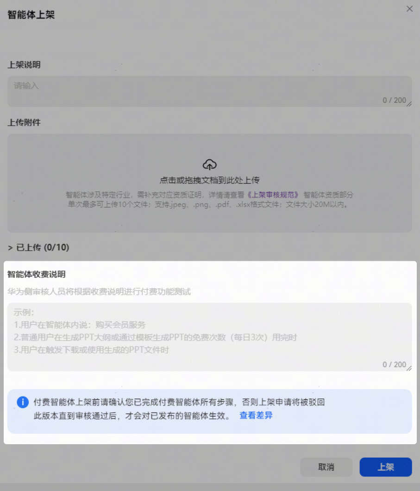

## 9. 支持查看交易明细与收益结算：

**a.【交易明细****】**

具体查看路径为【配置】-【商品管理】-【交易明细】。

交易明细主要是给开发者查看用户付费和退款的流水，方便开发者对账和及时调整套餐；华为支持保存最长7年的交易数据，开发者可以通过订单号、订单类型、商品ID、商品名、国家/地区（当前仅支持中国大陆）、支付时间、退款时间几个维度对订单进行筛选。

在订单处理结果为“同步失败”时，整个发放/撤销权益的流程就没有闭环，开发者运营可手动点击【补发】，重新触发权益发放或权益撤销，确保整个购买或退款流程完整。

同时支持开发者下载交易明细到本地，方便二次编辑查看。

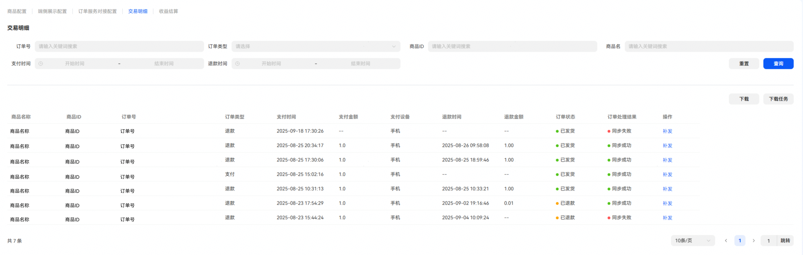

**b.【收益结算】**

具体查看路径为【配置】-【商品管理】-【收益结算】，点击后可跳转到管理中心的账户收益界面查看智能体收益结算。

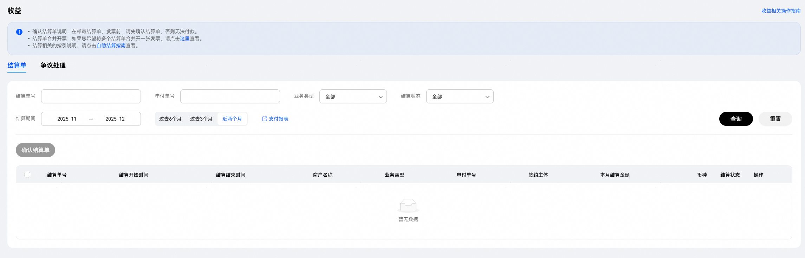
