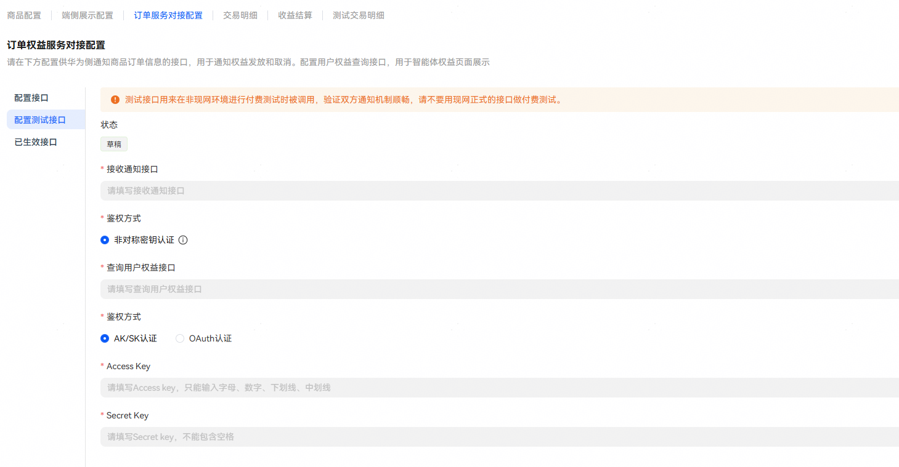
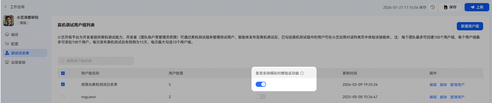
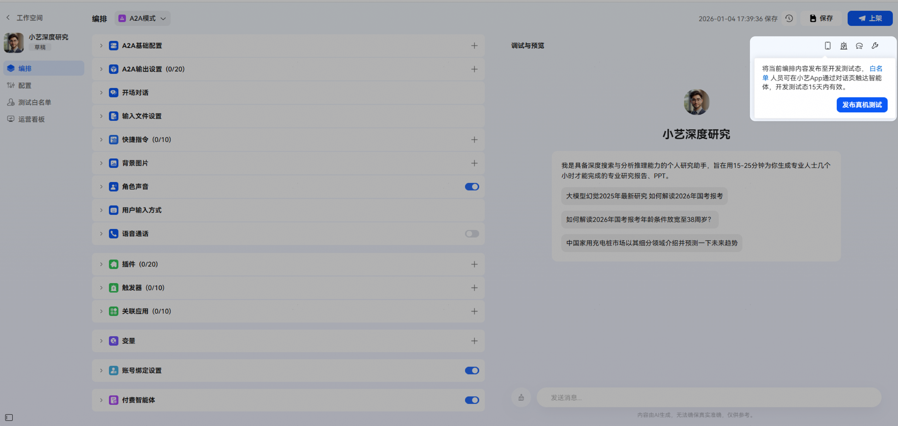
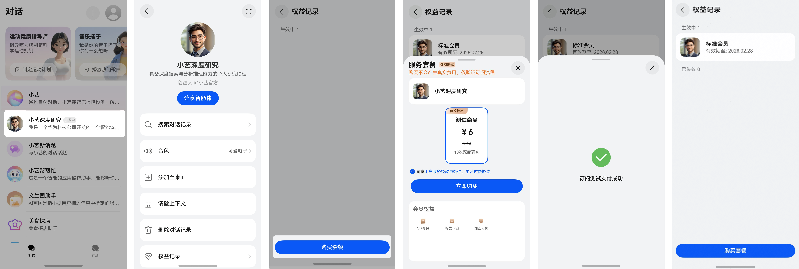
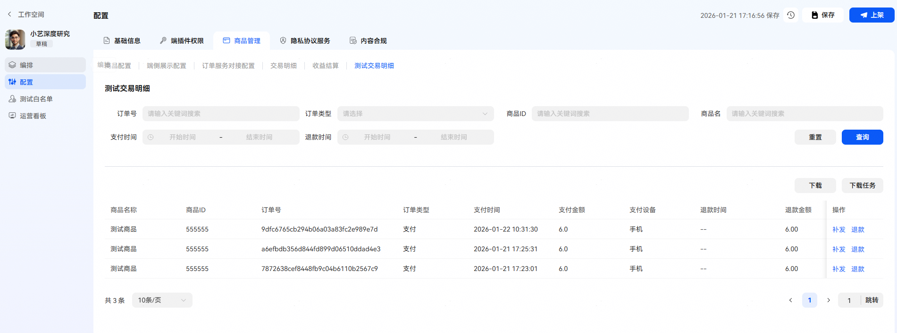

# 智能体数字商品支付服务收费调测

**1.** **配置测试接口，可参考[订单通知&权益查询](/docs/distribute/xiaoyi/digital-product-payment-0000002537601305/service-configuration-0000002537721283#section86943511115)。**

开发者服务器需要对来自于正式/测试接口的请求做状态区分（基于url或者入参purchaseTest判断），基于不同状态做相应的适配。

·

**2. 测试时商品说明**

测试使用已保存的最新商品数据，不需要上架。

测试商品按照默认的顺序展示，不支持基于【端侧商品展示】配置排序。

**3. [配置测试白名单](/docs/distribute/xiaoyi/real-machine-testing-0000002471344145/list-of-user-groups-for-real-machine-testing-0000002471264273)，配置收费调测的白名单测试组，打开【模拟付费验证功能】开关。**

**4. 发布真机测试****，在智能体编排页的【调试与预览】界面下，点击右上角的手机图标发布真机测试****。**

仅针对已打开【模拟付费验证功能】开关的测试组生效。

**5. 开启真机测试****，进入小艺对话页，找到测试智能体即可进行测试验证，具体流程可参考下图。**

**6.** **支持在【配置】-【商品管理】-【测试交易明细】查看测试交易明细和触发【补发】、【退款】操作来进行调试。**

