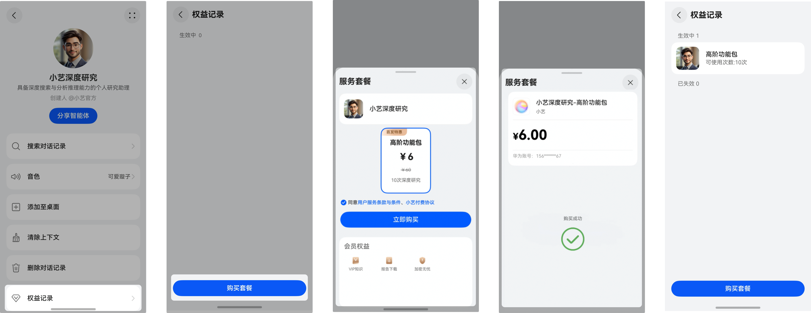
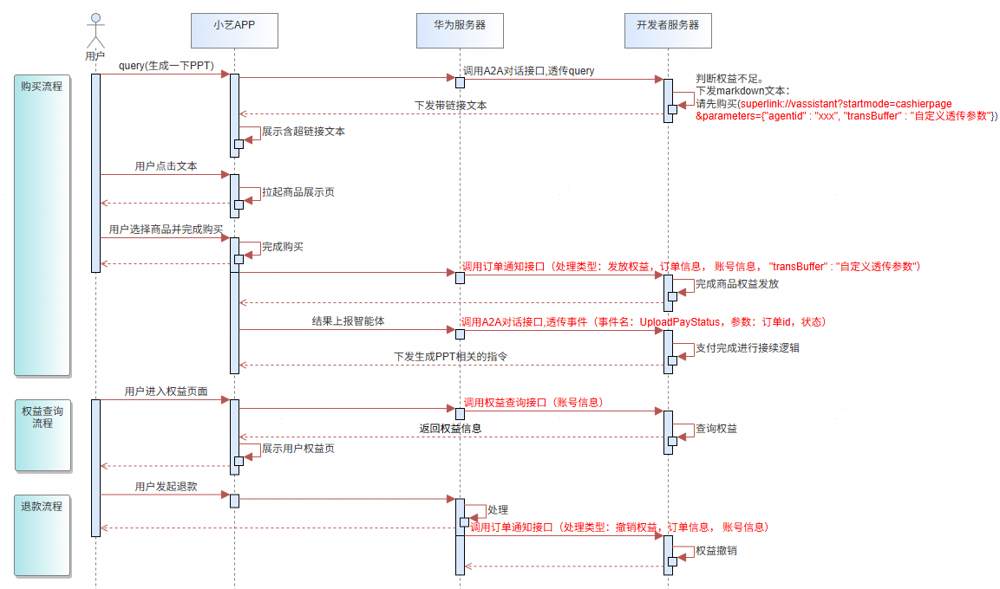

# 智能体数字商品支付服务介绍

## 1. 概述

如果您的智能体内提供需要付费使用的数字商品或服务，如虚拟点卡、游戏道具、游戏货币、各种无时限和有时限的会员权益（视频/音乐会员）等，可以集成“智能体数字商品支付服务”实现用户付费和权益发放的商业闭环。

## 2. 消费者支付服务使用介绍

在小艺app里面，打开智能体的右上角【更多】按钮，点击【权益记录】即可查看已生效或已失效的套餐，点击【购买套餐】，弹出商品购买界面，用户可根据自己需要选择合适的套餐购买。

## 3. 以下示例是A2A模式下数字商品支付流程图

图中交互接口可参考[发起会话](/docs/distribute/xiaoyi/agent2agent-definition-0000002500439093/message-stream-0000002505761434)、[订单通知接口](/docs/distribute/xiaoyi/interaction-interface-0000002505801554/order-notification-0000002537601307)、[权益查询接口](/docs/distribute/xiaoyi/interaction-interface-0000002505801554/privilege-query-0000002537721285)。

