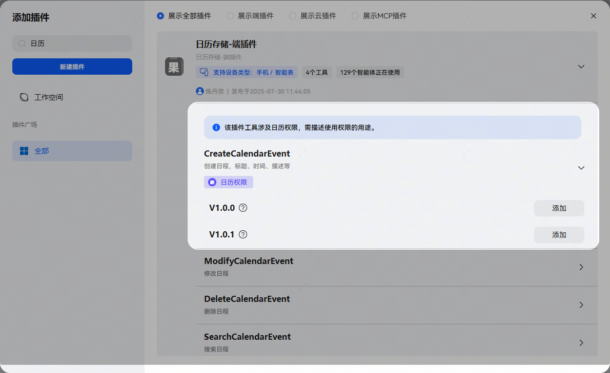
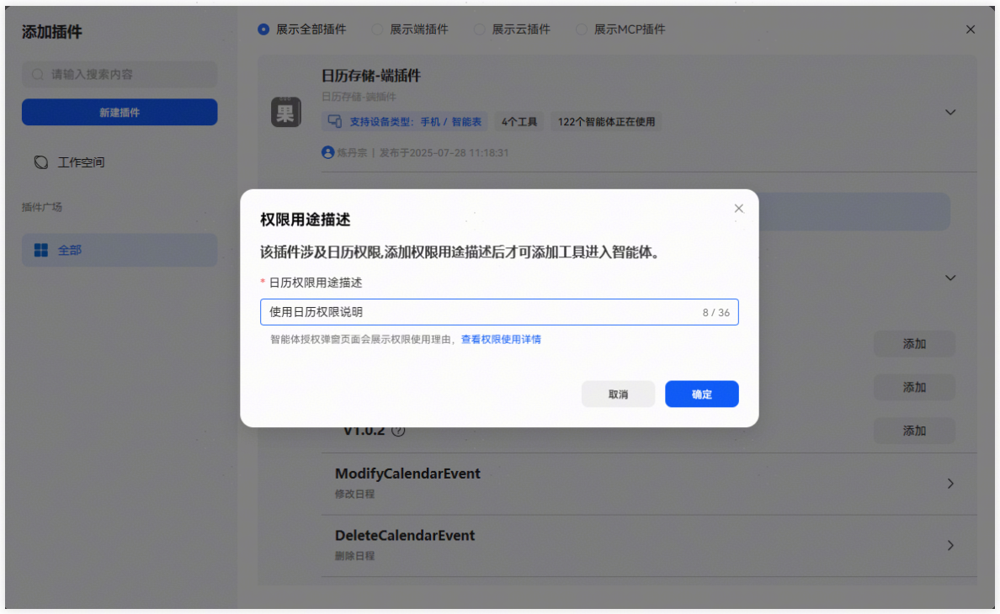
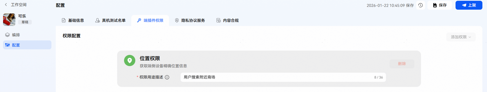
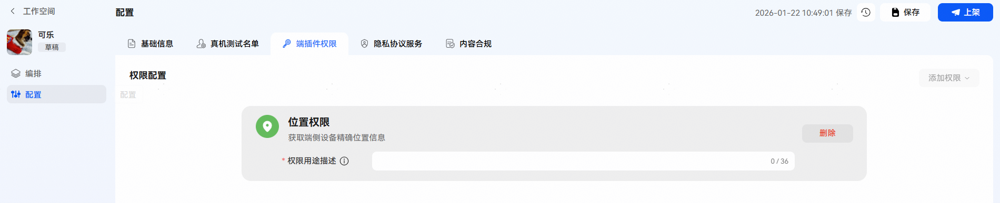

# 端插件权限管控

在智能体或工作流中添加需要配置权限的端插件时，需增加权限用途说明:

插件添加成功后，智能体配置中的权限配置会增加权限用途描述配置：

添加工作流后，若工作流中使用到需要权限的插件，会在权限配置页面生成对应的权限：

添加工作流后查看权限配置页面，此时会自动添加所使用的权限：

注意，此时的权限用途描述为空，需要手动填写用途描述，若没有填写用途描述，无法上架智能体：

填写对应用途描述后可正常上架。

需要增加其他权限配置时，选择权限配置页面的添加权限按钮，选择需要的权限，并填写权限使用用途：

手机端侧使用需要权限的智能体时，需要用户授权：

