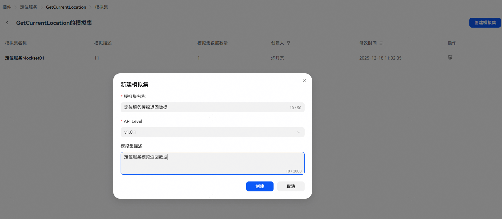
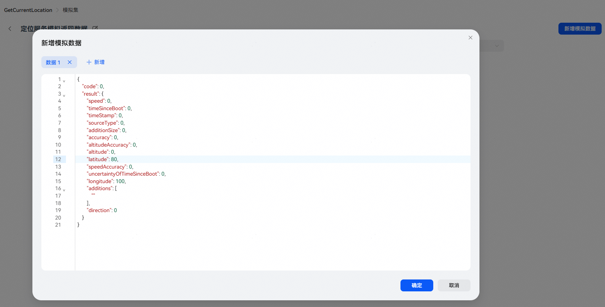

# 创建工具模拟集

## 创建模拟集

插件上架后，点击工具的【模拟集】进入模拟集管理页面，点击【创建模拟集】填写信息后开始创建。注意：

* 前台执行或卡片执行不支持创建模拟集，仅后台执行工具支持。

## 模拟集基本信息说明

| 配置项 | 说明 |
| --- | --- |
| 模拟集名称 | 创建时会自动生成模拟集名称（插件名称+mockset+序号），支持修改。 |
| API Level | 选择使用该模拟集的工具版本。 |
| 模拟集描述 | 模拟集描述说明，可记录模拟集使用场景。 |

## 模拟数据说明

模拟集创建完成后，即可在模拟集中添加模拟数据。

新增模拟数据时，系统将根据工具输出参数的字段定义，自动生成对应数据结构。生成的数据支持编辑，通常直接填充数据值即可。注意：不建议添加输出参数中未定义的参数，否则该参数将被忽略，无法使用。

