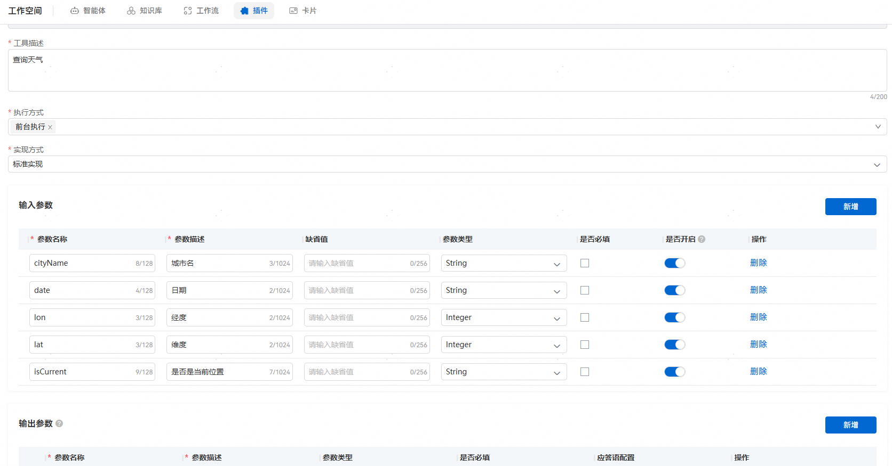
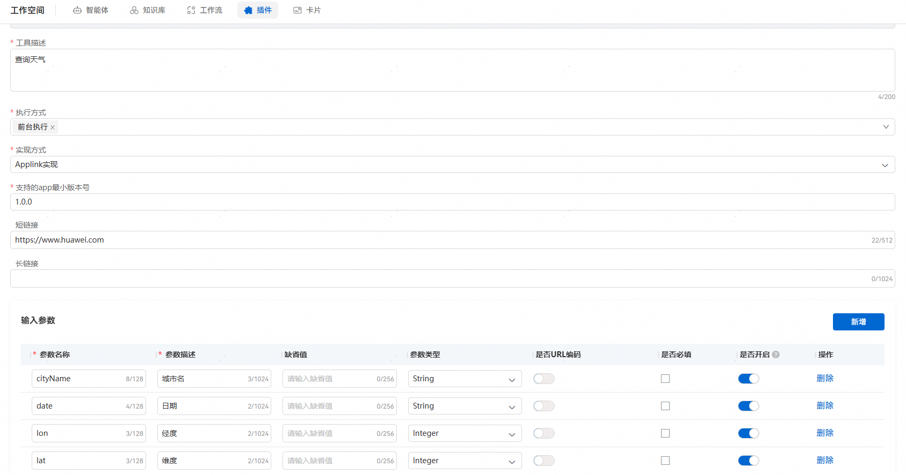
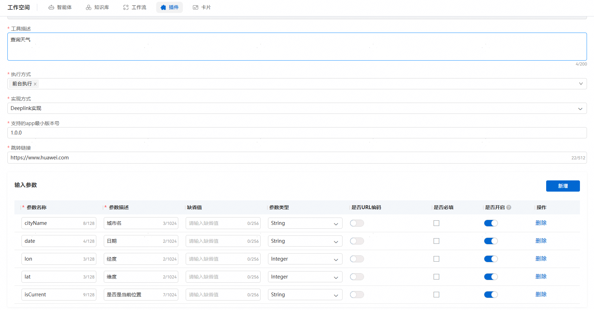
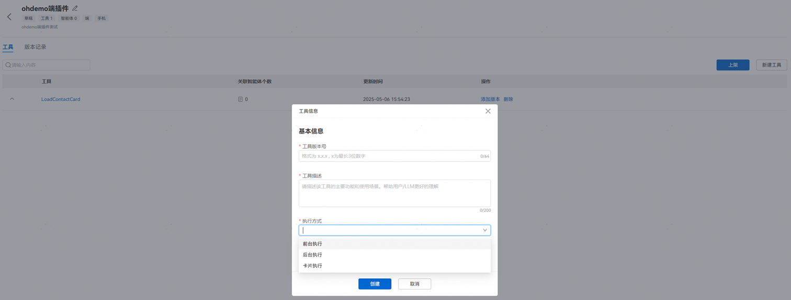
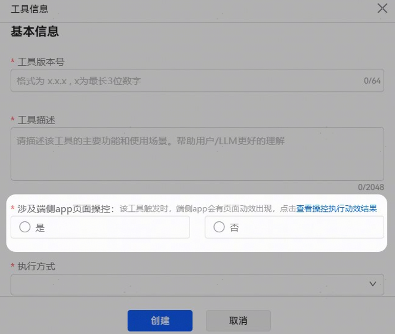
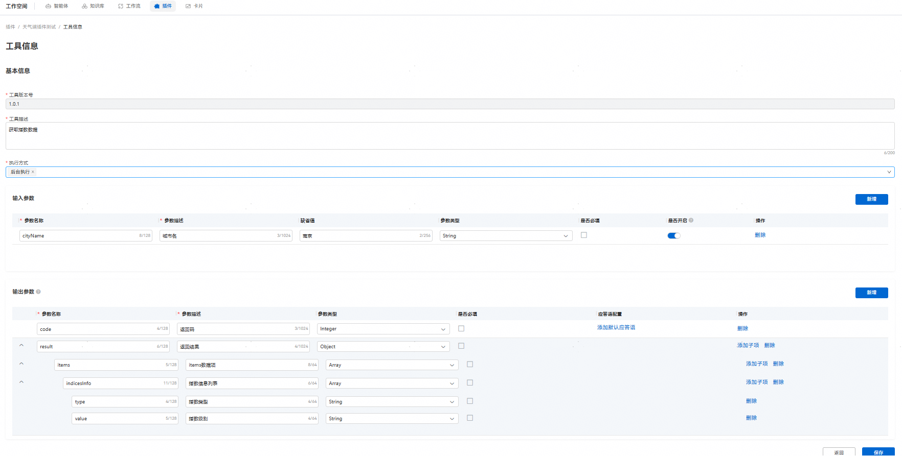
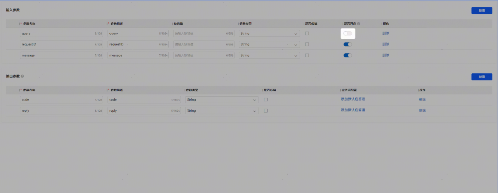
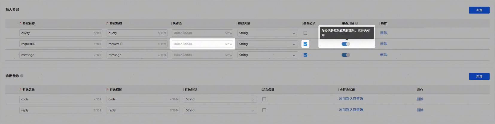

# 端插件配置

## 工具基本信息

新建工具后填写工具名称：

添加版本-填写工具版本号、工具描述、执行方式、选择涉及端侧app页面操控开或关

工具描述：填写该工具的功能，用于大模型更好地理解，精准匹配与之对应的业务场景下调用该工具。

执行方式：前台执行、后台执行、卡片执行。

1、前台执行：拉起端侧应用到前台页面；

选择前台执行时，配置工具选择实现方式有三种：标准实现、Applink实现、Deeplink实现。

① 标准实现：[插件工具的对应代码实现](https://developer.huawei.com/consumer/cn/doc/service/corresponding-code-implementation-of-plug-in-tools-0000002437625938)

② Applink实现：已经实现了Applink的应用可以直接配置成端插件使用，Applink携带的参数要以端插件入参的形式呈现，需要配置支持app的最小版本号，长短链接最少填一个。

实现参照：[参考文档](https://developer.huawei.com/consumer/cn/doc/harmonyos-guides/app-linking-startup)

③ Deeplink实现：已经实现了Deeplink的应用可以直接配置成端插件使用，Deeplink携带的参数要以端插件入参的形式呈现，需要配置支持的app最小版本号，跳转链接必填。

实现参照：[参考文档](https://developer.huawei.com/consumer/cn/doc/harmonyos-guides/deep-linking-startup)

2、后台执行：后台执行该工具，后续使用该工具的时候，可以绑定卡片把返回的数据以卡片形式呈现出来；

3、卡片执行：调用端侧应用渲染卡片。

涉及端侧app页面操控：

样例效果：

## 输入输出参数配置

输入参数：大模型会根据用户输入的词和参数描述进行匹配，在调用插件时传入参数；

输出参数：对应端侧应用回的数据规格，返回参数必须包含code和result字段，将具体返回数据放在result字段内。

某些插件参数值较为稳定，不需要动态传入参数值，建议为参数设置默认值，并关闭开启开关（参数对模型不可见），减少智能体中的大模型调用插件时的流程，提高调用效率。

但对于必填的输入参数，如果想关闭开启开关，则需要填写缺省值。

