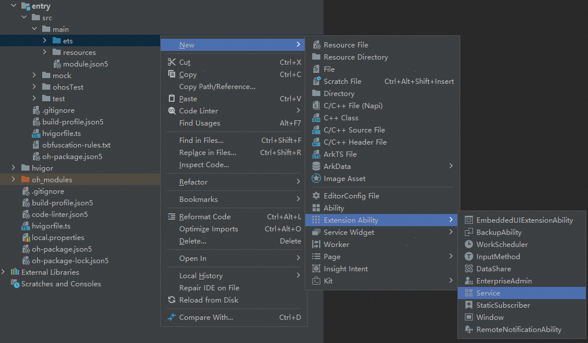
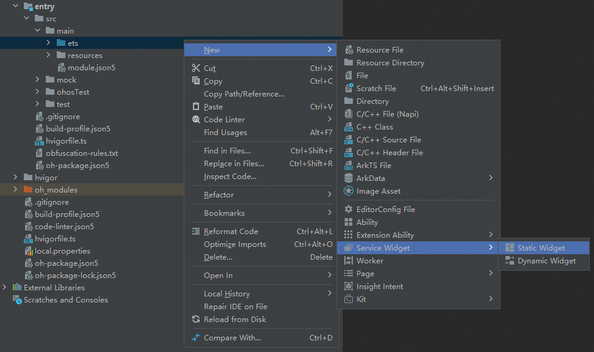
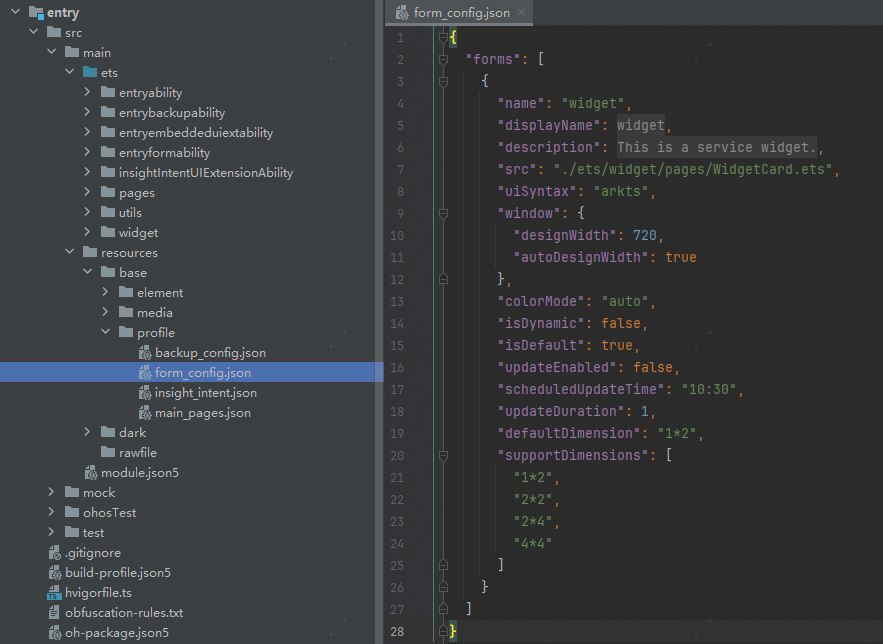
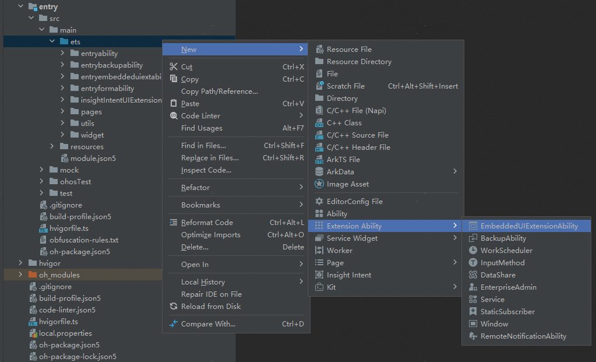
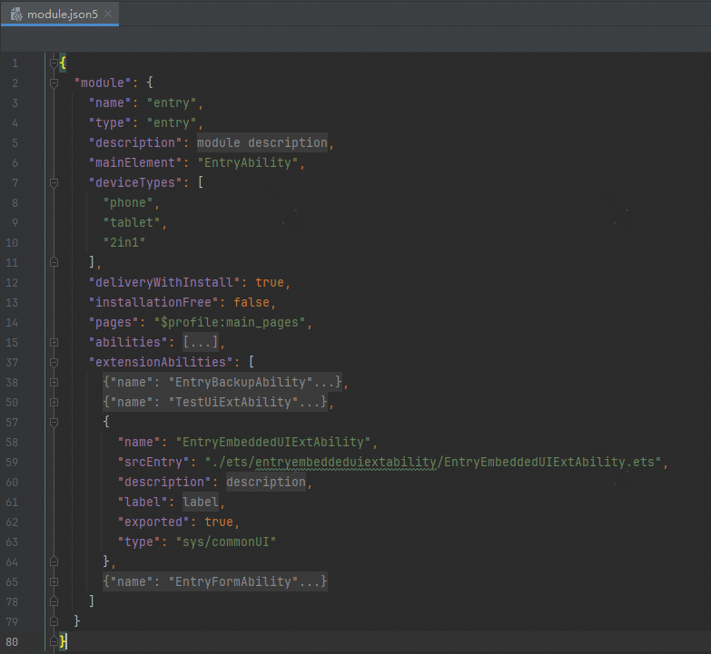

# 插件工具的对应代码实现

当绑定的端插件被大模型调用时，设置为前端、后端执行的插件工具会触发InsightIntentExecutorImpl类方法的调用，可以在对应的类方法里面匹配对应的工具名称后，进行自定义逻辑业务的处理。

**前台执行的插件工具的端侧代码实现**

设置为前台执行的插件工具，会触发InsightIntentExecutorImpl类方法的onExecuteInUIAbilityForegroundMode方法执行，在方法内匹配对应的意图名称（插件工具名称）后，实现自定义的业务逻辑代码。

onExecuteInUIAbilityForegroundMode方法中的参数name对应意图名称（插件工具名称），param对应插件输入参数，可以调用pageLoader.loadContent方法加载页面文件。

```
 // InsightIntentExecutorImpl.ets

 import { common, insightIntent, InsightIntentExecutor, UIExtensionContentSession } from '@kit.AbilityKit';
 import { window } from '@kit.ArkUI';
 import { LogUtil } from '../utils/LogUtil';

 const TAG = 'InsightIntentExecutorImpl'

 class Constants {
   // 打电话 前台执行
   public static INTENT_CALL_PHONE = "callPhone";
   // 查看日程 后台执行
   public static INTENT_LOAD_CALENDAR_EVENT_CARD = "LoadCalendarEventCard";
 }

 export default class InsightIntentExecutorImpl extends InsightIntentExecutor {
   /**
    * override 执行前台UIAbility意图
    *
    * @param name 意图名称
    * @param param 意图参数
    * @param pageLoader 窗口
    * @returns 意图调用结果
    */
   onExecuteInUIAbilityForegroundMode(name: string, param: Record<string, Object>, pageLoader: window.WindowStage):
     Promise`insightIntent.ExecuteResult` {
     LogUtil.error(TAG, 'onExecuteInUIAbilityForegroundMode is success')
     switch (name) {
       case Constants.INTENT_CALL_PHONE:
         return this.callPhone(param, pageLoader);
       default:
         pageLoader.loadContent('pages/Index');
         break;
     }
     return Promise.resolve({
       code: -1,
       result: {
         message: 'unknown intent'
       }
     } as insightIntent.ExecuteResult)
   }

   // 拨打电话 前台执行
   private callPhone(param: Record<string, Object>,
      pageLoader: window.WindowStage): Promise`insightIntent.ExecuteResult` {
          return new Promise((resolve, reject) => {
             let want: Want = {
                bundleName: "com.ohos.contacts",
                moduleName: "phone",
                abilityName: "MainAbility",
                 parameters: {},
             };
             (getContext(this) as common.UIAbilityContext).startAbility(want, (err, data) => {
                 LogUtil.info(TAG, `data is =${data}}`)
             });
      })
    }
 }
```

**后台执行的插件工具的端侧代码实现**

设置为后台执行的插件工具，有两种实现方式，分别是uiAbility的后台执行和serviceExtension的实现。

**(1) uiAbility的后台执行**

insight\_intent.json文件配置

```
{
   "insightIntents": [
     {
       "intentName": "LoadCalendarEventCard",
       "domain": "",
       "intentVersion": "1.0.1",
       "srcEntry": "./ets/entryability/InsightIntentExecutorImpl.ets",
       "uiAbility": {
         "ability": "EntryAbility",
         "executeMode": [
           "background"
         ]
       }
     }
   ]
 }
```

设置为后台执行的插件工具，会触发InsightIntentExecutorImpl类方法的onExecuteInUIAbilityBackgroundMode方法执行，在方法内匹配对应的意图名称（插件工具名称）后，实现自定义的业务逻辑代码。

onExecuteInUIAbilityBackgroundMode方法参数intentName对应意图名称（插件工具名称），intentParam对应插件输入参数。

```
// InsightIntentExecutorImpl.ets文件

 import { common, insightIntent, InsightIntentExecutor, UIExtensionContentSession } from '@kit.AbilityKit';
 import { window } from '@kit.ArkUI';
 import { LogUtil } from '../utils/LogUtil';

 const TAG = 'InsightIntentExecutorImpl'

 class Constants {
   // 打电话 前台执行
   public static INTENT_CALL_PHONE = "callPhone";
   // 查看日程 后台执行
   public static INTENT_LOAD_CALENDAR_EVENT_CARD = "LoadCalendarEventCard";
 }

 export default class InsightIntentExecutorImpl extends InsightIntentExecutor {

   // 后台执行
   async onExecuteInUIAbilityBackgroundMode(intentName: string, intentParam: Record<string, Object>):
     Promise`insightIntent.ExecuteResult` {
     LogUtil.info(TAG, `onExecuteInUIAbilityBackgroundMode name: ${intentName}, param: ${JSON.stringify(intentParam)}`);
     switch (intentName) {
       case Constants.INTENT_LOAD_CALENDAR_EVENT_CARD:
         return this.LoadCalendarEventCard(intentParam);
       default:
         let result: insightIntent.ExecuteResult = {
           code: 0,
           result: {
             "other": "default message",
             "intentName": intentName
           }
         }
         LogUtil.info(TAG, `onExecuteInUIAbilityBackgroundMode`);
         return result;
     }
   }

   //日程 后台执行
   private LoadCalendarEventCard(param: Record<string, Object>): Promise`insightIntent.ExecuteResult` {
     return new Promise((resolve, reject) => {
       resolve({
         code: 0,
         result: {
           code: 0,
           items: [
             {
            "title": "开会"
          }
           ]
         }
       })
     })
   }
 }
```

**(2) serviceExtension的实现**

通过工程模板，创建serviceExtension后台服务。



insight\_intent.json文件配置

```
{
   "insightIntents": [
     {
     "intentName":"ServiceExtensionIntent",
     "domain":"",
     "intentVersion":"1.0.1",
     "srcEntry":"./ets/entryability/InsightIntentExecutorImpl.ets",
     "serviceExtension":{
        "ability":"ServiceExtAbility"
     }
     }
   ]
 }
```

设置为后台执行的插件工具，会触发InsightIntentExecutorImpl类方法的onExecuteInServiceExtensionAbility方法执行，在方法内匹配对应的意图名称（插件工具名称）后，实现自定义的业务逻辑代码。

onExecuteInServiceExtensionAbility方法参数name对应意图名称（插件工具名称），param对应插件输入参数。

```
import { insightIntent, InsightIntentExecutor } from '@kit.AbilityKit';
 import { LogUtil } from '../utils/LogUtil';

 const TAG = 'InsightIntentExecutorImpl'

 class Constants {
   public static SERVICE_EXTENSION_INTENT: string = 'ServiceExtensionIntent';
 }

 export default class InsightIntentExecutorImpl extends InsightIntentExecutor {

   async onExecuteInServiceExtensionAbility(name: string, param: Record<string, Object>): Promise`insightIntent.ExecuteResult` {
     LogUtil.info(TAG, `onExecuteInServiceExtensionAbility`);
     switch (name) {
       case Constants.SERVICE_EXTENSION_INTENT:
         LogUtil.info(TAG, `onExecuteInServiceExtensionAbility::ServiceExtension intent`);
         return this.LoadCalendarEventCard(param);
       default:
         LogUtil.info(TAG, `onExecuteInServiceExtensionAbility::invalid intent`);
         break;
     }
     let result: insightIntent.ExecuteResult = {
       code: -1,
       result: {
         message: 'ExecuteInUIAbilityBackgroundMode Failed'
       }
     };
     return result;
   }

   private LoadCalendarEventCard(param: Record<string, Object>): Promise`insightIntent.ExecuteResult` {
     return new Promise((resolve, reject) => {
       LogUtil.info(TAG, '日程标题：' + `${param.title}`);
       resolve({
         code: 0,
         result: {
           code: 0,
           message: '可以看故宫天安门',
           items: [
             {
               "title": "开会"
             }
           ]
         }
       })
     })
   }
 }
```

继承实现ServiceExtensionAbility类，重写相关方法。

```
import Want from '@ohos.app.ability.Want';
 import ServiceExtensionAbility from '@ohos.app.ability.ServiceExtensionAbility';
 import { rpc } from '@kit.IPCKit';
 import { hilog } from '@kit.PerformanceAnalysisKit';

 const REQUEST_VALUE = 1;

 class StubTest extends rpc.RemoteObject {
   constructor(des: string) {
     super(des);
   }

   onRemoteMessageRequest(
     code: number,
     data: rpc.MessageSequence,
     reply: rpc.MessageSequence,
     options: rpc.MessageOption
   ): boolean | Promise<boolean> {
     return true;
   }

   getLocalInterface(descriptor: string): rpc.IRemoteBroker {
     return super.getLocalInterface(descriptor);
   }

   getInterfaceDescriptor() {
     return "";
   }

   sendMessageRequest(
     code: number,
     data: rpc.MessageSequence,
     reply: rpc.MessageSequence,
     options: rpc.MessageOption
   ): Promise`rpc.RequestResult` {
     return super.sendMessageRequest(code, data, reply, options);
   }

   getCallingPid() {
     return REQUEST_VALUE;
   }

   getCallingUid() {
     return REQUEST_VALUE;
   }

   attachLocalInterface(localInterface: rpc.IRemoteBroker, descriptor: string) {
   }
 }

 /**
  * 后台ServiceExtensionAbility测试类
  */
 export default class ServiceExtAbility extends ServiceExtensionAbility {
   onCreate(want: Want) {
     hilog.info(0x0000, 'testTag', '%{public}s', 'ServiceExtensionAbility onCreate');
     hilog.info(0x0000, 'testTag', '%{public}s', 'want param:' + JSON.stringify(want) ?? '');
   }

   onRequest(want: Want, startId: number) {
     hilog.info(0x0000, 'testTag', '%{public}s', 'ServiceExtensionAbility onRequest');
     hilog.info(0x0000, 'testTag', '%{public}s', 'want param:' + JSON.stringify(want) ?? '');
     hilog.info(0x0000, 'testTag', '%{public}s', 'startId param:' + JSON.stringify(startId) ?? '');
   }

   onConnect(want: Want): rpc.RemoteObject | Promise`rpc.RemoteObject` {
     hilog.info(0x0000, 'testTag', '%{public}s', 'ServiceExtensionAbility onConnect');
     hilog.info(0x0000, 'testTag', '%{public}s', 'want param:' + JSON.stringify(want) ?? '');
     return new StubTest("test");
   }

   onDisconnect(want: Want) {
     hilog.info(0x0000, 'testTag', '%{public}s', 'ServiceExtensionAbility onDisconnect');
     hilog.info(0x0000, 'testTag', '%{public}s', 'want param:' + JSON.stringify(want) ?? '');
   }

   onDestroy() {
     hilog.info(0x0000, 'testTag', '%{public}s', 'Ability onDestroy');
   }
 }
```

**卡片执行的插件工具的端侧代码实现**

卡片执行的实现方案有FormExtension卡片、UIExtension卡片

|  |  |
| --- | --- |
| <strong>卡片类型</strong> | <strong>应用场景</strong> |
| <strong>FormExtension卡片</strong> | 仅支持1\*2，2\*2，2\*4，4\*4标准卡片；  仅支持ArkTS声明式开发范式的部分控件。 |
| <strong>UIExtension卡片</strong> | 可以提供非标规格卡片;  支持ArkTS声明式开发范式的所有控件；  只有系统应用可以使用。 |

**（1）卡片执行-FormExtension卡片端侧实现**

**在端侧新建卡片**



**生成卡片配置文件**



**insight\_intent.json文件配置**

ability: 卡片对应Ability，formName：卡片名称，与form\_config中定义一致。

```
// insight_intent.json文件

 {
   "insightIntents": [
     {
       "intentName": "Travel",
       "domain": "",
       "intentVersion": "1.0.1",
       "srcEntry": "./ets/entryability/InsightIntentExecutorImpl.ets",
       "form": {
         "ability": "EntryFormAbility",
         "formName": "widget"
       }
     }
   ]
 }
```

**继承实现FormExtensionAbility类，重写相关方法。**

在onAddForm方法内匹配意图名称，解析插件工具输入参数，最后通过createFormBindingData接口把获取的输入参数传递给卡片页面。

```
// EntryFormAbility.ets文件

 import{ formBindingData, FormExtensionAbility, formInfo } from '@kit.FormKit';
 import { Want } from '@kit.AbilityKit';
 import { Logger } from '../util/Logger';

 const TAG = "EntryFormAbility";

 class QUERY {
   public from: string;
   public to: string;
   public type: string;

   constructor(from: string, to: string,
     type: string) {
     this.from = from;
     this.to = to;
     this.type = type;
   }
 }

 export default class EntryFormAbility extends FormExtensionAbility {
   onAddForm(want: Want) {
     Logger.info(TAG, "onAddForm");

     if (want?.parameters?.['ohos.insightIntent.executeParam.name'] != undefined) {
       const intentName = want.parameters['ohos.insightIntent.executeParam.name'];
       Logger.info(TAG, "意图名称：" + intentName);
     }

     let from = '';
     let to = '';
     let type = '';
     if (want?.parameters?.['ohos.insightIntent.executeParam.param'] != undefined) {
       const executeParameter = want.parameters['ohos.insightIntent.executeParam.param'] as QUERY;
       Logger.info(TAG, 'onAddForm:' + JSON.stringify(executeParameter))
       from = executeParameter?.from;
       to = executeParameter?.to;
       type = executeParameter?.type;
     }

     // Called to return a FormBindingData object.
     let formData: Record<string, string> = {
       'from': from,
       'to': to,
       'type': type,
     };
     return formBindingData.createFormBindingData(formData);
   }

   onCastToNormalForm(formId: string) {
     // Called when the form provider is notified that a temporary form is successfully
     // converted to a normal form.
     Logger.info(TAG, "onCastToNormalForm");
   }

   onUpdateForm(formId: string) {
     // Called to notify the form provider to update a specified form.
     Logger.info(TAG, "onUpdateForm");
   }

   onFormEvent(formId: string, message: string) {
     // Called when a specified message event defined by the form provider is triggered.
     Logger.info(TAG, "onFormEvent");
   }

   onRemoveForm(formId: string) {
     // Called to notify the form provider that a specified form has been destroyed.
     Logger.info(TAG, "onRemoveForm");
   }

   onAcquireFormState(want: Want) {
     // Called to return a {@link FormState} object.
     Logger.info(TAG, "onAcquireFormState");
     return formInfo.FormState.READY;
   }
 };
```

**卡片页面需要定义@LocalStorageProp装饰器变量接收传入的卡片参数。**

```
// WidgetCard.ets

 let storageUpdateRouter = new LocalStorage();

 @Entry(storageUpdateRouter)
 @Component
 struct WidgetCard {
   /*
    * The title.
    */
   readonly TITLE: string = 'Hello World';
   /*
    * The action type.
    */
   readonly ACTION_TYPE: string = 'router';
   /*
    * The ability name.
    */
   readonly ABILITY_NAME: string = 'EntryAbility';
   /*
    * The message.
    */
   readonly MESSAGE: string = 'add detail';
   /*
    * The width percentage setting.
    */
   readonly FULL_WIDTH_PERCENT: string = '100%';
   /*
    * The height percentage setting.
    */
   readonly FULL_HEIGHT_PERCENT: string = '100%';

   @LocalStorageProp('from') from:string =  'init from';
   @LocalStorageProp('to') to:string =  'init to';
   @LocalStorageProp('type') type:string =  'init type';

   build() {
     Row() {
       Column() {
         Text(this.from)
           .fontSize($r('app.float.font_size'))
           .fontWeight(FontWeight.Medium)
           .fontColor($r('app.color.item_title_font'))
         Text(this.to)
           .fontSize($r('app.float.font_size'))
           .fontWeight(FontWeight.Medium)
           .fontColor($r('app.color.item_title_font'))
         Text(this.type)
           .fontSize($r('app.float.font_size'))
           .fontWeight(FontWeight.Medium)
           .fontColor($r('app.color.item_title_font'))
       }
       .width(this.FULL_WIDTH_PERCENT)
     }
     .height(this.FULL_HEIGHT_PERCENT)
     .onClick(() => {
       postCardAction(this, {
         action: this.ACTION_TYPE,
         abilityName: this.ABILITY_NAME,
         params: {
           message: this.MESSAGE
         }
       });
     })
   }
 }
```

**（2）卡片执行-UIExtension卡片（仅供系统应用使用）**

**新建EmbeddedUIExtensionAbility**



**修改对应模块中的module.json5文件中对应的type字段值为sys/commonUI**



**insight\_intent.json文件配置**

```
{
       "intentName": "SearchWeather",
       "domain": "",
       "intentVersion": "1.0.1",
       "srcEntry": "./ets/entryembeddeduiextability/EntryEmbeddedUIExtAbility.ets",
       "uiExtension": {
         "ability": "EntryEmbeddedUIExtAbility"
       }
 }
```

InsightIntentExecutorImpl类中onExecuteInUIExtensionAbility方法和EmbeddedUIExtensionAbility类中onSessionCreate方法都可以匹配对应插件工程名称后，执行自定义的逻辑代码，差异在于只有onExecuteInUIExtensionAbility方法能返回意图执行结果。

**InsightIntentExecutorImpl类中重写实现onExecuteInUIExtensionAbility方法**

onExecuteInUIExtensionAbility方法中的参数name对应意图名称（插件工具名称），param对应插件输入参数，可以调用pageLoader.loadContent方法加载页面文件。

```
// InsightIntentExecutorImpl.ets

 import { common, insightIntent, InsightIntentExecutor, UIExtensionContentSession } from '@kit.AbilityKit';
 import { hilog } from '@kit.PerformanceAnalysisKit';
 import { window } from '@kit.ArkUI';

 const DOMAIN = 0x0000;
 const TAG = 'InsightIntentExecutorImpl'

 export default class InsightIntentExecutorImpl extends InsightIntentExecutor {
   onExecuteInUIExtensionAbility(name: string, param: Record<string, Object>, pageLoader: UIExtensionContentSession):
     insightIntent.ExecuteResult | Promise`insightIntent.ExecuteResult` {
     hilog.info(DOMAIN, TAG, `onExecuteInUIExtensionAbility name: ${name}, param: ${JSON.stringify(param)}`);
     let result: insightIntent.ExecuteResult = {
       code: -105,
       result: {
         "error": "invalid intent name",
         "intentName": name
       }
     }
     return result;
   }
 }
```

**继承实现EmbeddedUIExtensionAbility类，重写相关方法**

如下所示，onSessionCreate方法内调用了loadContent方法，加载UIExtension需要显示的Page页面。

```
// EntryEmbeddedUIExtAbility.ets

 import { hilog } from '@kit.PerformanceAnalysisKit';
 import { UIExtensionContentSession, Want } from '@kit.AbilityKit';
 import EmbeddedUIExtensionAbility from '@ohos.app.ability.EmbeddedUIExtensionAbility';

 const DOMAIN = 0x0000;

 export default class EntryEmbeddedUIExtAbility extends EmbeddedUIExtensionAbility {
   onCreate() {
     hilog.info(DOMAIN, 'testTag', `onCreate`);
   }

   onForeground() {
     hilog.info(DOMAIN, 'testTag', `onForeground`);
   }

   onBackground() {
     hilog.info(DOMAIN, 'testTag', `onBackground`);
   }

   onDestroy() {
     hilog.info(DOMAIN, 'testTag', `onDestroy`);
   }

   onSessionCreate(want: Want, session: UIExtensionContentSession) {
     const storage: LocalStorage = new LocalStorage();
     storage.setOrCreate('session', session);
     session.loadContent('entryembeddeduiextability/pages/EntryEmbeddedUIExtAbilityPage', storage);
     hilog.info(DOMAIN, 'testTag', `onSessionCreate done`);
   }

   onSessionDestroy(session: UIExtensionContentSession) {
     session.terminateSelf().catch(() => {
       // handle error
     });
     hilog.info(DOMAIN, 'testTag', `onSessionDestroy`);
   }
 }
```