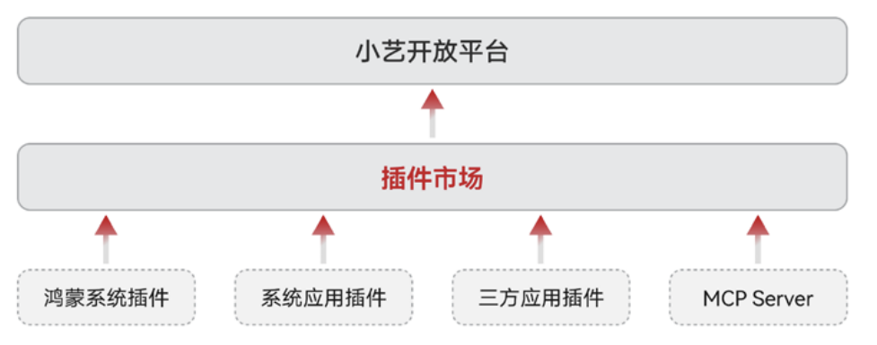
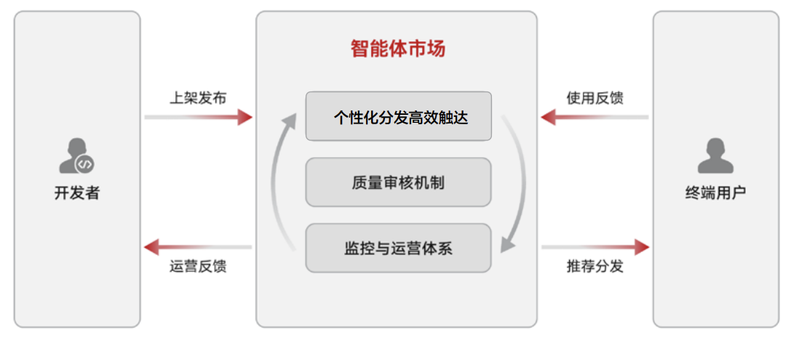

# 平台功能

**四种开发模式支撑智能体灵活构建**

1. **LLM模式**

   LLM 模式是一种基于大模型的智能体编排方式。开发者按需选择大模型，根据业务逻辑编写提示词，以LLM为理解中枢，结合意图识别、工具调用、对话上下文，动态选择插件、工作流，响应用户需求。LLM模式适用于简单对话、知识问答、基础内容生成等场景。
2. **工作流模式**

   工作流模式是一种基于规则化流程的智能体编排方式。开发者将复杂任务拆解为有序的规则化步骤（如数据获取、处理、执行），串联插件、大模型、条件分支、代码块等组件实现自动化执行流程，完成业务逻辑。工作流模式适用于需多步骤协同、逻辑复杂、业务多样性的场景。
3. **A2A模式**

   A2A模式是一种三方智能体接入小艺开放平台的高效编排方式。开发者可通过该模式基于鸿蒙Agent通信协议快速、便捷地将成熟的第三方智能体对接至小艺开放平台，实现分发与调用，提升平台的场景覆盖能力。该模式适用于同时具备鸿蒙端应用与云侧智能体能力的企业开发者。
4. **OpenClaw模式**

   OpenClaw 模式是一种开放灵活的智能体接入与构建方式，开发者可通过该模式接入OpenClaw工具 ，快速创建个性化智能体。该模式适用于个性化助手、自动化服务、场景化应用等多样化需求。

**插件**

小艺开放平台通过插件市场实现生态能力的统一接入与开放：平台将鸿蒙系统插件、系统应用插件、第三方应用插件及三方生态 MCP 工具等能力，经可靠性、稳定性测试后，通过开发平台向开发者开放。

同时开放自定义端云插件能力，支持开发者基于自身诉求打造仅供自己的智能体使用的私有插件。

**智能体市场高效上架分发**

小艺开放平台通过智能体市场推动鸿蒙智能体生态繁荣，借助精准分发、质量保障、监控 运营等手段构建了开发者与终端用户的良性循环：鸿蒙生态开发者完成智能体开发与测试后，可一键发布至智能体市场，获得高效、精准的分发渠道，提升作品曝光与用户触达；终端用户依托严格的质量保障与持续更新机制，始终享有高标准使用体验。
