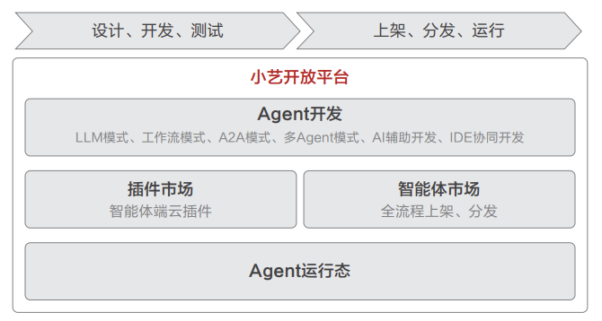

# 平台介绍

小艺开放平台依托鸿蒙系统生态，为开发者打造全链路智能体开发解决方案：平台提供 LLM 模式（大语言模型驱动）、工作流模式（可视化流程编排）、A2A 模式（直连三方智能体）、OpenClaw模式（个性化助手）四大核心开发模式。平台配备端到端工具链，覆盖从智能体开发、多端调试（手机/平板/车机/PC/手表）到部署上架的全生命周期。

智能体完成开发后，将统一上架至智能体市场，实现集中管理和多设备、多入口分发。

1. **鸿蒙系统级入口**

   用户通过鸿蒙系统的系统导航条、小艺搜索、小艺建议等系统入口，快速触达相关的鸿蒙智能体，实现随时可达的智能化服务。
2. **小艺入口**

   小艺是鸿蒙系统中的超级智能体，通过便捷的系统级交互（复制、拖拽、圈选等），小艺能基于屏幕内容和用户意图，深度理解用户需求，通过规划拆解任务，协同多个智能体最优路径完成用户任务，提供更加高效、个性化的智慧体验。
3. **应用内入口**

   通过统一的服务标识和能感知上下文的轻量入口，将智能体从需要用户主动发现和调用的独立功能，转变为与应用核心体验无缝融合、按需涌现的服务。这有助于用户建立一致的认知，把AI 从“需要主动调用的工具”升级为 " 自然流动的服务 "。
