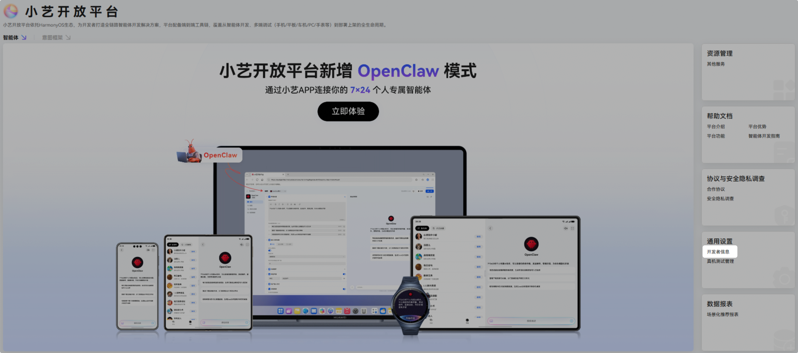
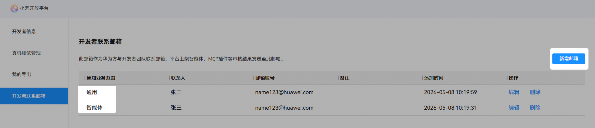
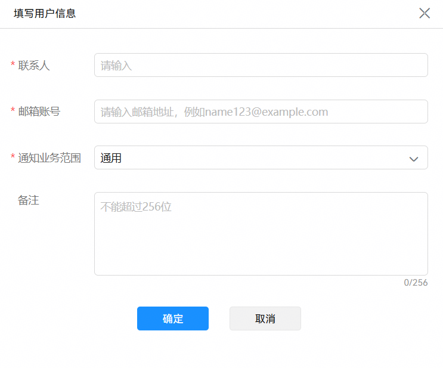

# 大模型下线通知

## 概述

本章节旨在向开发者罗列小艺开放平台模型服务的下线计划及相关影响。

## 下线模型公告表

| 模型 | 建议迁移模型 | 模型下线时间 |
| --- | --- | --- |
| DeepSeek-V3 | DeepSeek-V3.2 | 2026年05月30日 |
| DeepSeek-R1 | DeepSeek-V3.2 | 2026年05月30日 |

## 模型下线影响说明

模型下线后，使用了该模型的线上服务（包括智能体、工作流等）将无法正常运行，导致服务中断。

请开发者务必及时登录[小艺开放平台](https://developer.huawei.com/consumer/cn/hag/hagindex.html?isInFrame=true&lang=zh_CN#/)，将涉及服务切换至新模型并完成升级，以确保业务连续性。给您带来的不便，敬请谅解。

## 邮件通知配置指南

平台提供了邮件提醒能力，模型下线之前将周期性发送邮件提醒开发者更换模型。

**配置步骤**

步骤1：登录[小艺开放平台](https://developer.huawei.com/consumer/cn/hag/hagindex.html?isInFrame=true&lang=zh_CN#/)，点击通用设置中【开发者信息】。

步骤2：选择【开发者联系邮箱】，点击【新增邮箱】，填写用户信息后，【确认】即可。

**信息说明**

a. 联系人：开发者姓名；

b. 邮箱账号：开发者邮箱，为确保您能收到重要通知，请务必配置有效的联系邮箱；

c. 通知业务范围：选择通用或智能体类型；

d. 备注：备注说明，非必填。

