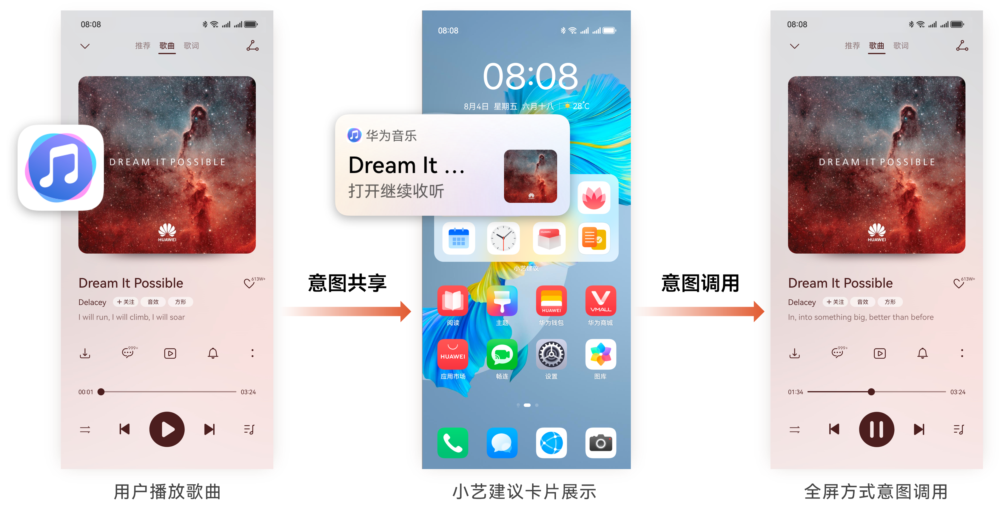
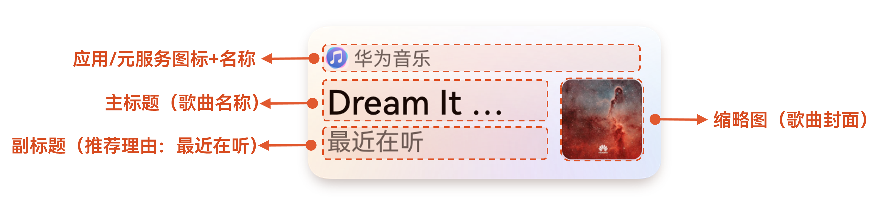

import MergeTable from '@site/src/components/MergeTable';

# 智慧分发特性

当前已开放以下智慧分发特性，其他更多特性将陆续开放。

意图框架在每个垂域下都开放了多个智慧分发特性，以满足开发者不同垂域和场景的分发诉求。以下以“歌曲续听推荐”特性为例，介绍特性的交互设计以及特性的展示效果，其他特性的详细信息请参阅页面最后的各垂域的智慧分发特性列表。

## 基本介绍

|  |  |
| --- | --- |
| <strong>特性名称</strong> | 歌曲续听推荐 |
| <strong>特性类型</strong> | 习惯推荐 |
| <strong>适用入口</strong> | 小艺建议 |
| <strong>分发载体</strong> | 应用/元服务 |

## 意图依赖

| <strong>意图名称</strong> | <strong>意图名称（英文）</strong> | <strong>意图调用</strong> | <strong>意图共享</strong> |
| --- | --- | --- | --- |
| 播放歌曲 | PlayMusic | 端-前台 & 端-后台 | 端 |

## 交互设计

意图框架支持开发者通过“意图共享”，将用户听歌曲的行为和数据共享给意图框架，经过意图框架的规律学习，最终在小艺建议入口展示对应场景的模板卡片（如播放歌曲）。

应用/元服务将当前用户已听歌曲共享给意图框架，在意图框架学习出规律后，在小艺建议入口展示歌曲推荐。

## 卡片展示效果

使用意图框架提供的系统标准模板卡，无需开发者开发，模板卡样式的示例如下：

主要展示元素为：应用/元服务名称、应用/元服务图标、主标题、缩略图、副标题。

卡片展示元素对应意图共享（PlayMusic）的参数如下：

| <strong>展示元素</strong> | <strong>意图参数字段</strong> | <strong>说明</strong> |
| --- | --- | --- |
| 应用/元服务名称 | NA | 系统自动获取（无需开发者填写） |
| 应用/元服务图标 | NA | 系统自动获取（无需开发者填写） |
| 主标题 | displayName | 歌曲名称 |
| 缩略图 | logoURL | 歌曲封面图片 |
| 副标题 | NA | 固定可解释性内容，由系统自动获取（无需开发者填写），例如”最近常听” |

## 各垂域的智慧分发特性列表

| 垂域 | 特性名称 | 特性类型 | 入口 | 场景描述 | 依赖意图（中文） | 意图调用 | 意图共享 |
| --- | --- | --- | --- | --- | --- | --- | --- |
| 视频 | 常看视频续播推荐 | 习惯推荐 | 小艺建议 | 根据用户播放视频行为形成习惯画像，并根据播放历史推荐续播内容（未播完） | 播放视频 | 端 | 端 |
| 视频新内容推荐 | 习惯推荐 | 根据用户播放视频行为形成习惯画像，在用户常看视频时段获取新视频内容并推荐 | 搜索视频 | 云 | —— |
| 播放视频 | 端 | 端 |
| 订阅视频更新推荐 | 事件推荐 | 基于关注的视频节目事件进行推荐 | 查看订阅视频更新 | 端 | 云 |
| 直播 | 预约直播更新推荐 | 事件推荐 | 小艺建议 | 基于预约的直播事件进行推荐 | 查看预约直播 | 端 | 云 |
| 音乐 | 音乐续听推荐 | 习惯推荐 | 小艺建议 | 根据用户播放歌曲行为形成习惯画像，并根据播放历史推荐最近播放内容 | 播放歌曲 | 端 | 端 |
| 常听歌单推荐 | 习惯推荐 | 根据用户播放歌单行为形成习惯画像，并根据播放历史推荐常听内容 | 播放歌单 | 端 | 端 |
| 有声 | 有声续听推荐 | 习惯推荐 | 小艺建议 | 根据用户播放有声行为形成习惯画像，并根据播放历史推荐续听内容（未听完） | 播放有声 | 端 | 端 |
| 有声新内容推荐 | 习惯推荐 | 根据用户播放有声行为形成习惯画像，并上云搜索推荐有声内容 | 搜索有声 | 云 | —— |
| 播放有声 | 端 | 端 |
| 关注有声节目更新推荐 | 事件推荐 | 基于关注的有声节目 | 查看订阅有声更新 | 端 | 云 |
| 游戏 | 常玩游戏续玩 | 习惯推荐 | 小艺建议 | 根据用户玩游戏行为形成规律推荐 | 玩转游戏 | 端 | 端 |
| 游戏进程更新推荐 | 事件推荐 | 基于游戏中进程更新事件推荐 | 查看游戏进程 | 端 | 云 |
| 阅读 | 常看书籍续读推荐 | 习惯推荐 | 小艺建议 | 根据用户阅读行为形成标签画像，并根据用户阅读历史推荐续读内容 | 阅读书籍 | 端 | 端 |
| 订阅书籍上架/更新推荐 | 事件推荐 | 用户订阅的书籍上架或者章节有更新时推荐 | 查看订阅读物更新 | 端 | 云 |
| 阅读书籍 | —— | 端 |
| 新闻（资讯博客） | 常看资讯博客类型推荐 | 习惯推荐 | 小艺建议 | 根据用户浏览资讯习惯形成标签画像，推荐展示标签内容； | 查看资讯博客 | 端 | 端 |
| 常看资讯博客类型内容推荐 | 习惯推荐 | 根据用户浏览资讯习惯形成标签画像，并根据此搜索最新内容进行推荐 | 搜索资讯博客 | 云 | —— |
| 查看资讯博客 | 端 | 端 |
| 关注创作者更新推荐 | 事件推荐 | 根据创作者更新事件触发，对用户经常浏览资讯博客的创作者进行推荐 | 查看关注创作者更新 | 端 | 云 |
| 查看资讯博客 | 端 | 端 |
| 常看专栏推荐 | 习惯推荐 | 根据用户浏览社区/车友圈行为学习规律，进行专栏推荐 | 查看专栏 | 端 | 端 |
| 专栏事件推荐 | 事件推荐 | 用户常浏览专栏在有内容更新时进行推荐 | 查看专栏更新 | 端 | 云 |
| 查看专栏 | 端 | 端 |
| 常看榜单推荐 | 习惯推荐 | 根据用户浏览榜单习惯形成规律，并搜索实时榜单内容推荐展示 | 查看榜单 | 端 | 端 |
| 交通票务 | 航班行程推荐（事件） | 事件推荐 | 小艺建议 | 基于航班订单事件进行航班行程推荐 | 查看已订航班信息 | 端 | 云 |
| 火车行程推荐（事件） | 事件推荐 | 基于火车订单事件进行火车行程推荐 | 查看已订火车信息 | 端 | 云 |
| 住宿 | 酒店订单推荐（事件） | 事件推荐 | 小艺建议 | 基于酒店订单事件进行行程推荐 | 查看已订酒店信息 | 端 | 云 |
| 违章查询 | 常看车辆限行推荐 | 习惯推荐 | 小艺建议 | 基于用户常看车辆限行规律进行推荐，并展示当天实时结果 | 搜索车辆限行 | 云 | —— |
| 查看车辆限行 | 端 | 端 |
| 商城 | 加购商品降价提醒 | 事件推荐 | 小艺建议 | 基于加购商品降价事件进行推荐提醒 | 查看商品降价 | 端 | 云 |
| 本地生活 | 生活缴费提醒 | 事件推荐 | 小艺建议 | 根据生活缴费到期，余额不足等事件进行推荐 | 查看生活缴费 | 端 | 云 |
| 天气日历 | 常看生活指数推荐 | 习惯推荐 | 小艺建议 | 基于用户常看天气生活指数规律进行推荐，并展示当天实时结果 | 搜索生活指数 | 云 | —— |
| 查看生活指数 | 端 | 端 |
| 家居装修 | 常用设备推荐 | 习惯推荐 | 小艺建议 | 基于用户经常使用IOT设备规律进行学习推荐 | 查看智能设备 | 端 | 端 |
| 银行 | 还款代办事件提醒 | 事件推荐 | 小艺建议 | 在用户信用卡/贷款还款日前推荐还款提醒 | 查看还款 | 端 | 云 |
| 还款技能调用 | 技能调用-对话 | 小艺语音 | 通过用户对话输入理解拉起还款页面 | 发起还款 | 端 | —— |
| 本地搜索还款功能 | 本地搜索 | 小艺搜索 | 查找搜索还款、还信用卡等功能 | 发起还款 | 端 | 端 |
| 股票基金 | 新股新债事件推荐 | 事件推荐 | 小艺建议 | 结合用户对新股新债的阅读习惯，在盘前，给用户推荐新股新债的卡片 | 查看新股新债更新 | 端 | 云 |
| 查看新股日历 | 端 | 端 |
| 常看自选股推荐 | 习惯推荐 | 根据用户查看自选股的习惯，学习规律给用户推送自选股卡片 | 查看自选股行情 | 端-前台  端-卡片 | 端 |
| 办公软件 | 企业动态信息推荐 | 事件推荐 | 小艺建议 | 企业动态 信息变更推荐 | 查看关注企业更新 | 端 | 云 |
| 招聘 | 常看招聘信息推荐 | 习惯推荐 | 小艺建议 | 根据常看的招聘岗位进行学习推荐 | 查看工作信息 | 端 | 端 |
| 学习 | 常学课程推荐 | 习惯推荐 | 小艺建议 | 常学课程学习 | 学习课程 | 端 | 端 |
| 医疗 | 预约体检提醒 | 事件推荐 | 小艺建议 | 预约体检后进行提醒推荐 | 查看挂号预约信息 | 端 | 云 |
| 工具 | 常用打卡推荐 | 习惯推荐 | 小艺建议 | 常用打卡行为规律学习 | 打卡 | 端 | 端 |
| 常用扫码推荐 | 习惯推荐 | 用户经常使用扫码功能进行推荐 | 扫码 | 端 | 端 |
| 旅游 | 景点攻略内容推荐 | 技能调用-对话 | 小艺语音 | 跨城场景卡-推荐城市攻略 | 搜索旅游攻略 | 云 | —— |
| 本地搜索旅游攻略 | 端 | —— |
| 搜索旅游攻略 | 技能调用-对话 | 小艺语音 | 通过理解用户输入搜索景点攻略，在小艺内展示卡片，并支持选择跳转 | 搜索旅游攻略 | 云 | —— |
| 查看旅游攻略 | 端 | —— |
| 查看景点攻略- AGC位置推荐 | 位置推荐 | 小艺建议 | AGC位置推荐场景查看景点攻略 | 查看旅游攻略 | 端 | 云 |