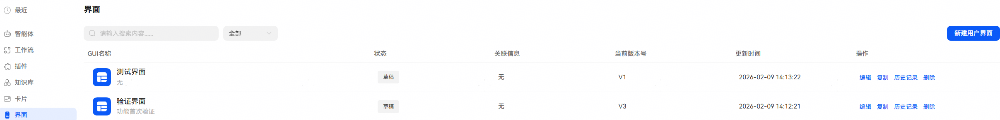
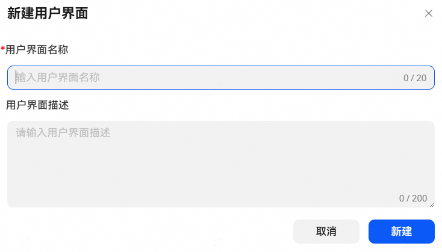
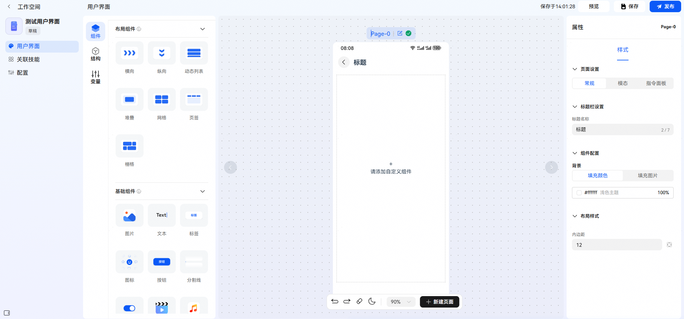
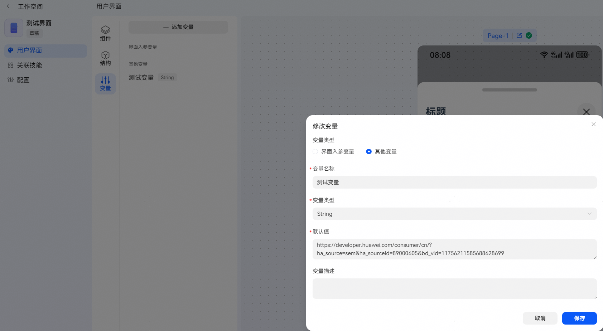
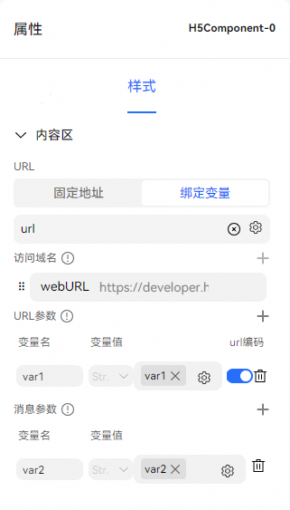
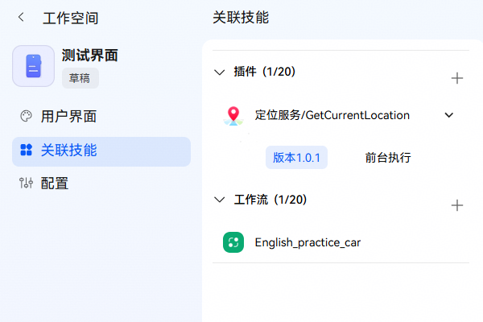
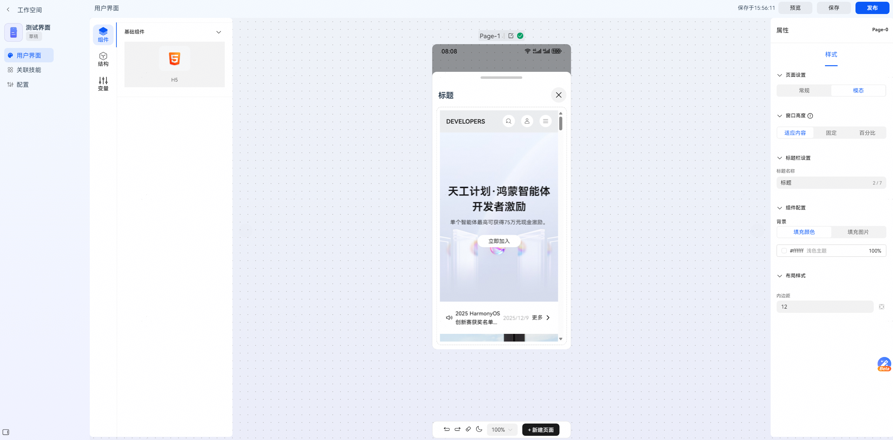
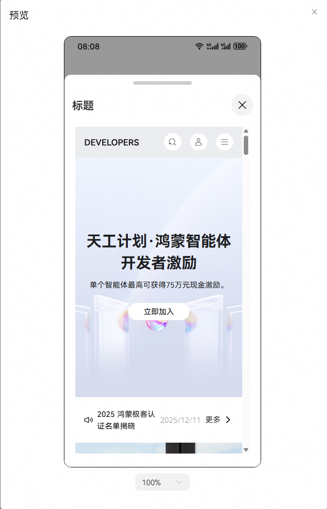
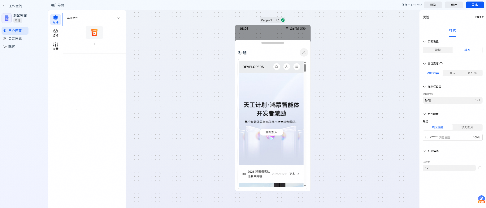

# 开发界面

界面与卡片均为小艺通过智能体提供的用户交互方式。其中，界面以全屏或半屏弹出的形式呈现，为用户提供一个相对独立、沉浸式的交互空间。用户可在该界面中通过点击按钮、输入文本等控件操作，与智能体完成高效、直观的交互。

本章节将介绍界面创建与发布，当智能体需要实现图形用户界面（以下简称GUI）交互场景时，可以参考本章节介绍实现。GUI创建后支持在智能体中供工作流绑定使用，工作流绑定GUI参考[工作流界面使用](/docs/distribute/xiaoyi/workflow-configuration-5-0000002471264261/workflow-gui-0000002549407129)、触发器绑定GUI参考[触发器通用事件](/docs/distribute/xiaoyi/trigger-0000002437625878/trigger-common-0000002492963588)。

## 新建界面

进入小艺开放平台，点击【工作空间】-【界面】-【新建用户界面】，填写用户界面名称和描述后，点击【新建】。

## 编辑界面

界面编辑页面从左到右依次为功能区、预览画布区和属性配置区。开发者可以拖动组件图标到中间画布区域，选中中间画布上某个组件时，右边会展示该组件的属性配置，修改属性配置可以实时在画布上生效。组件编辑使用可参考[自定义卡片编辑](https://developer.huawei.com/consumer/cn/doc/service/custom-card-editing-0000002471264337)。

变量：

变量用于存储页面的临时数据以及用户界面的入参，分为两种类型：

* 界面入参变量：工作流输出界面时传入，非必传，如果不传就会用界面内定义的默认值。
* 其他变量：自定义变量参数。

变量创建后，可以在组件属性配置时绑定使用。

## 界面关联技能

在【关联技能】管理页面支持添加插件或工作流，作为组件事件调用的白名单。注意：

* 事件执行动作中使用的插件/工作流将自动在此处生成关联关系。
* H5组件只允许添加端插件作为白名单。

## 界面预览、保存与发布

**界面预览**

点击预览后，可在弹出的窗口中预览界面效果。预览展示了界面在设备上的预期显示效果。

**界面保存与发布**

预览效果符合预期后，点击保存并发布界面，界面发布后，在智能体工作流绑定界面时，就可以关联到已发布的界面。

