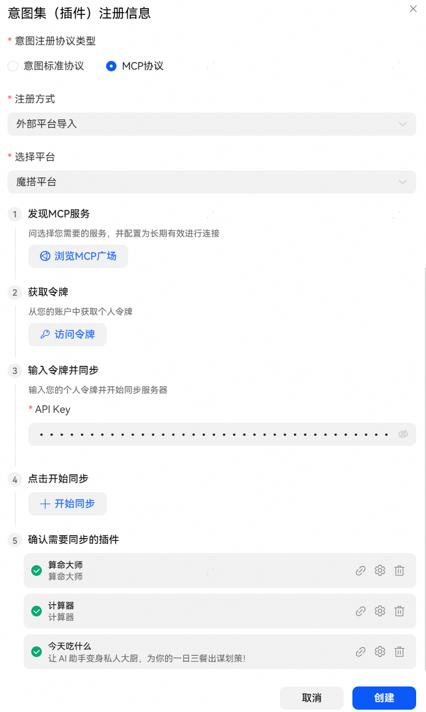
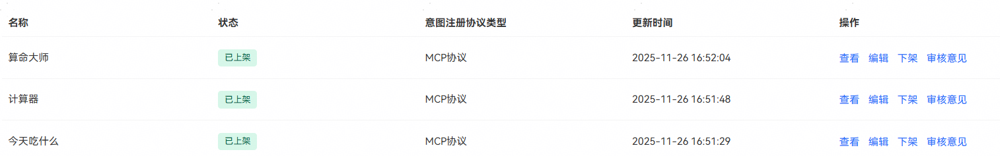
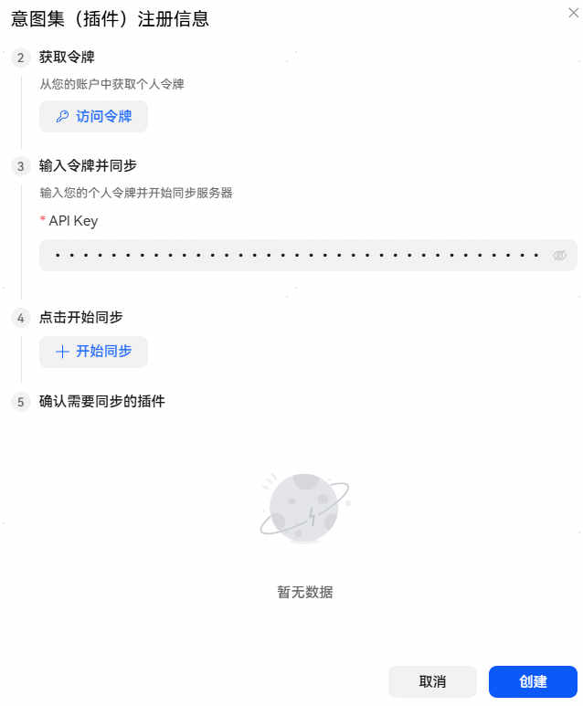
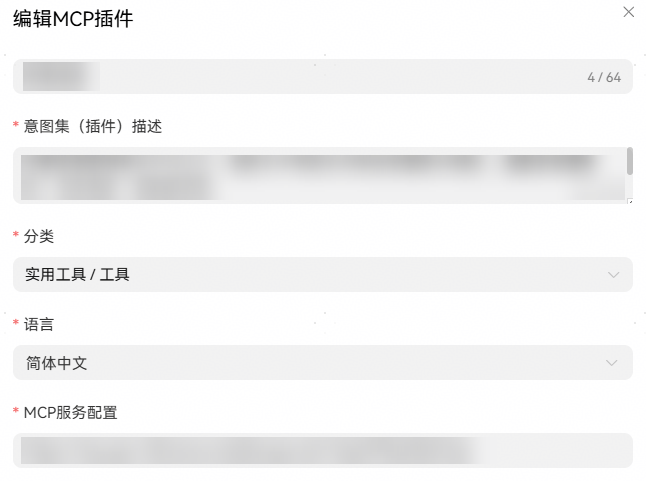

# 外部平台导入

## 创建步骤

1，【注册方式】选择【外部平台导入】，【选择平台】选择【魔搭平台】。

2，填写API Key，可以点击【访问令牌】进行获取。

3，点击【开始同步】按钮。

4，插件列表同步完成后点击创建。

点击创建后会自动逐步完成插件创建、工具拉取、插件发布（仅支持发布到智能体渠道）。

## FAQ

问题1、外平台导入方式注册MCP插件，输入访问令牌同步完成后，未同步到插件信息？

答：仅支持导入在魔搭平台自部署的**长期有效**的MCP插件，请先在该访问令牌对应魔搭账号下部署符合要求的插件。

问题2、外平台导入方式注册MCP插件创建后，同步回来的插件未全部创建？

答：已同步并创建到插件列表中的MCP插件，再次导入时虽然会在同步的插件列表中展示，但点击创建后自动过滤掉已创建插件（根据MCP服务配置中的配置地址判断插件是否重复）； 如有需要，可下架并删除重复插件后重新同步。

问题3、人工智能生成合成内容标识和大模型备案信息填写相关问题？

答：详情可参考[AI标识和大模型备案FAQ](https://developer.huawei.com/consumer/cn/doc/service/developer-behavior-0000002497919308)。
