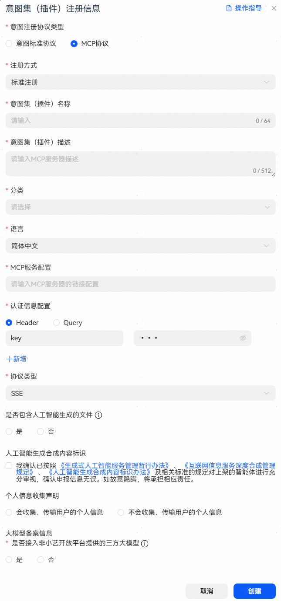
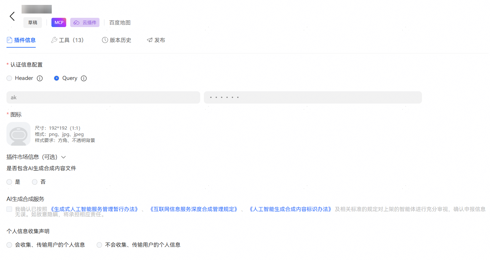
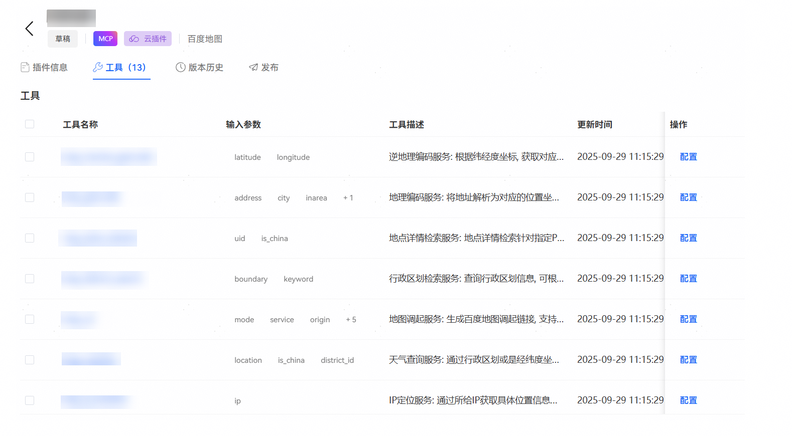
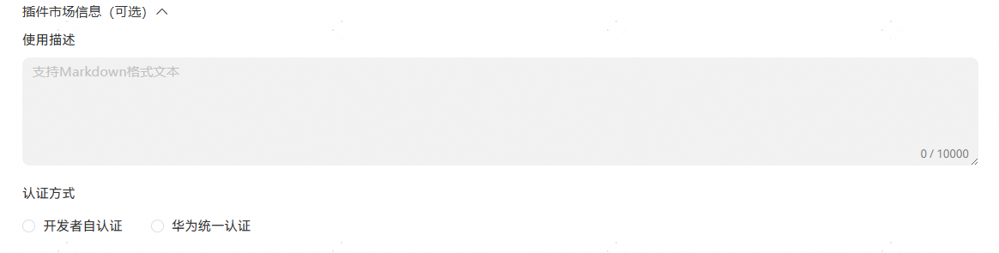
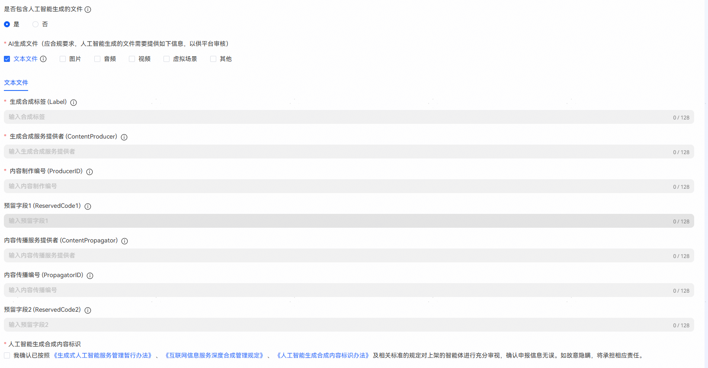
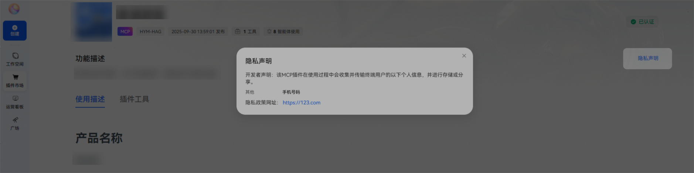
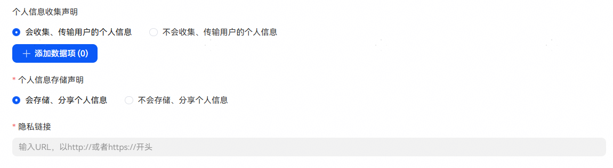
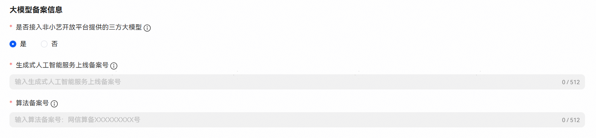

# 标准注册

## 标准注册创建说明

【注册方式】选择【标准注册】，填写插件信息后点击创建。

点击创建后进入插件信息编辑页面，手动上传插件图标点击保存，保存会自动拉取工具列表。

若出现工具列表，检查工具入参，参数是否重复或者缺失，参数类型是否正确。若一切无误，则配置成功。

若未出现工具列表，请等候几分钟重新进入，后台加载存在延时；如若重新进入后，还是没有工具信息，可能是插件的链接和鉴权信息配置错误。多次尝试后仍未解决，请联系华为小艺平台人员定位 。

此外：如果需要发布到插件市场需补充插件市场信息，需要发布到主对话或插件市场需补充人工智能体生成合成服务、个人信息收集声明和大模型备案信息。

## 插件市场信息说明

【使用描述】：描述请使用Markdown格式。描述中包含server的功能概述，包含apikey申请方式。

【开发者自认证】：需要使用该插件的开发者自行申请认证key，使用插件前需完成认证信息配置 。

【华为统一认证】：由华为方统一申请认证key并完成认证信息填写后，提供给其他开发者使用。

## 人工智能生成合成服务填写说明

应国家法律合规要求：[《生成式人工智能服务管理暂行办法》](https://www.cac.gov.cn/2023-07/13/c_1690898327029107.htm)、[《互联网信息服务深度合成管理规定》](https://www.cac.gov.cn/2022-12/11/c_1672221949354811.htm)、[《人工智能生成合成内容标识办法》](https://www.cac.gov.cn/2025-03/14/c_1743654684782215.htm)，插件公开上架前需填写人工智能生成合成服务信息，以供平台审核。

填写项说明：

人工智能生成合成服务填写插件中是否涉及人工智能生成合成的内容，开发者需按照国家法律规定如实在这里填写申报。

| 填写项 | 说明 |
| --- | --- |
| 是否包含人工智能生成合成内容文件 | 结果中是否包含AI生成合成内容，如文本文件、图片、音频、视频、虚拟场景等；若包含选择“是”，否则选择“否”。 |
| AI生成文件 | 涉及AI生成合成内容文件时必填，根据实际勾选对应AI生成文件类型，并填写人工智能生成合成内容标识。 |
| 人工智能生成合成内容标识 | 请仔细阅读相关规定后勾选。 |

“是否包含人工智能生成合成内容文件”选择“是”时需填写人工智能生成合成内容标识。人工智能生成合成内容标识详情可参考[《人工智能生成合成内容标识方法》](https://openstd.samr.gov.cn/bzgk/std/newGbInfo?hcno=F32EA2A561F1886CD8D606513512D547) 。

人工智能生成合成内容标识配置及说明：

| 配置 | 说明 |
| --- | --- |
| 生成合成标签 (Label) | 存储内容属于、可能、疑似为人工智能生成合成的属性信息：属于人工智能生成合成内容的，值取1；可能为人工智能生成合成内容的，值取2；疑似为人工智能生成合成内容的，值取3。 |
| 生成合成服务提供者 (ContentProducer) | 存储生成合成服务提供者的名称或编码。 |
| 内容制作编号 (ProducerID) | 存储生成合成服务提供者对该内容的唯一编号。 |
| 预留字段1 (ReservedCode1) | 可存储用于生成合成服务提供者自主开展安全防护、保护内容、标识完整性的信息。 |
| 内容传播服务提供者 (ContentPropagator) | 存储内容传播服务提供者的名称或编码。 |
| 内容传播编号 (PropagatorID) | 存储内容传播服务提供者对该内容的唯一编号。 |
| 预留字段2 (ReservedCode2) | 可存储用于内容传播服务提供者自主开展安全防护、保护内容、标识完整性的信息。 |

## 个人信息收集声明说明

插件公开上架前，需填写“个人信息收集声明说明”，以便使用者了解插件的个人信息收集和存储情况。

个人信息收集声明填写信息会在智能体-【插件市场】对应插件详情页【隐私声明】中展示，点击可查看声明信息。

填写项说明：

【是否收集、传输用户的个人信息】：若“是”请按实际添加数据项及存储声明；点击【添加数据项】可查看个人信息数据范围。

【个人信息存储声明】：是否存储分享收集到的用户个人信息。若“是”需继续填写隐私链接。

【隐私链接】：个人信息存储分享说明地址。

## 大模型备案信息说明

插件中如果使用了非小艺开放平台提供的三方大模型，需在此处申报备案，多个备案号使用英文逗号分隔。生成式人工智能服务上线备案号查询：登录[《国家互联网信息办公室关于发布生成式人工智能服务已备案信息的公告》](https://www.cac.gov.cn/2024-04/02/c_1713729983803145.htm)查询、算法备案号查询：登录[《互联网信息服务算法备案系统》](https://beian.cac.gov.cn/#/index)查询。

