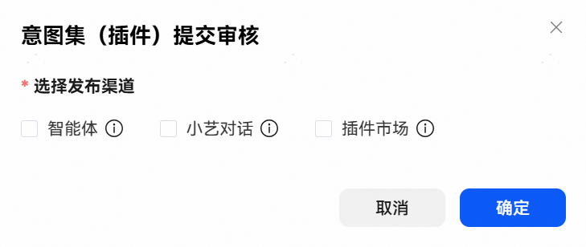

# 发布插件

点击【发布】-【提交审核】，勾选待发布渠道点击【确认】后即可发布，MCP插件有三种发布渠道：

智能体：发布到智能体，可以在创建智能体和工作流时，在工作空间中选择此插件；发布后即可上架成功，无需人工审核。

小艺对话：发布到小艺对话，可以在技能服务中使用此插件；发布后需联系华为侧人员进行审核。

插件市场：选择发布到插件市场后，经过审核后可以将此插件开放到插件市场中被其他开发者发现和使用；发布后需联系华为侧人员进行审核公开。

