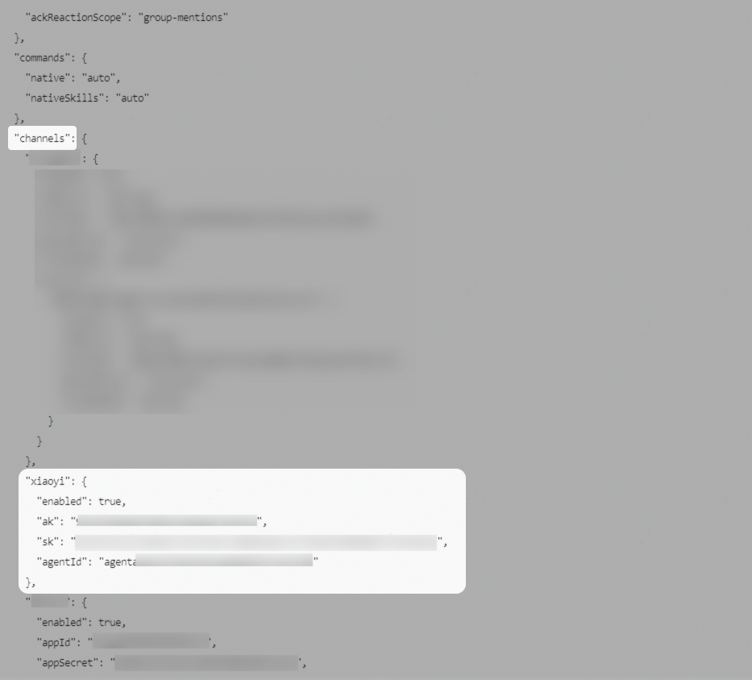
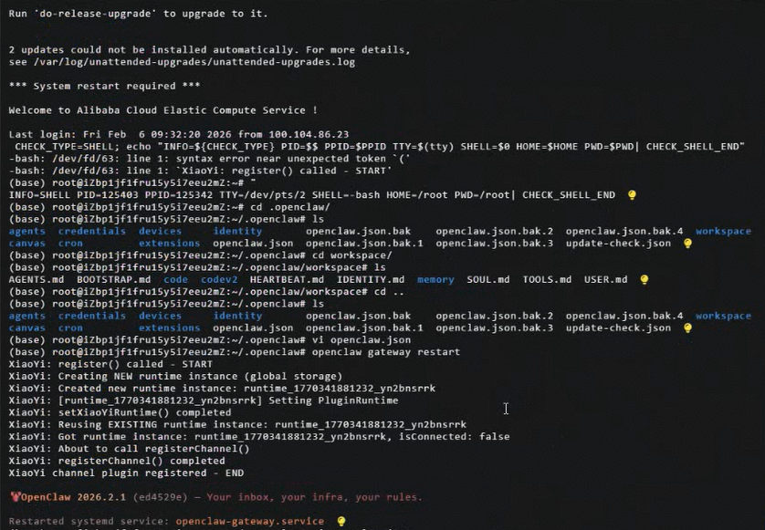
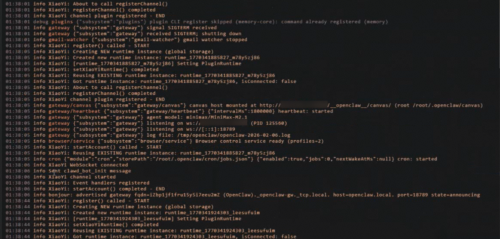
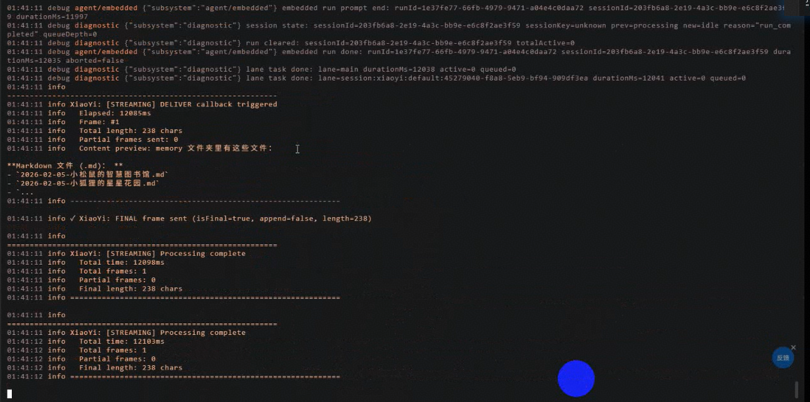

# OpenClaw接入

## 接入步骤

## 一、服务器安装OpenClaw

参考[OpenClaw官方](https://docs.openclaw.ai/zh-CN/install)安装到个人电脑或服务器，也可以直接使用云服务商提供的OpenClaw应用模板安装。

**注意：OpenClaw官方社区目前也建议不要把OpenClaw部署在个人的主力电脑中，否则可能对本地电脑数据的安全造成影响。**

## 二、创建OpenClaw智能体

参考[创建OpenClaw智能体](/docs/distribute/xiaoyi/ability-expansion-function-introduction-0000002437625858/open-claw-base-0000002518704040)，创建完成后获取【channels配置】。

## 三、将智能体channel配置接入OpenClaw服务器

a. 在服务器中执行以下命令接入小艺插件。

```
openclaw plugins install @ynhcj/xiaoyi@latest
```

b. 在OpenClaw服务器的/root/.openclaw/openclaw.json配置文件中，添加小艺的channels配置项。

注意：

* 如果已配置过其他channel，在配置文件中找到channels位置，在其json对象里增加xiaoyi的配置。

* 若未创建过其他channel，在配置文件json的顶层增加如下channels配置，channels对象位置与models、agents对象在同一个层级。
* 请确保配置中的ak和sk已替换。

配置示例：

```
"channels": {
	"xiaoyi": {
		"enabled": true,
		"ak": "{{小艺开放平台凭证ak}}",
		"sk": "{{小艺开放平台凭证sk}}",
		"agentId": "{{智能体的agentId}}"
	}
}
```



c. 配置完成后运行以下命令重启服务器，使配置生效。

```
openclaw gateway restart
```



d. 在服务器上执行以下命令查看日志。若日志中出现“info sent claw\_bot\_init message”，则表明服务器已成功与小艺建立连接。

后续小艺的调用日志也可通过该命令进行查看。

```
openclaw logs --follow
```



## 效果示例

调试效果


调用OpenClaw服务器日志


