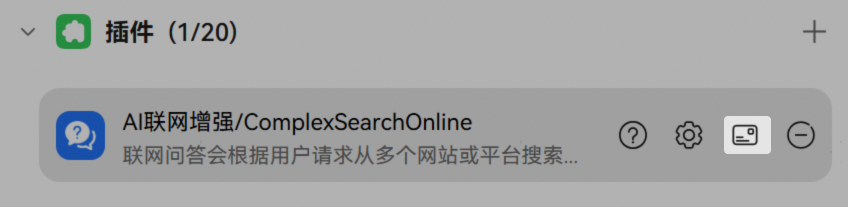
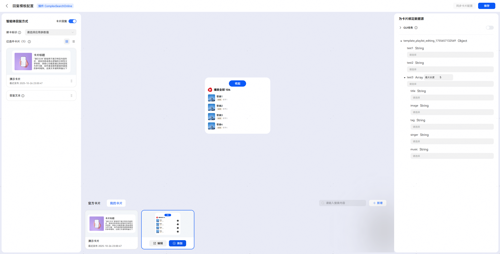
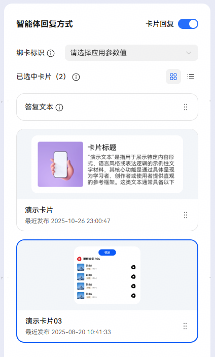
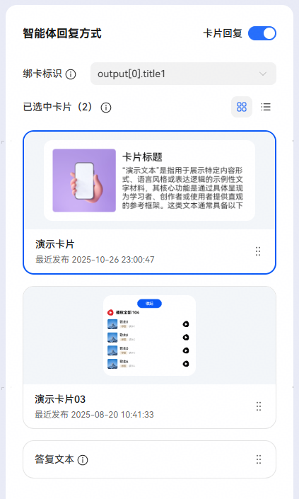
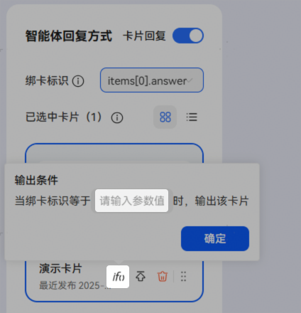

# 插件绑卡

添加插件后点击图中【绑定回复卡片】图标进入绑卡页面。

点击卡片可查看卡片的详细内容，如果想绑定该卡片，将鼠标悬浮在卡片上后，点击添加按钮。

同一插件支持绑定多张卡片；支持同一时刻输出多张卡片；支持配置答复文本和卡片的输出顺序，答复文本和卡片将按照配置顺序输出。

* 批式插件工具，答复文本与卡片可随意编排位置（批式插件融合生成开关关闭时，无答复文本，只输出卡片）；
* 流式插件工具，支持分别在首末帧返回绑卡信息。如果在首帧返回绑卡信息，则先出卡再出文本；如果在末帧返回绑卡信息，则先出文本再出卡片。

**绑卡标识**

开发者可以通过绑定绑卡标识设置出卡条件，不设置绑卡标识时，固定出卡。

* 绑卡标识仅支持选择String和Array[String]类型的插件响应字段；
* 出卡对比值在卡片输出条件中配置；
* 用户选择绑卡标识为String类型时，当绑卡标识值和输出条件中输入值完全相等时出卡，否则不出卡；
* 用户选择绑卡标识为Array[String]类型时，当绑卡标识值包含输出条件中输入的值时出卡，否则不出卡。

输出条件设置入口：

