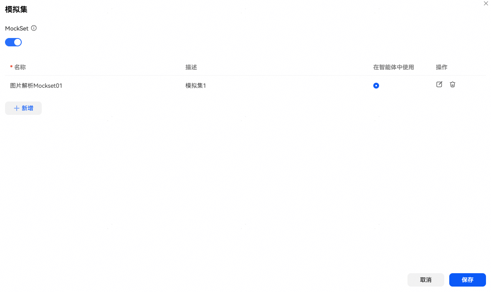
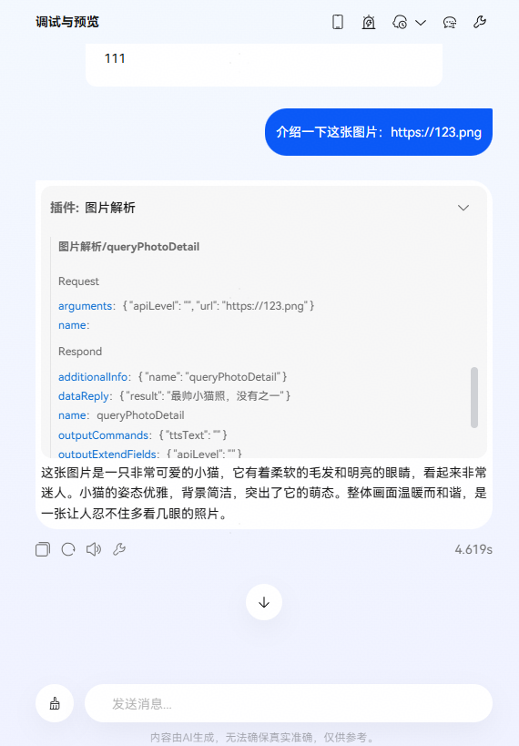

# 插件模拟集

## 功能介绍

在智能体中调用插件时，支持使用模拟集数据进行调试，无需依赖真实接口，提升开发效率。

## 模拟集配置

如下图所示，点击插件【模拟集】图标进入模拟集绑定界面，打开MockSet开关，选择使用模拟集数据，智能体调用此插件时，插件将响应配置的模拟数据。模拟集创建可参考 [云插件模拟集](/docs/distribute/xiaoyi/cloud-plug-in-0000002471344189/cloud-plug-mock-0000002517832252)、[端插件模拟集](/docs/distribute/xiaoyi/end-plug-in-0000002471264313/end-plug-mock-0000002549594931)。

## 智能体调试

插件绑定模拟集后，可在网页端进行调试。注意：仅在网页调试时使用模拟集数据；当手机端调用智能体时，将自动调用真实接口，不会使用模拟集数据。

