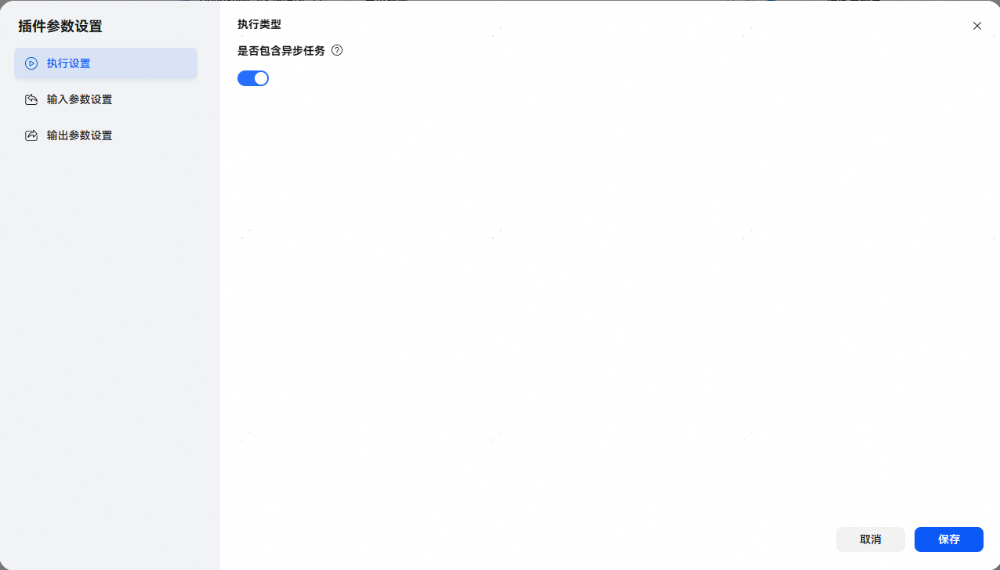
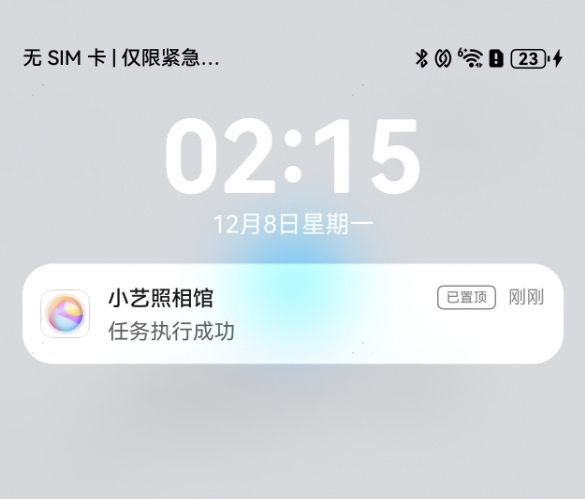
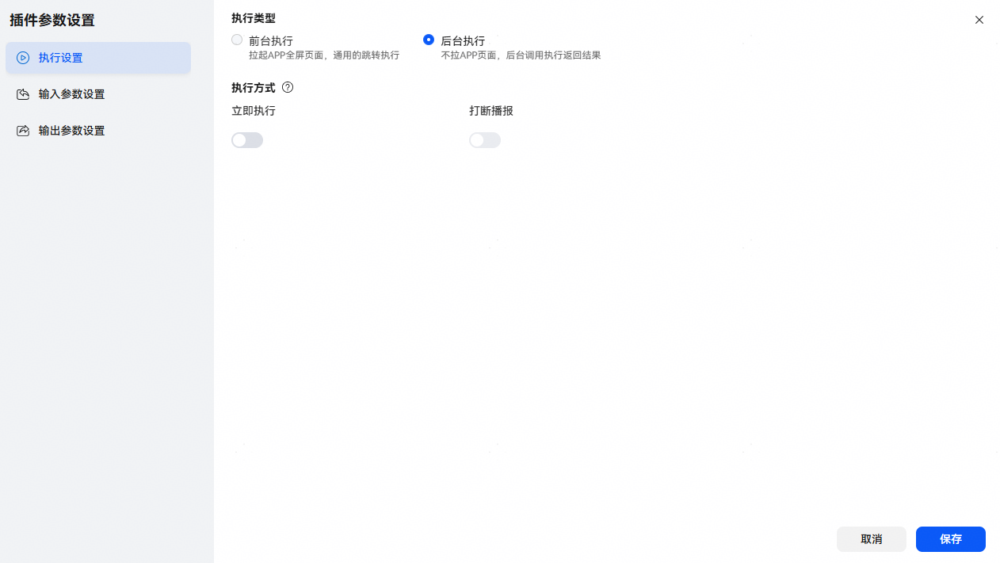
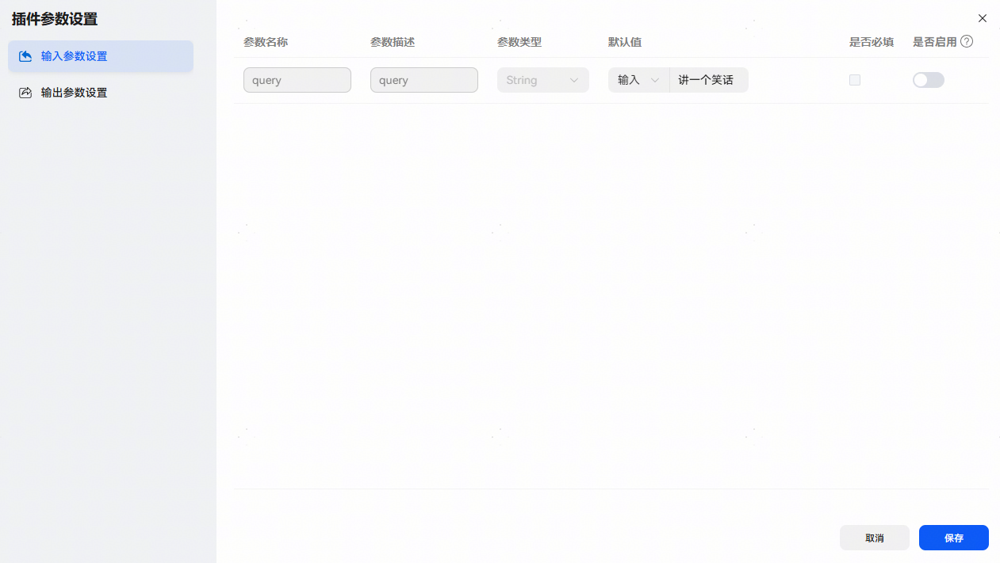
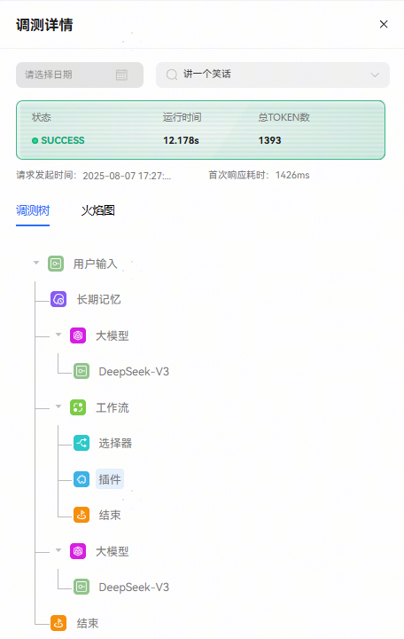
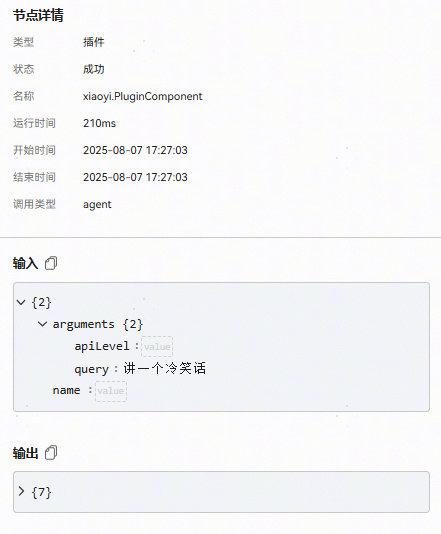
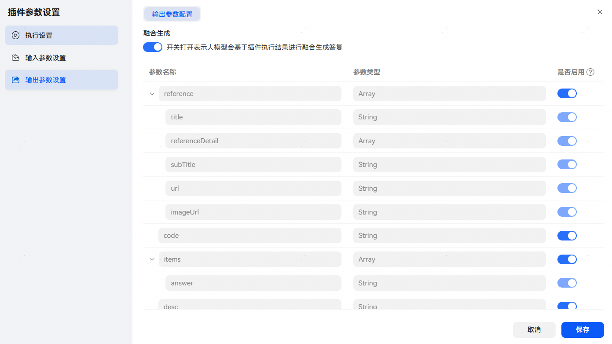
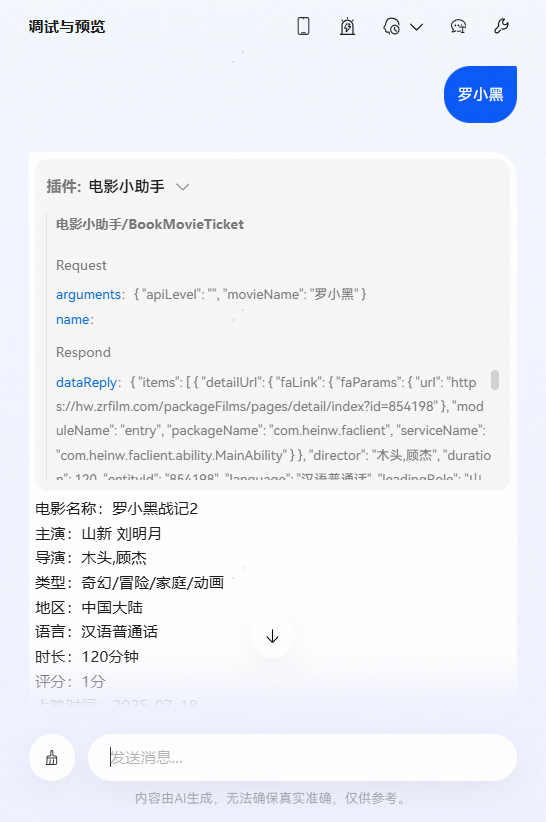
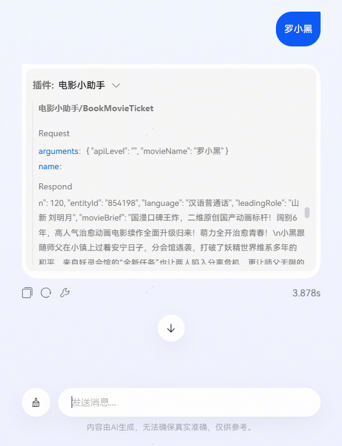

# 插件参数设置

添加插件后点击【插件参数设置】图标进入设置页面，支持执行设置、输入参数设置和输出参数设置：

## 执行设置（云/MCP插件）

对于插件执行耗时较长，执行完希望自动通知到用户结果的场景，可通过配置异步任务实现。

点击执行设置中开启【是否包含异步任务】开关，手机端与智能体对话，若小艺APP不在前台，插件执行完成后，将自动向用户发送Push消息通知用户执行结果；开关关闭时，插件执行完成后不发送通知消息；开关默认关闭。

Push消息通知效果：

## 执行设置（端插件）

【执行类型】：分为前台执行和后台执行两种类型，在插件配置界面修改，详情参考[端插件配置](/docs/distribute/xiaoyi/end-plug-in-0000002471264313/endpoint-plugin-configuration-0000002437785762)。

* 前台执行：拉起端侧应用到前台页面。
* 后台执行：后台执行该工具，后续使用该工具的时候，可以绑定卡片把返回的数据以卡片形式呈现出来。

【执行方式】：可设置立即执行和打断播报两种类型。

* 立即执行：清空已下发指令，立即执行该指令。
* 打断播报：系统提供了“打断播报”功能。使用时必须开启“立即执行”开关方可生效。建议在涉及音视频播放的场景使用。

## 输入参数设置

【默认值】：设置参数的默认值。默认值支持输入和引用两种方式，其中引用是使用变量中定义的参数。

【是否启用】：打开开关，表示参数对大模型可见，大模型可以读取该参数；关闭开关，表示隐藏参数，大模型无法读取该参数。

* 如果设置了参数默认值且打开是否启用开关，那么调用插件时，大模型会以该默认值为基础，但仍会根据自身的逻辑判断是否使用其他值。
* 如果设置了参数默认值且关闭是否启用开关，那么调用插件时，大模型只会使用这个默认值。

  

  输入参数启用关闭：使用默认值调用插件。

  

  输入参数启用打开：大模型根据用户语料提取输入参数值调用插件。

  

## 输出参数设置

智能体添加插件后，大模型可以根据插件的执行结果进行融合生成，通过插件输出参数配置，可以设置是否让大模型融合生成以及某输出参数是否给大模型进行融合生成。

* 【融合生成】：开关打开表示大模型会基于插件执行结果进行融合生成生成。
* 【是否启用】：融合生成开关开启时，若参数设置不启用，该参数将不会给大模型融合生成。

  

  **开启融合生成效果：**

  

  **关闭融合生成效果：**

  
