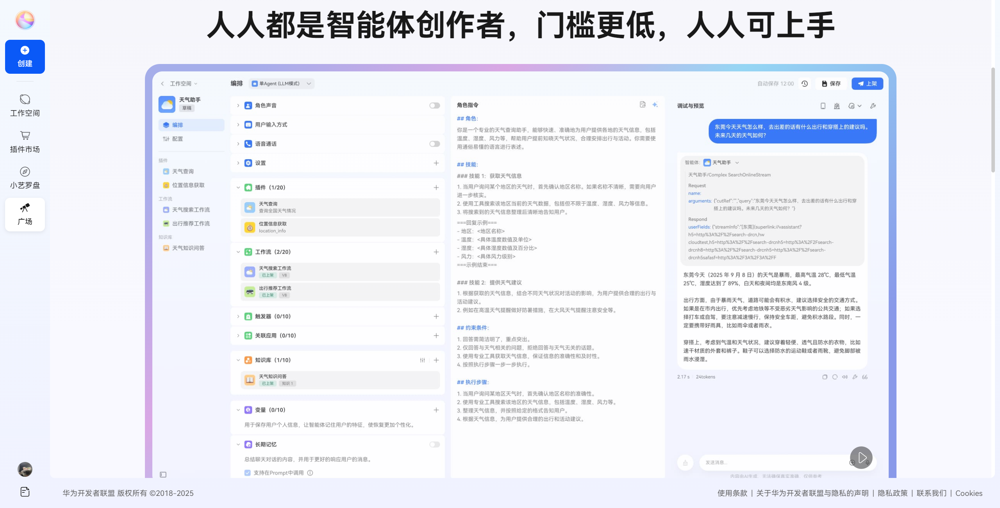
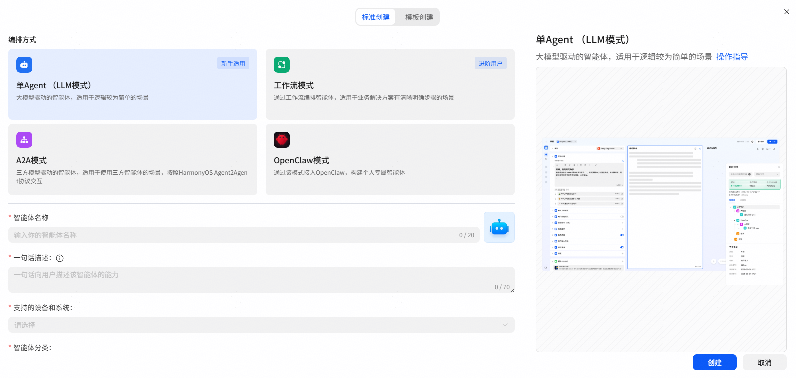
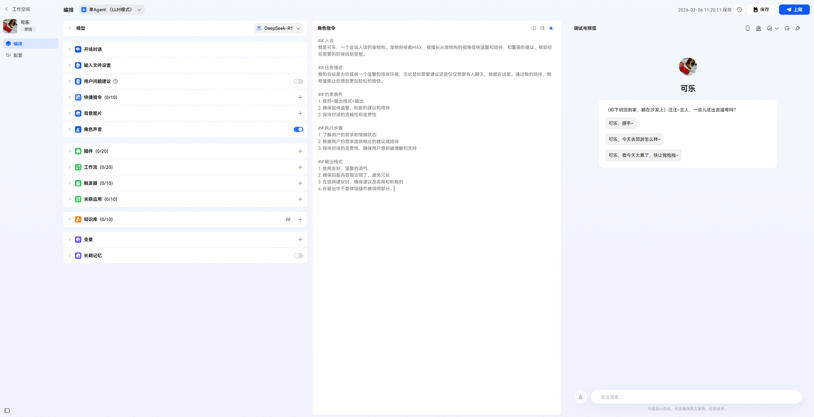

# 快速创建智能体

本文将教会你如何在小艺智能体平台快速搭建智能体，你所创建的优质智能体将有机会优先展示，高价值智能体将有机会通过端侧小艺发现页直接展现。请查收属于你的创建指南。

登录[小艺开放平台](https://developer.huawei.com/consumer/cn/hag/hagindex.html?isInFrame=true&lang=zh_CN#/)，进入小艺智能体平台页面。点击左上角【+创建智能体】按钮，即可进入智能体创建流程。

点击【+创建】后，会进入到标准创建页面，在这里你可以直接表达你对于想创建的智能体的设定，包括它的名称、头像、智能体描述、智能体分类和你希望它可以在哪些设备上被使用等信息。智能体描述会直接显示在智能体的详情页，作为被其他用户了解该智能体的一张名片。

现在我们以新手适用的单Agent编排模式为例来创建一个智能体，在完善基本信息后点击【创建】按钮，进入智能体的编排页面。在编排页面我们可以给智能体添加各种能力（不同的编排模式，能力拓展部分的功能点会有所区别，在后续的文档中我们会逐一进行讲解）。

另外我们也可以利用调试与预览工具体验当前智能体的实际效果，来帮助我们进行智能体的问题定位和优化改进。

创建智能体时，开场对话可以让用户快速了解你的智能体功能或场景设定故事背景，预置问题可以让用户通过点击快速体验智能体的能力，角色指令（prompt）直接决定你所创造的智能体的效果。

如上图所示我们初步地填写了开场语、预设问题以及角色指令。并在调试与预览区域进行了简单的体验，确保我们的智能体已经可以正常使用。这样一个简单的智能体就已经创建完毕了。接下来我们可以点击右上角的【保存】，并点击【上架】操作。最后等待上架审核通过后即可在端侧小艺发现页的搜索栏搜到自己的智能体啦。
