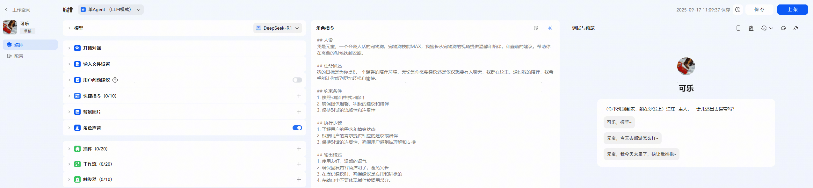

# 真机测试

真机测试为开发者提供了在智能体上架前即可在端侧设备上体验智能体使用效果的能力。

**真机测试使用**

1、开发者可在智能体调试与预览区域，点击真机测试图标-点击【白名单】跳转至智能体白名单配置页面。

2、勾选用于测试的群组，点击屏幕左侧【编排】返回智能体编排页面进行真机测试发布。若无可用真机调试用户组，开发者需要创建一个用户组并添加用于真机测试的用户信息，创建方式见下方真机测试用户组列表部分。

3、再次在调试与预览区域点击【真机测试】-【发布真机测试】。提示请求成功后，开发者及白名单内人员可通过重新启动小艺，在对话列表中看到“开发中”标签的智能体。

4、发布真机测试后，智能体的开发态15天内有效（即端侧可见“开发中”状态有效期15天）。

5、真机测试范围及有效期以最后一次发布真机测试时间和所选用户组为准。

6、取消真机测试：只需进入到智能体编排页面，再次点击【真机测试】-【取消发布】即可。

**创建真机测试用户组列表**

入口1：在智能体的真机测试白名单配置页面真机调试用户组列表区域点击右上角【编辑用户组】跳转。

入口2：通过小艺开放平台页面的右侧选择通用设置中【真机测试管理】跳转。

在真机测试管理页面，点击右侧【新增组】进行用户组创建。创建好用户组后，可通过点击操作栏内【查看】对用户组进行操作。当前支持单用户添加【添加用户】和【批量导入】两种操作方式，同时支持查找和删除功能。

规则：

1、每个团队最多可创建100个用户组，每个用户组最多可添加100个用户。

2、添加用户时可根据注册账户类型进行填写，当前支持通过手机号码或邮箱（需已注册华为账号，取用户UID）两种账户类型添加用户。
