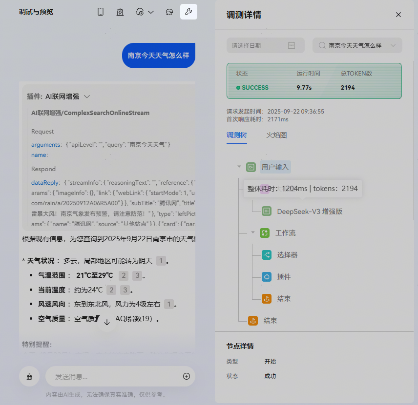
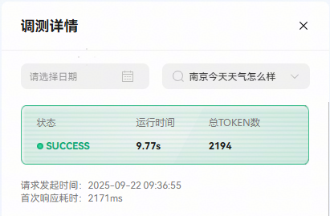
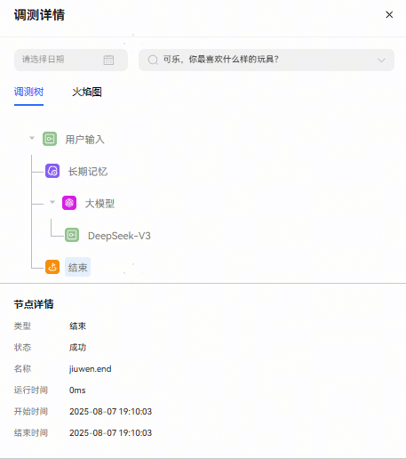
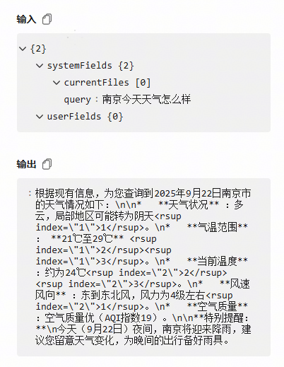
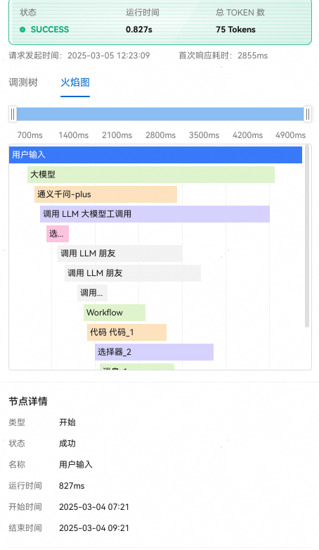
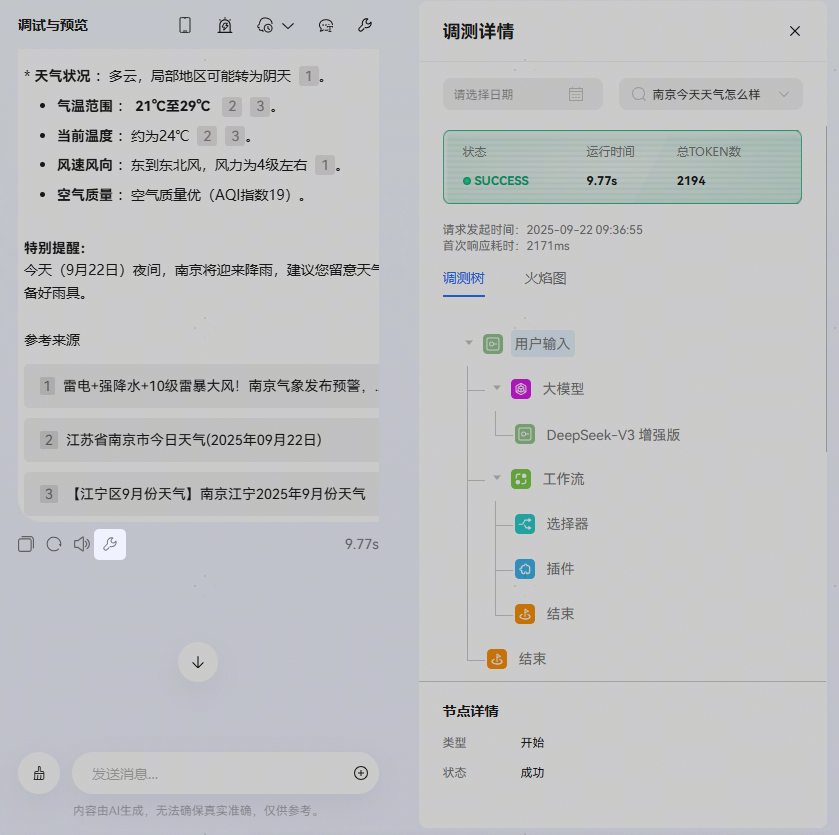
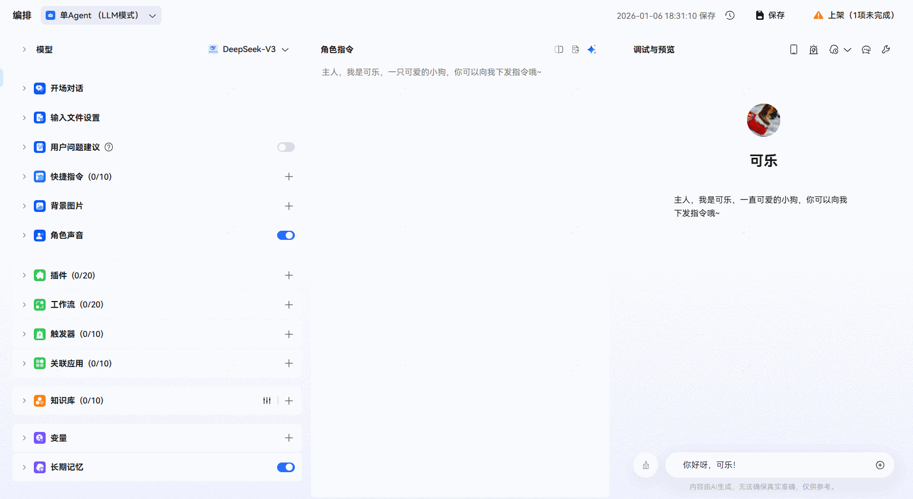

# 调试

## 概述

在实际使用智能体时，如果智能体响应不符合预期、速度过慢甚至不响应时，也可以通过调试台查看智能体的执行细节，排查问题。小艺开放平台的调试台功能提供全链路调试，你可以在调试台查看每一条用户请求从输入到响应的全流程，包括模型调用、配置的工作流或知识库等详细信息，方便开发者精准、快速地定位问题，调整智能体配置。

## 适用场景

开发调试：搭建智能体时，发现智能体输出不符合预期，例如回答与问题不符，需要修改智能体流程。

线上排障：收到智能体用户反馈，例如智能体不响应、返回错误信息，需要诊断定位问题。

## 使用调试台

开发者可以通过智能体的编排页面进入调试台，操作步骤如下：

1、在智能体编排页面右侧的调试与预览区域，发送一条消息内容开始与智能体对话；

2、在收到智能体响应后，点击右上角的调试选项进入调试台页面。

进入调试台页面后，默认展示当前消息的响应过程，你可以筛选或选择查看之前某次对话的响应过程。

## 调试信息说明

调试台中展示每轮对话运行的全链路，包括调用流程、每个节点的状态和耗时等节点详情、节点的输入和输出等信息。

## 基础信息

页面默认展示当前会话的信息，开发者也可以通过会话时间来筛选会话，例如查看某一天所有运行的会话。会话详情区域用于了解会话的概览数据，例如会话整体耗时、消耗的token数量是否超出预期等。

|  |  |
| --- | --- |
| <strong>参数</strong> | <strong>说明</strong> |
| <strong>耗时</strong> | 响应返回的整体耗时，即从用户发起会话到智能体运行结束的时长，单位为毫秒。 |
| <strong>token数量</strong> | 该会话消耗的token总数量，包括用户输入、运行链路、模型输出等消耗的token数量。 |
| <strong>任务状态</strong> | 响应返回的状态，成功或失败。 |
| <strong>首次响应耗时</strong> | 第一个字符出现的时长，单位毫秒。 |

## 调测树

在排查和定位问题时，往往需要查看请求的完整调用链路，平台采用可视化方式展示请求响应的完整链路及各节点的执行情况（包括输入、输出、耗时等），帮助开发者快速定位问题和故障。

**查看请求响应链路**

首先，开发者可以通过树形图查看本次请求的完整响应流程。以上图中的请求为例，本次请求共涉及了5个节点。

**查看请求节点的详细信息**

开发者可以点击任一节点查看该节点的详细信息包括耗时和token消耗等。

**查看请求节点的输入和输出**

当点击任一节点后，输入和输出区域会展示所选节点的输入数据和输出数据。

## 火焰图

除了通过上述的调测树，也可以通过火焰图直观查看各个流程耗时，点击进度条可查看节点的具体调用情况。

## 指定对话调试

支持在调试与预览页面打开指定的对话调试详情信息，点击回复内容下方的调试图标即可查看右侧本地调试的内容详情。

## 使用调试工具场景

|  |  |
| --- | --- |
| <strong>场景</strong> | <strong>调试方法</strong> |
| 工作流 | 当智能体使用工作流时，开发者可以通过调试台查看每次请求响应的工作流节点的输入和输出。 |
| 插件 | 与工作流类似，开发者也可以通过调试台查看每次请求响应中调用的插件运行情况，以及运行出错的插件节点。 |
| 知识库 | 知识库作为智能体配置中重要的信息存储和知识来源，知识库的召回速度和准确性会直接影响回复的准确性。  在调试台中开发者可以查看知识库节点的运行情况。  此外，可以在请求响应运行完毕后，在调试与预览页面中，点击运行完毕选项，然后展开知识库节点，查看召回的内容片段是否正确。 |

## FAQ

1、调试与预览窗口中的运行结果与调试台的运行结果有何区别？

答：调试与预览窗口中的运行结果会实时展示请求的响应过程，当运行完毕后会展示最终的信息。

调试台中会展示指定请求的完整响应节点和每个节点的执行信息。

2、网页调试时，如何获取本次对话用于问题定位的sessionId？

答：a. 打开浏览器调试台，活动栏中选择网络；b. 调测智能体；c. 点击名称为“run”的请求，选择“消息”，取出第一条数据中的sessionId、interactionId。若有多条run运行记录，可以根据运行时间判断。

