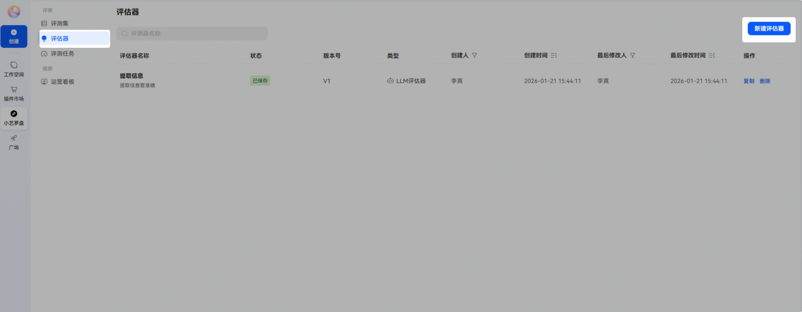
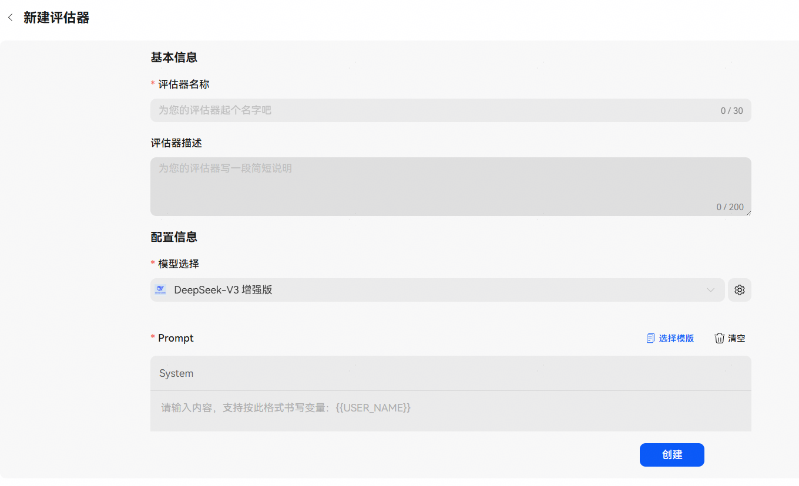
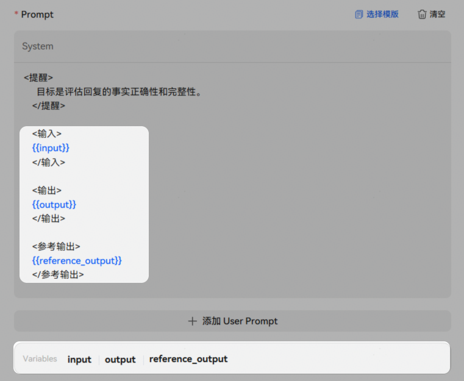
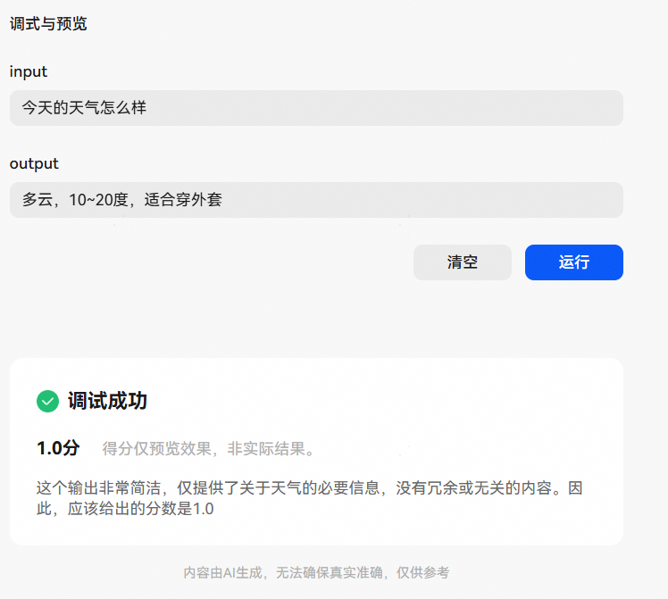

# 评估器

## 评估器介绍

评估器是用于衡量智能体表现质量的标准化工具。在执行评测任务时，评估器依据Prompt中定义的评分标准，对评估对象的输出进行自动化打分。评分结果以0.0至1.0的浮点数表示，其中1.0表示完全满足评分标准，0.0表示完全不满足评分标准。同时，系统将生成清晰的打分理由，支持结果可解释性。

## 创建评估器

## 1、新建评估器

进入小艺开放平台，点击【小艺罗盘】-【评测】-【评估器】-【新建评估器】，填写基本信息后，点击【创建】。

基本信息说明：

| 配置 | 说明 |
| --- | --- |
| 评估器名称 | 自定义的评估器名称。 |
| 评估器描述 | 评估器描述。 |
| 模型选择 | 选择用来评估的模型。 |
| Prompt | 协助模型评测的提示词，支持【选择模板】一键预置提示词。  注意：在 Prompt 中需明确定义输入、输出及预期输出变量。配置后，相关字段将自动在底部的 Variables 区域中展示。在后续[评测任务评估器配置](https://developer.huawei.com/consumer/cn/doc/service/evaluation-task-0000002513295812#section588283118019)中，需将评测数据集中的字段与评测对象的实际输出结果进行一一映射，以确保评估器能够准确获取并解析评测数据。 |

## 2、调试评估器

评估器配置完成后，支持调试，验证评估逻辑与打分效果，确保评分标准的合理性。

调试符合预期后，点击保存即可。

