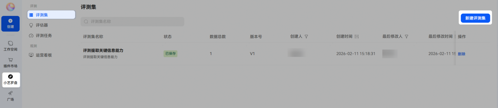
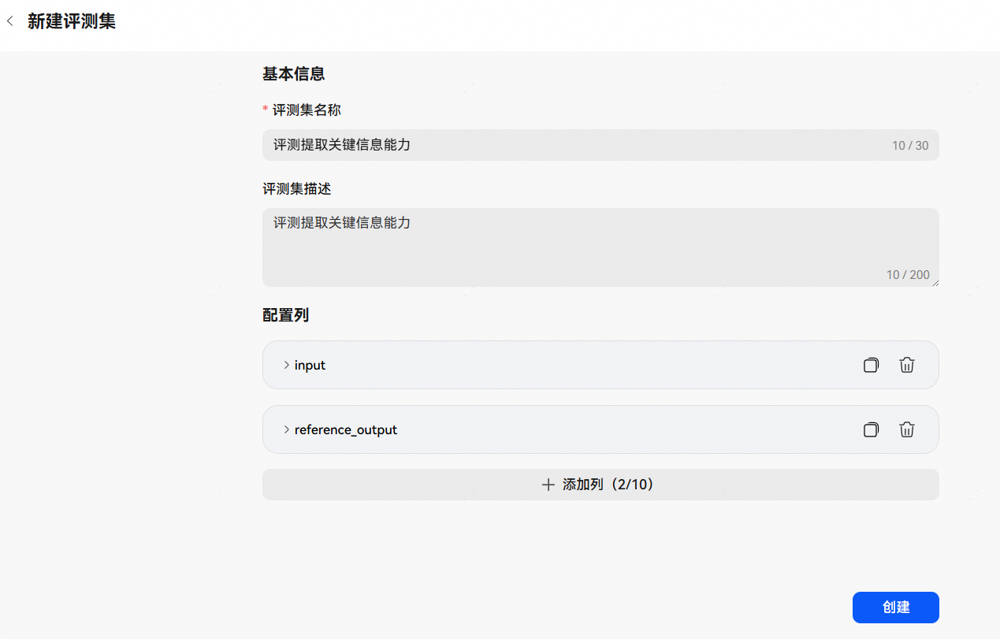
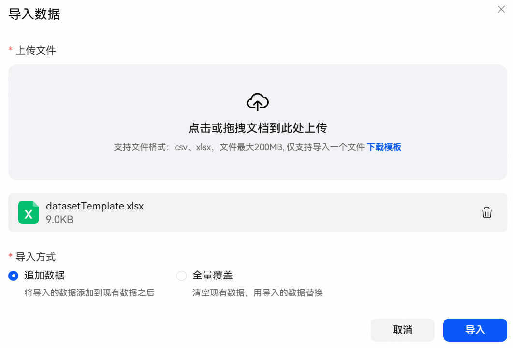
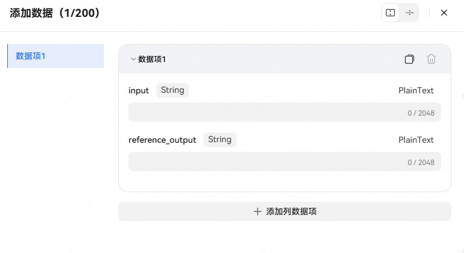
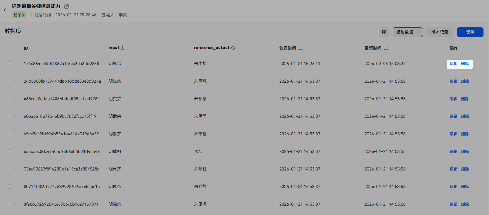
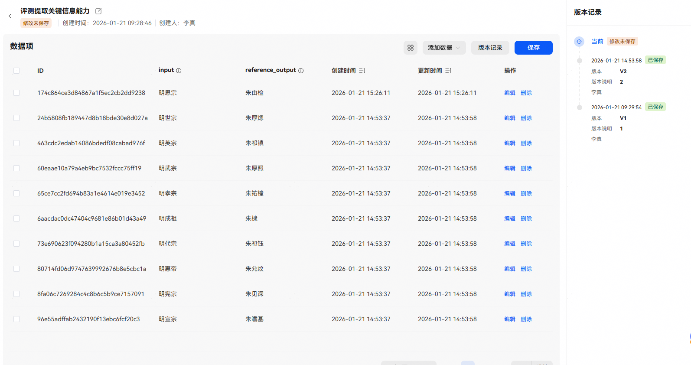

# 评测集

## 评测集介绍

评测集是专为评估智能体输出质量而构建的结构化数据集合，由输入数据、预期输出两部分组成，实现智能体系统性评估能力的标准化与工程化。

构建高质量评测集，建议遵循以下原则：

* 代表性：覆盖真实应用场景中的典型任务类型（如问答、摘要、推理、写作等），确保评估结果能反映智能体在实际使用中的表现。
* 多样性：包含不同难度层级、语言风格、领域背景和输入复杂度，避免智能体仅在“舒适区”表现良好。
* 真实性：输入指令贴近真实用户提问方式（自然语言、口语化表达等），输出参考建议由专家标注或高质量生成，杜绝“理想化”或“人工造题”。
* 稳定性与可扩展性：评测集应具备良好的版本管理机制，支持持续迭代与增量更新；同时结构清晰，便于后续扩展。

## 构建评测集

## 1、新建评测集

进入小艺开放平台，点击【小艺罗盘】-【评测】-【评测集】-【新建评测集】，填写基本信息后，点击【创建】。

基本信息说明：

| 配置 | 说明 |
| --- | --- |
| 评测集名称 | 自定义的评测集名称。 |
| 评测集描述 | 评测集描述。 |
| 配置列 | 默认包含input和reference\_output，支持自定义增删。 |
| input | 输入数据列配置，包含：  列名称：输入列名称。  数据类型：输入列数据类型。  是否必填：输入列必填性，开关开启表示必填。  列描述：输入列描述，将作为输入投递给评测对象，协助理解此项输入数据。 |
| reference\_output | 预期输出列配置，包含：  列名称：输入列名称。  数据类型：输入列数据类型。  是否必填：输入列必填性，开关开启表示必填。  列描述：预期理想输出，可作为评估时的参考标准。 |

## 2、添加测试数据

测试集新建完成后，即可添加数据，支持本地导入和手动添加两种方式。

**本地导入**

点击【添加数据】-【本地导入】，上传评测文件，导入支持追加数据和全量覆盖两种方式。

* 追加数据：将导入的数据添加到现有数据之后。
* 全量覆盖：清空现有数据，用导入的数据替换。

**手动添加**

点击【添加数据】-【手动添加】，手动输入每组测试数据，可点击【+添加列数据项】添加多组数据，最多添加200条，完成后保存即可。

## 3、保存测试集

测试数据预置完成后，点击【保存】即可。

## 4、编辑测试数据

测试数据支持新增、修改、删除：

* 新增：在评测集数据页，点击【添加数据】进行添加。
* 修改：在评测集数据页，点击目标数据项操作列的【编辑】按钮，修改数据后保存。
* 删除：在评测集数据页，点击目标数据项操作列的【删除】按钮，即可删除该条数据。

## 5、测试集版本记录

每次保存测试集后都会新建一个测试集版本，可在【版本记录】中查看操作历史。

