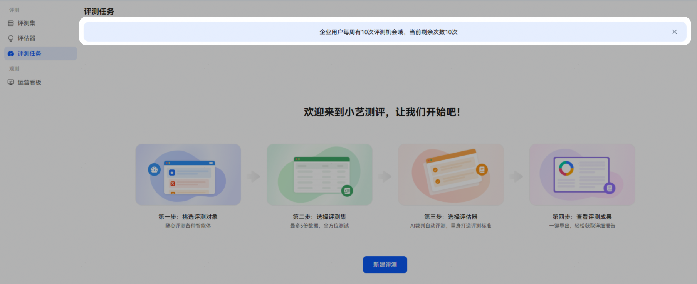
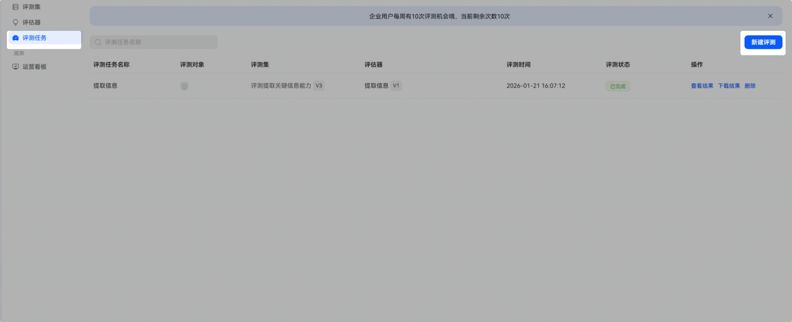
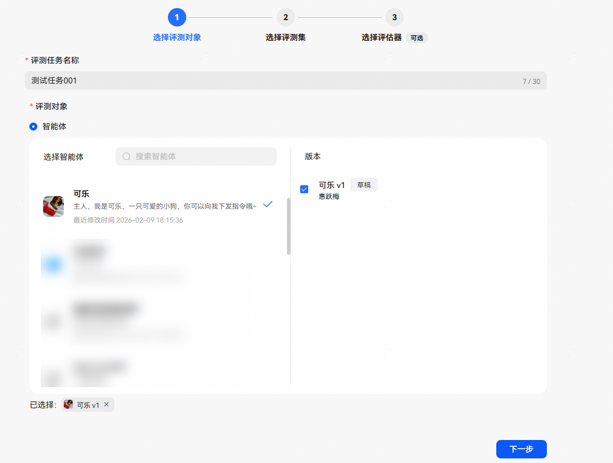
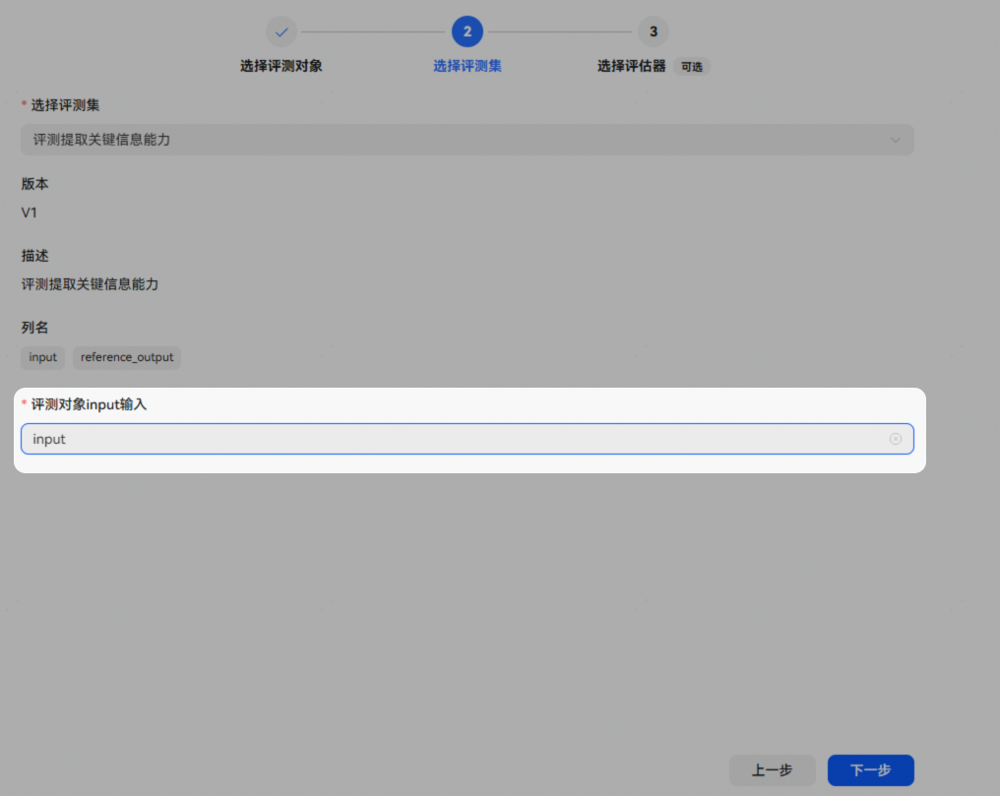
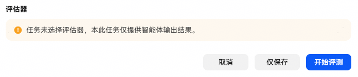
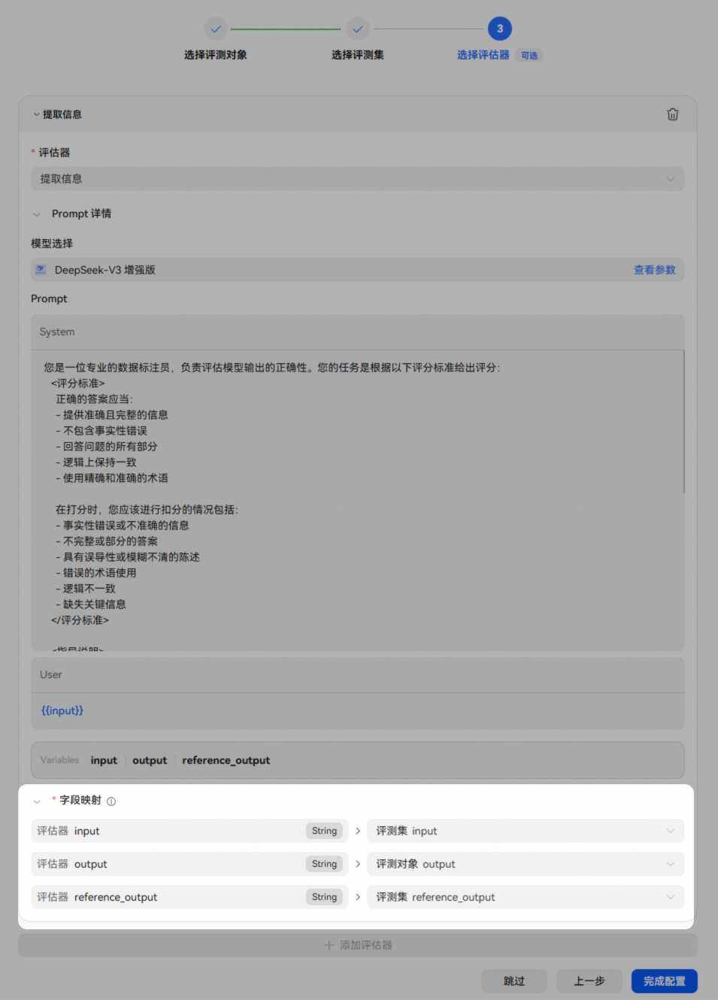
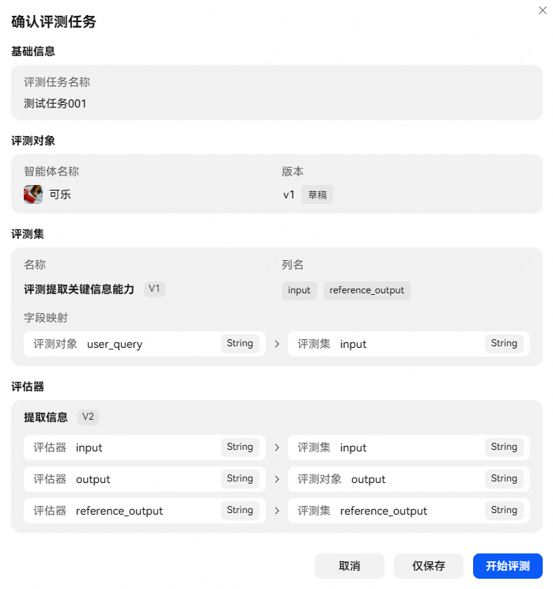
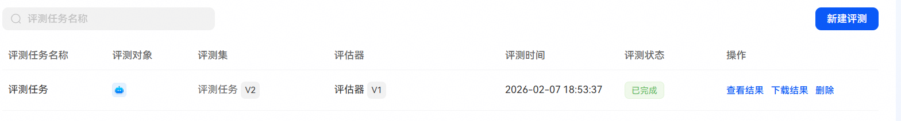

# 评测任务

## 概述

评测任务是基于预设的数据集，自动调用待评测智能体生成输出结果，并由评估器依据标准化评分规则对输出结果进行自动化评测，最终生成测试结果的过程。

**注意：评测机会每周都有次数限制，请合理利用！**

## 创建评测任务

进入小艺开放平台，点击【小艺罗盘】-【评测】-【评测任务】-【新建评测】，进行创建。

## 1、选择评测对象

## 2、选择评测集

## 3、选择评估器（可选）

本步骤中评估器可选，根据是否启用评估器，行为逻辑如下：

**情况1：未选择评估器**

系统在智能体执行完成后，直接输出执行结果。开发者仅可在执行完成后，查看输入输出。适用于仅需要批量运行场景。

**情况2：选择评估器**

系统在智能体执行完成后，自动触发评估器对输出结果进行打分。任务执行完成后，开发者可查看输入输出、**得分情况和打分理由**。在需要质量控制、结果验证或持续优化智能体表现的场景中，推荐启用评估器，以提升整体执行可信度与分析效率。

注意：为确保评估器能准确获取并解析评测数据，请在选择评估器后，手动配置字段映射关系。将评测集的输入/预期输出映射到评估器输入字段，将评测对象实际输出映射到评估器实际输出字段。

## 4、启动评测任务

确认评测任务后，点击【开始评测】即可。

## 5、查看评测结果

评测完成后，可以点击查看/下载评测结果。

