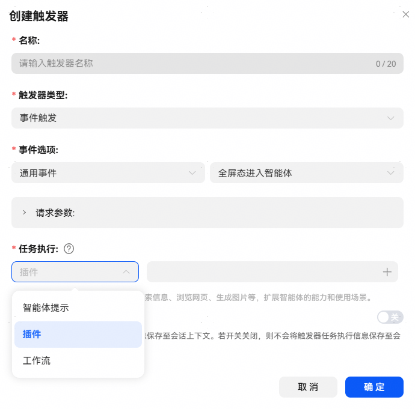
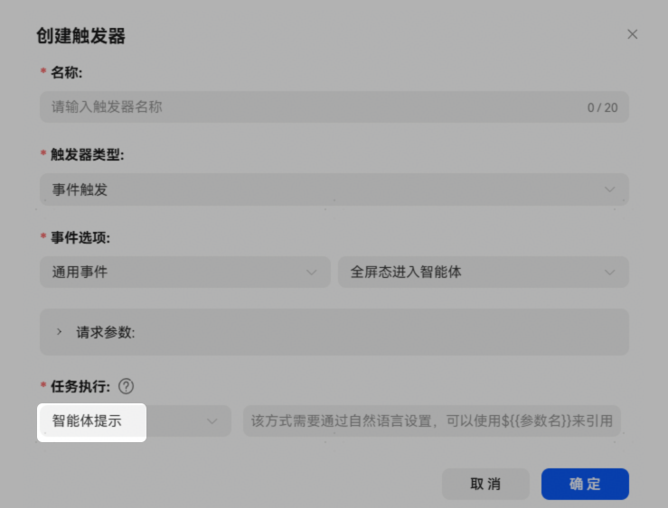
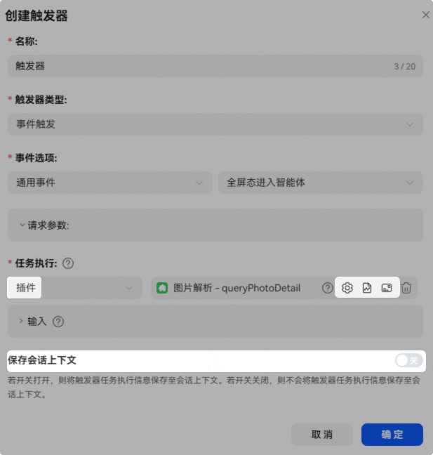
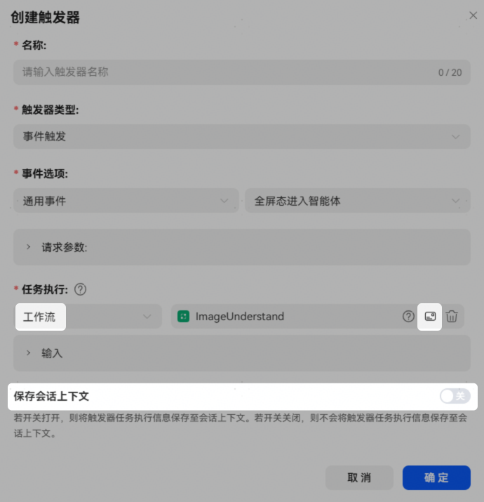

# 通用事件

半屏态或全屏态进入智能体时触发执行任务。仅LLM模式和A2A模式智能体支持通用事件触发器配置。

**通用事件触发器配置**：

【事件选项】：通用事件，智能体中一个通用事件仅可关联一个触发器。

【任务执行】：支持智能体提示、插件和工作流三种类型。

**智能体提示**

触发时将会把预设内容发送给智能体执行。

**插件**

触发器任务执行类型为插件时，触发时系统将会自动调用插件执行。

* 插件支持通过参数设置进行融合生成配置，详情可参考[插件参数设置](https://developer.huawei.com/consumer/cn/doc/service/plugin-parameter-setting-0000002493084596)；
* 插件支持通过绑卡按钮绑定卡片，插件绑卡可参考[插件绑卡](https://developer.huawei.com/consumer/cn/doc/service/plugin-card-0000002525044573)；
* 支持设置是否保存会话上下文，若开启开关则将触发器任务执行信息保存至会话上下文供后续对话使用，开关关闭则不会保存；
* 插件支持使用模拟集，详情可参考[插件模拟集使用](https://developer.huawei.com/consumer/cn/doc/service/plugin-mock-0000002517939356)。

**工作流**

触发器任务执行类型为工作流时，触发时系统将会自动调用工作流执行。

* 工作流支持通过绑定按钮绑定卡片或界面，工作流绑卡可参考[工作流/工作流配置](https://developer.huawei.com/consumer/cn/doc/service/workflow-configuration-5-0000002471264261)，工作流绑定界面可参考[工作流界面使用](https://developer.huawei.com/consumer/cn/doc/service/workflow-gui-0000002549407129)；
* 支持设置是否保存会话上下文，若开关开启则将触发器任务执行信息保存至会话上下文供后续对话使用，开关关闭则不会保存。

**触发器在不同模式下的差异**：

| 模式 | 差异点 | 作用 |
| --- | --- | --- |
| A2A模式 | 不支持任务执行配置。 | A2A模式下，触发器生效时主要是把绑定的通用事件以及相应参数通过A2A基础配置里配的API URL传递给三方智能体，由三方智能体做处理。 |
| LLM模式 | 可以配置任务执行：智能体提示、插件、工作流。 | LLM模式下，触发器生效时，执行已配置的任务。 |

**常见问题**：

1、由触发器触发工作流时，因为没有用户主动输入，工作流无法自动关联默认输入的USER\_INPUT。因此，这种情况下，触发器绑定的工作流需要在开始节点定制其他输入参数，并在触发器中指定参数值。

2、触发器绑定的插件或工作流升级时，暂不支持触发器自动更新，需手动重新绑定插件或工作流。
